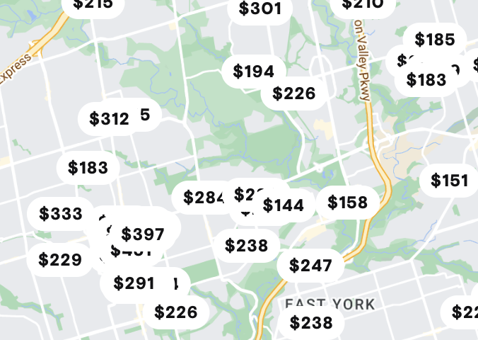
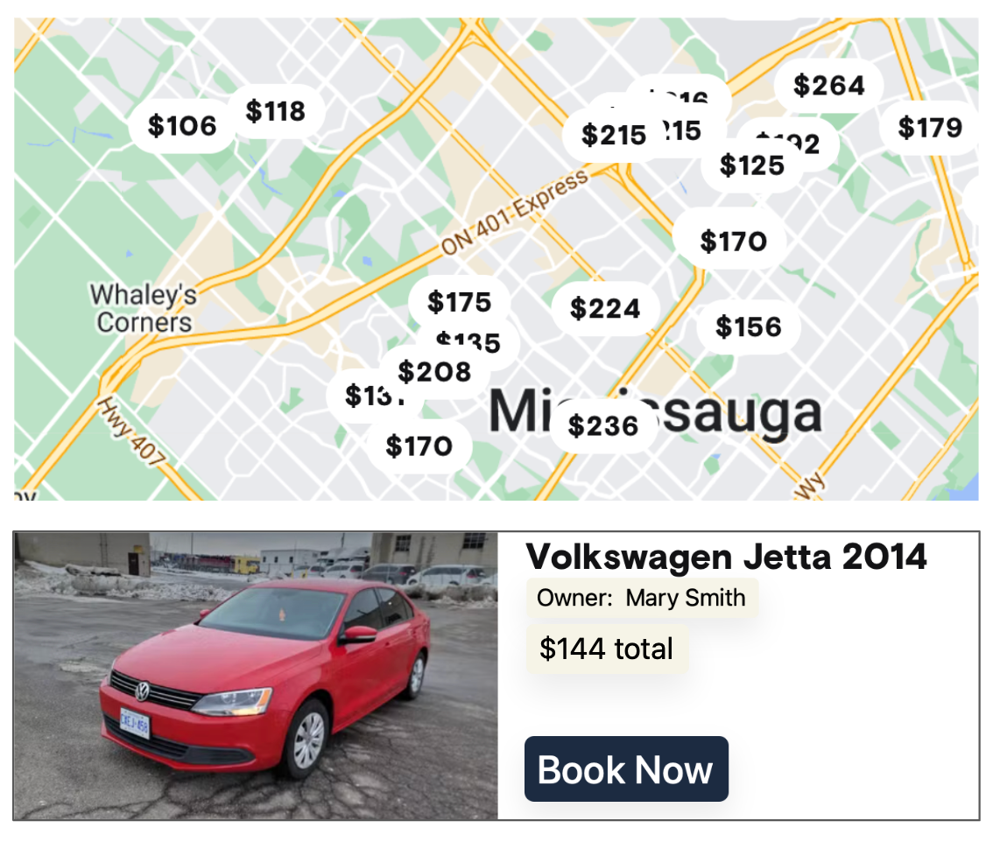

# BTP610 - Group 2 - Car Rental App
## Project Details
### Authors:
- [Bryce Seefieldt](https://github.com/bryce-seefieldt)
- [Hamzah](https://github.com/)
- [Rahul](https://github.com/)

### Notes
#### Collaborative Contribution (Team Coding)

- Use `npx expo install --fix` to update the dependencies to the latest version.

- Updates to version should be agreed on by whole group and tagged with a new version number and a new commit.
- Version changes to `package.json` are not reflected in the apps until the app is rebuilt.


### TODO:

- [ ] Create 2 distinct REACT Native apps
  - [ ] "Renter" app
  - [ ] "Owner" app

## Problem Description
In this project, you will build a clone of the Turo app. Turo is a marketplace for people who are looking to rent cars can connect with people who have cars to rent.

**Your project must consist of 2 apps:**
1. Car Owner app: Used by the "owner" to post the cars they want available to rent
2. Renter app: Used by customers to search for cars to rent
### User Account Management
- User accounts must be implemented with Firebase Authentication.
- Both apps must have screens to enable user login (you can reuse the same screen)
- Both apps must provide a way for the user to logout.
- The account system must be able to distinguish between users who are owners versus users.
- For simplicity, do NOT implement user account signup screens. Instead, FOR INITIAL TESTING WE WILL manually create the user using the Firebase Authentication Console (website)


## Problem Description

### User Account Management
- User accounts must be implemented with Firebase Authentication.
- Both apps must have screens to enable user login (you can reuse the same screen)
- Both apps must provide a way for the user to logout.
- The account system must be able to distinguish between users who are owners versus users.
- For simplicity, do NOT implement user account signup screens. Instead, manually create the user using the Firebase Authentication Console (website)

### Data Persistence
- All relevant data must be persisted to Firebase Firestore.
- Both apps should read from the same Firestore database.
- Design your collections in a way that makes it easy to share data between both applications.

### Owner App Features
```graphql
Login Screen -> My Listings Screen -> Create a Listing Screen 
```
#### 1. User login screen
1. The initial screen of the app is a login screen.
2. After logging in, the user can Create a Listing or Manage Bookings

#### 2. Create a Listing Screen

Provide a screen that has a form for the user to create a listing for their car.
The form must capture:
1. Car model (Honda Civic) and license plate.
2. Cost to rent the car
3. A photo/image of the car. The photo should be a web url.
4. The city and address of the item/service. An example is:
- City: Winnipeg
- Address: 1485 Portage Avenue
  
#### 3. My Listings Screen
1. Provide a screen where the owner can manage their bookings.
2. For each booking, show:
-  Information to identify the car is being booked (including price)
- Name of user who made the booking
- Booking confirmation code
- CANCEL BOOKING button. Pressing this button cancels the booking and removes it from the renter's booking list.

### Renter App Features
This app enables a user to search for and book a car. For simplicity, a user can only have 1 booking at a time.
```graphql
-> Login Screen 
    -> Search Screen
    -> My Bookings Screen 
```
#### 1. Login Screen
1. Provide a login screen. You may reuse your login screen from the owner app.
2. After successful login, navigate the user to either the Search Screen or My Bookings screen. (Use a Tab Navigator)
   
#### 2. My Bookings Screen
If the user has a booking:
- display the booking's confi rmation code, item information, and pickup location (address and city of the item).
- Provide a "cancel" button. When pressed, make the necessary database updates to cancel the booking.

If there is no booking, then show an appropriate error message.

#### 3. Search Screen

##### Example Search Screen UI Map
The screen must display a MapView of all listings in the same city as the user's location:


1. To retrieve the user's location, choose from these options:
- OPTION 1: When the screen loads, use the geocoding libraries to automatically retrieve the device location
- OPTION 2: Provide a textbox for the user to enter their city.
2. Each listing must be displayed as a map marker. The map marker must provide information about the `listing price`. Options for implementation:
- Use the default Marker, but provide the price in the marker's callout
- Use a custom Marker to display the price
3. When a Map Marker is pressed, the screen should display a summary of the selected listing
The summary must show:
- Photo of the car
- Car information (model, license plate)
- Price
- Owner name
- BOOK NOW button

##### Example Search Screen UI:


4. Booking an item
For simplicity, the user can only ever have 1 booking at a time. Therefore, when the BOOK NOW button is pressed:
- Replace any existing bookings with a new booking
- auto generate a booking confirmation code
- display a success message and show the address and city of the item
- update the relevant database collections.
  
When the user returns to the My Bookings page, the booking should appear.

## Implementation Plan - Phase 1: Application Initialization

### 1. Project Structure Setup
```bash
apps/car-rental/
├── owner/
│   ├── screens/
│   │   ├── LoginScreen.js
│   │   ├── CreateListingScreen.js
│   │   └── MyListingScreen.js
│   ├── App.js
│   └── firebaseConfig.js
└── renter/
    ├── screens/
    │   ├── LoginScreen.js
    │   ├── SearchListingsScreen.js
    │   └── MyBookingsScreen.js
    ├── App.js
    └── firebaseConfig.js
```

### 2. Firebase Configuration
1. Initialize shared Firebase project
   - Configure Authentication service
   - Configure Firestore database
   - Create initial database schema for:
     - Users (owners vs renters)
     - Car listings
     - Bookings

2. Database Schema Design
```javascript
// Users Collection
users: {
  uid: string,  // Firebase Auth UID
  type: string, // "owner" or "renter"
  name: string,
  email: string
}


listings: {
  uid: string,
  ownerUid: string,  // Firebase Auth UID of owner
  make: string,
  model: string,
  year: number,
  licensePlate: string,
  price: number,
  city: string,
  address: string,
  isAvailable: boolean
}

// Bookings Collection
bookings: {
  uid: string, // same as listing uid for correstponding listing document
  owneruId: string,  // Firebase Auth UID of renter
  renterId: string,  // Firebase Auth UID of renter
  confirmationCode: string, //combine last 4 digits of owner uid, listing uid and renter uid plus random string of 4 characters. e.g. <XXXX>-<YYYY>-<ZZZZ>-<AAAA>
  active: boolean  // true or false
}

// Listings Collection
listings:{
  createDate:timestamp,
  lastUpdate:timestamp,
  licensePlate:string,
  make:string,
  model:string,
  ownerName:string,
  ownerUid:string,
  price:number,
  year:number
}

```

### 3. Implementation Steps

#### Step 1: Firebase Setup
1. Copy and adapt firebaseConfig.js from example code to both apps
2. Initialize Firebase Authentication and Firestore services
3. Test connection in both apps

#### Step 2: Authentication Implementation
1. Implement LoginScreen in both apps using example code
   - Adapt UI to car rental context
   - Add user type verification
   - Implement session persistence check
2. Add logout functionality to both apps
3. Test user type restrictions

#### Step 3: Navigation Setup
1. Owner App Navigation
   ```graphql
   Login Screen -> Tab Navigator
                    ├── Create Listing Screen
                    └── My Listings Screen
   ```

2. Renter App Navigation
   ```graphql
   Login Screen -> Tab Navigator
                    ├── Search Screen
                    └── My Bookings Screen
   ```

#### Step 4: Screen Implementation
1. Owner App Screens
   - LoginScreen: Adapt from example code
   - CreateListingScreen: Basic form structure
   - MyListingScreen: Basic list view

2. Renter App Screens
   - LoginScreen: Adapt from example code
   - SearchListingsScreen: Basic list view
   - MyBookingsScreen: Basic list view

### 4. Testing Requirements
1. Authentication Flow
   - User login with correct type succeeds
   - User login with wrong type shows error
   - Session persistence works
   - Logout functions correctly

2. Database Access
   - Both apps can read from shared database
   - Owner can create/update listings
   - Renter can view listings

### Questions Requiring Clarification:
1. Should we implement email/password signup or only use Firebase Console for user creation?
2. Do we need to implement user profile management?
3. Should we implement real-time updates for listings/bookings?
4. Are there specific UI requirements for error messages?

### Next Steps:
After receiving clarification on the above questions, we can proceed with implementing the basic functionality in a step-by-step manner, starting with the owner app followed by the renter app.

### Implementation Clarifications

#### 1. User Authentication
- Initial implementation will use Firebase Console for user creation only
- Two test users will be hard-coded for development:
```javascript
// Owner Test Account
email: "owner@test.com"
password: "123456"

// Renter Test Account
email: "renter@test.com"
password: "123456"
```
- User type verification will be handled through Firebase Authentication custom claims
- Sign-up functionality will be implemented in a future phase

#### 2. User Profile Management
- Initial implementation focuses on core user type verification only
- Profile management features will be implemented in a future phase
- User type (owner/renter) will be stored in Firebase Authentication custom claims

#### 3. Real-time Updates
Database queries will be refreshed:
- On screen load/reload
- After major state changes:
  - New listing created
  - Booking status changed
  - Listing updated/deleted
- Using Firebase Firestore's query functions as demonstrated in example code

#### 4. Error Handling Standards
Following the example code pattern:
```javascript
try {
    // Operation code
} catch (err) {           
    console.log(`Error code: ${err.code}`)
    console.log(`Error message: ${err.message}`)
    setErrorMessageLabel(err.message)
}
```

Error message display:
- Consistent styling across all screens
- Clear action-oriented messages
- Error states:
  - Authentication failures
  - Wrong app type (owner trying to use renter app)
  - Database operation failures
  - Network connectivity issues

### Updated Testing Requirements
1. Authentication Testing
   - Owner login succeeds in owner app
   - Renter login succeeds in renter app
   - Owner login fails in renter app with clear error
   - Renter login fails in owner app with clear error
   - Session persistence verified
   - Logout clears session

2. Database Access Testing
   - Owner CRUD operations on listings
   - Renter read-only access to listings
   - Renter CRUD operations on own bookings
   - Real-time updates verified on state changes

### Next Implementation Steps
1. Initialize Firebase project with test users
2. Implement LoginScreen with hard-coded credentials
3. Add user type verification
4. Setup basic navigation structure
5. Implement initial screen templates
6. Add database queries
7. Implement error handling
8. Test core functionality

## Firebase Console Configuration Steps

### 1. Firebase Authentication Setup
1. In Firebase Console, navigate to "Authentication" > "Sign-in method"
2. Enable "Email/Password" authentication
3. Create test users through "Users" tab:
```javascript
// Owner Test Account
email: "owner@test.com"
password: "123456"

// Renter Test Account
email: "renter@test.com"
password: "123456"
```
4. Set Custom Claims for user type:
   - In Firebase Console, navigate to "Authentication" > "Users"
   - Select each user and add custom claims:
```javascript
// For owner user
{
  "userType": "owner"
}

// For renter user
{
  "userType": "renter"
}
```

### 2. Firestore Database Setup
1. In Firebase Console, navigate to "Firestore Database"
2. Create database in test mode
3. Configure Collections and Document Structure:

```javascript
// Collection: users
{
  userId: "Firebase Auth UID",
  userType: "owner" | "renter",
  email: "string",
  createdAt: "timestamp"
}

// Collection: listings
{
  listingId: "auto-generated",
  ownerId: "Firebase Auth UID",
  model: "string",         // e.g., "Honda Civic"
  licensePlate: "string",  // e.g., "ABC123"
  price: number,          // e.g., 50.00
  photoUrl: "string",     // URL to car image
  city: "string",         // e.g., "Winnipeg"
  address: "string",      // e.g., "1485 Portage Avenue"
  isAvailable: boolean,   // true/false
  createdAt: "timestamp",
  updatedAt: "timestamp"
}

// Collection: bookings
{
  bookingId: "auto-generated",
  listingId: "reference to listing",
  renterId: "Firebase Auth UID",
  confirmationCode: "string",  // auto-generated
  status: "string",           // "active", "completed", "cancelled"
  createdAt: "timestamp",
  updatedAt: "timestamp"
}
```

### 3. Security Rules Configuration
1. In Firebase Console, navigate to "Firestore Database" > "Rules"
2. Configure basic security rules:

```javascript
rules_version = '2';
service cloud.firestore {
  match /databases/{database}/documents {
    // User profile access
    match /users/{userId} {
      allow read: if request.auth != null && request.auth.uid == userId;
    }
    
    // Listing access
    match /listings/{listingId} {
      // Anyone can read listings
      allow read: if request.auth != null;
      // Only owners can create/update/delete their own listings
      allow create, update, delete: if request.auth != null 
        && get(/databases/$(database)/documents/users/$(request.auth.uid)).data.userType == "owner"
        && request.resource.data.ownerId == request.auth.uid;
    }
    
    // Booking access
    match /bookings/{bookingId} {
      // Owners can read bookings for their listings
      // Renters can read their own bookings
      allow read: if request.auth != null && (
        get(/databases/$(database)/documents/users/$(request.auth.uid)).data.userType == "owner" ||
        resource.data.renterId == request.auth.uid
      );
      // Only renters can create/update/delete their own bookings
      allow create, update, delete: if request.auth != null 
        && get(/databases/$(database)/documents/users/$(request.auth.uid)).data.userType == "renter"
        && request.resource.data.renterId == request.auth.uid;
    }
  }
}
```

### 4. Testing Firebase Configuration
1. Authentication Testing:
   - Test login with owner credentials
   - Test login with renter credentials
   - Verify custom claims are accessible
   - Test invalid login attempts

2. Database Testing:
   - Create test listing document
   - Create test booking document
   - Verify security rules:
     - Owner can CRUD their listings
     - Renter can read listings
     - Renter can CRUD their bookings
     - Owner can read bookings for their listings

### 5. Next Steps
After Firebase configuration is complete:
1. Update firebaseConfig.js in both apps with new project credentials
2. Implement user type verification in LoginScreen
3. Add database queries following security rules


