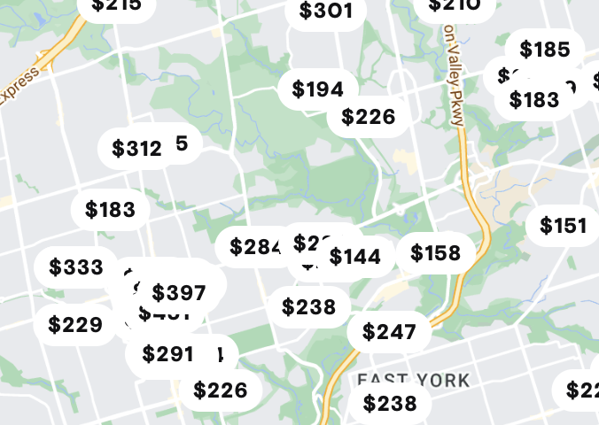
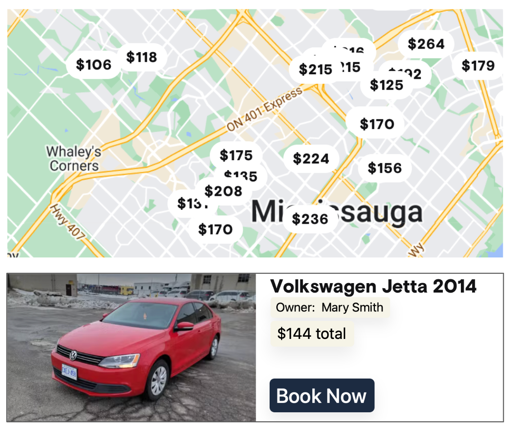

# BTP610 - Group 2 - Car Rental App
## Project Details
### Authors:
- [Bryce Seefieldt](https://github.com/bryce-seefieldt)
- [Hamzah](https://github.com/)
- [Rahul](https://github.com/)


### TODO:

- [ ] Create 2 distinct REACT Native apps
  - [ ] "Renter" app
  - [ ] "Owner" app

## Problem Description
In this project, you will build a clone of the Turo app. Turo is a marketplace for people who are looking to rent cars can connect with people who have cars to rent.

**Your project must consist of 2 apps:**
1. Car Owner app: Used by the “owner” to post the cars they want available to rent
2. Renter app: Used by customers to search for cars to rent
### User Account Management
- User accounts must be implemented with Firebase Authentication.
- Both apps must have screens to enable user login (you can reuse the same screen)
- Both apps must provide a way for the user to logout.
- The account system must be able to distinguish between users who are owners versus users.
- For simplicity, do NOT implement user account signup screens. Instead, FOR INITIAL TESTING WE WILL manually create the user using the Firebase Authentication Console (website)


## Problem Description

### User Account Management
- User accounts must be implemented with Firebase Authentication.
- Both apps must have screens to enable user login (you can reuse the same screen)
- Both apps must provide a way for the user to logout.
- The account system must be able to distinguish between users who are owners versus users.
- For simplicity, do NOT implement user account signup screens. Instead, manually create the user using the Firebase Authentication Console (website)

### Data Persistence
- All relevant data must be persisted to Firebase Firestore.
- Both apps should read from the same Firestore database.
- Design your collections in a way that makes it easy to share data between both applications.

### Owner App Features
```graphql
Login Screen -> My Listings Screen -> Create a Listing Screen 
```
#### 1. User login screen
1. The initial screen of the app is a login screen.
2. After logging in, the user can Create a Listing or Manage Bookings

#### 2. Create a Listing Screen

Provide a screen that has a form for the user to create a listing for their car.
The form must capture:
1. Car model (Honda Civic) and license plate.
2. Cost to rent the car
3. A photo/image of the car. The photo should be a web url.
4. The city and address of the item/service. An example is:
- City: Winnipeg
- Address: 1485 Portage Avenue
  
#### 3. My Listings Screen
1. Provide a screen where the owner can manage their bookings.
2. For each booking, show:
-  Information to identify the car is being booked (including price)
- Name of user who made the booking
- Booking confirmation code
- CANCEL BOOKING button. Pressing this button cancels the booking and removes it from the renter’s booking list.

### Renter App Features
This app enables a user to search for and book a car. For simplicity, a user can only have 1 booking at a time.
```graphql
-> Login Screen 
    -> Search Screen
    -> My Bookings Screen 
```
#### 1. Login Screen
1. Provide a login screen. You may reuse your login screen from the owner app.
2. After successful login, navigate the user to either the Search Screen or My Bookings screen. (Use a Tab Navigator)
   
#### 2. My Bookings Screen
If the user has a booking:
- display the booking’s confi rmation code, item information, and pickup location (address and city of the item).
- Provide a “cancel” button. When pressed, make the necessary database updates to cancel the booking.

If there is no booking, then show an appropriate error message.

#### 3. Search Screen

##### Example Search Screen UI Map
The screen must display a MapView of all listings in the same city as the user’s location:


1. To retrieve the user’s location, choose from these options:
- OPTION 1: When the screen loads, use the geocoding libraries to automatically retrieve the device location
- OPTION 2: Provide a textbox for the user to enter their city.
2. Each listing must be displayed as a map marker. The map marker must provide information about the `listing price`. Options for implementation:
- Use the default Marker, but provide the price in the marker’s callout
- Use a custom Marker to display the price
3. When a Map Marker is pressed, the screen should display a summary of the selected listing
The summary must show:
- Photo of the car
- Car information (model, license plate)
- Price
- Owner name
- BOOK NOW button

##### Example Search Screen UI:


4. Booking an item
For simplicity, the user can only ever have 1 booking at a time. Therefore, when the BOOK NOW button is pressed:
- Replace any existing bookings with a new booking
- auto generate a booking confirmation code
- display a success message and show the address and city of the item
- update the relevant database collections.
  
When the user returns to the My Bookings page, the booking should appear.


