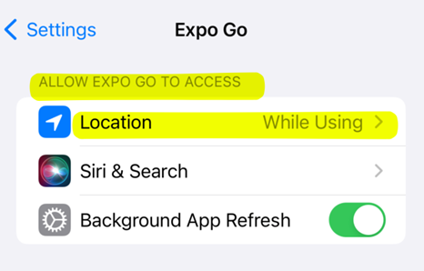
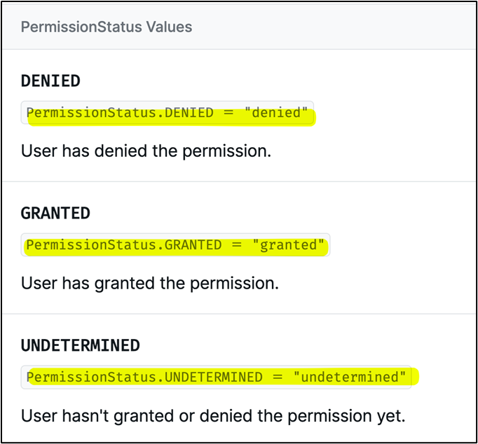
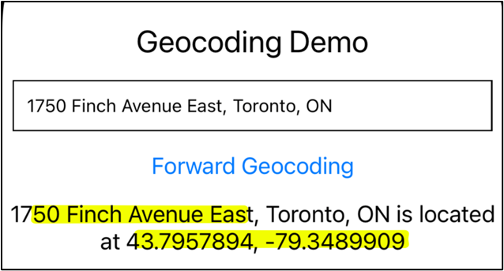

# Software Installation and React Native Project Setup


## Software Installation

If you do not already have these tools installed, then please download and install NodeJS and Visual Studio Code.

1.	Visual Studio Code: https://code.visualstudio.com/
2.	NodeJS (LTS version): https://nodejs.org/en.


________________________________________


## Creating a new React Native Project with Expo


After installing VSCode and NodeJS, create new React Native project using your operating system’s command line prompt application (Terminal, cmd.exe, Powershell.exe, ect)


Open your computer’s command line application

`npx create-expo-app --template`


Using your keyboard UP and DOWN keys, select the Blank option and press ENTER


Follow the on-screen instructions and wait for it to complete.

●	You may be asked to install “create-expo-app”. If so, then type “y”, then press ENTER


●	You may be asked to enter the name of your app. If so, type a name for your project, then press ENTER. In the example below, we choose the name “session01”

 

●	Wait for the process to complete.

●	When finished, the screen will look something like this:


________________________________________


## Run the React Native Project

After creating the project, we open the project and compile it into a format that can be deployed ot your phone.


1. Locate the folder that was created by the “npx create-expo-app” command


2. Open folder in Visual Studio Code:

 


 
3. In VSCode, open the Terminal (Terminal > New Terminal)

 

4.  In Terminal, type:

`npx expo start`


You will see message like this:
```
Starting project at /Users/jsmith/Desktop/my-app
Starting Metro Bundler

▄▄▄▄▄▄▄▄▄▄▄▄▄▄▄▄▄▄▄▄▄▄▄▄▄▄▄
█ ▄▄▄▄▄ █ ▀▀▄ ▄██▄█ ▄▄▄▄▄ █
█ █   █ ███ ▄▄ █▀██ █   █ █
█ █▄▄▄█ █ ▄▄ ████▄█ █▄▄▄█ █
█▄▄▄▄▄▄▄█ █ ▀ █▄▀ █▄▄▄▄▄▄▄█
█  ▄██ ▄▀   ██▀  █  ▄▄██  █
█▄ █ ▀ ▄  ▀█▄██▄▄█ ▄ ▀▄▄█▄█
██ ▀▄▀ ▄ ▀▄█▄ █ ▀█  ▄██▀ ▀█
█▄▄█ ▀ ▄█▀▄▄▀ ▄ ▄██ ▄▄▄█▀▄█
█▄▄█▄██▄█ ▄▀█▄▀   ▄▄▄  ▀█ █
█ ▄▄▄▄▄ █▀▄▄▄▄▄ █ █▄█ ██▀▄█
█ █   █ ██▀▀ ██ ▄ ▄▄   ▀ ██
█ █▄▄▄█ █  ▄▄▄▄▄█▀▀█ ▄██▄▄█
█▄▄▄▄▄▄▄█▄▄▄▄██▄▄▄▄▄▄▄███▄█


› Metro waiting on exp://10.164.196.18:19000
› Scan the QR code above with Expo Go (Android) or the Camera app (iOS)

› Press a │ open Android
› Press i │ open iOS simulator
› Press w │ open we

› Press j │ open debugger
› Press r │ reload app
› Press m │ toggle menu

› Press ? │ show all commands

```
________________________________________


## Running project on your real Android / IOS device:

1. Download “Expo Go” from your phone’s App Store:

Use this link to find the app:
https://expo.dev/client


 


2. After installation, connect your PHONE and COMPUTER to the same Wifi network

●	In this example, we are connecting both the phone and laptop to a network called “CollegeWifi-GUEST”

| Computer	| Phone  |
 	 


3.  Scan the QR code that appears in the Terminal
●	REMEMBER! Your computer and phone must be connected to the same Wifi Network!
●	See below for instructions on Android vs. IOS!

 
### Android Users:
●	Open the Expo Go App
●	Choose Scan QR Code

 


### IOS Users:

-	Open your Camera app\
-	Using your CAMERA app, scan the QR code
-	IOS may ask you if it can open the app using Expo Go. If yes, allow it to open in Expo Go.
n open the app using Expo Go. If yes, allow it to open in Expo Go.

4. App will download and install on your phone


If you see these messages, press “x” to dismiss the popups


Eventually, you will see the project output

 

________________________________________


Troubleshooting

You may encounter a message like this:

 

●	Typically this happens when you are on a corporate internet (network that require you to sign in)

●	If you see this message, try using “npx expo start --tunnel” to run the code
●	If asked to install ngrok, then choose “yes”


 ```
npx expo start --tunnel
```
```
Starting project at /Users/zebra/Desktop/rn-gb/ui-demo
Some dependencies are incompatible with the installed expo version:
  @react-native-picker/picker@2.4.10 - expected version: 2.4.8
Your project may not work correctly until you install the correct versions of the packages.
Install individual packages by running npx expo install @react-native-picker/picker@2.4.8
Starting Metro Bundler
✔ The package @expo/ngrok@^4.1.0 is required to use tunnels, would you like to install it globally? … yes
Installing @expo/ngrok@^4.1.0...
> npm install --global @expo/ngrok@^4.1.0
```


