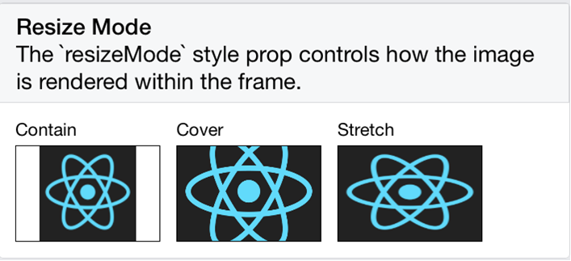
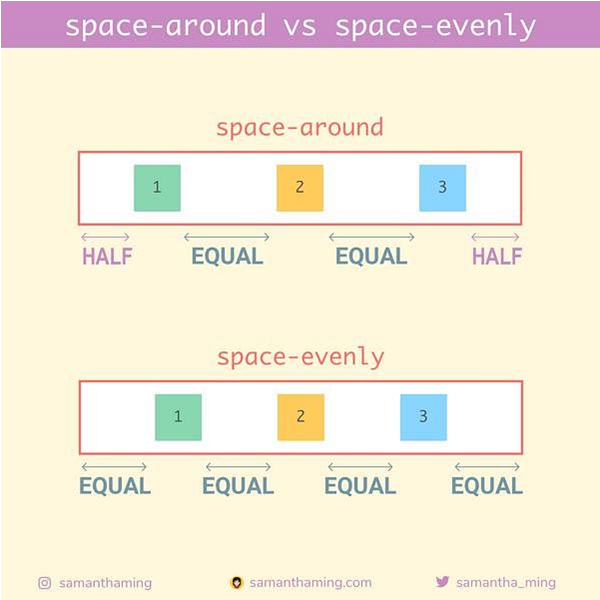

# BTP600 Wk2: Styling

## How to Add Styles to Elements

### Using inline styling
Styling applies to only the specified element, not any other element.
```js
<Text style={{ backgroundColor:"cyan", fontSize:40, padding:20}}>
Hello world!
</Text>
```

### Using the StyleSheet object
Styles can be reused on different elements.

1. Define a style in the StyleSheet object:
```js
const styles = StyleSheet.create({
   myText: {
    fontSize: 24,
    color: "#ff00ff",
    backgroundColor:"yellow",
    fontWeight:"bold",
    fontStyle:"italic",
    textAlign:"right"
  }
});
```
2. Apply the style to an element

```js
<Text style={styles.myText}>Open up App.js to start working on your app!</Text>
```

### Combining inline and reusable styles
An element can have both resuable and inline styles:
1. Create an array
```js
<Text style={ [] }>Hello</Text>
```

2. Add the reusable style
```js
<Text style={ [styles.myText] }>Hello</Text>
```

3. Add the inline style
```js
<Text style={ [styles.myText, {padding:20}] }>Hello</Text>
```

## Common Styling Properties

### Styling Text
fontSize:20
- Adjusts font size
- Uses the "sp" unit of measurement. 
- sp = scale independent pixels (https://m1.material.io/layout/units-measurements.html)
color:"#fff000"
- Sets the text color
- Can use predefined web colors or hex colors
backgroundColor:"#fff000"
- Sets the text color
- Can use predefined web colors or hex colors
textAlign:"left"|"center"|"right"|"justify"
- Aligns text within a container
textDecorationLine:"underline"
- Add an underline to the text
fontWeight:"bold"
- Sets the text to bold 
fontStyle:"italic"
- Adds italics to the text

### Controlling Whitespacing and Borders
padding:20
- Adds the same padding to all 4 sides of an element
- Use paddingLeft, paddingRight, paddingTop, paddingLeft to individually control the padding on each side of the element.
margin:20
- Adds the same margin to all 4 sides of an element
- Use marginLeft, marginRight, marginTop, marginBottom properties to individually control the margin on each side
borderWidth:1, borderColor:"#000000"
- Adds a border of the specified color with the specified thickness (width)

### Heights and Widths
height:20
- Adjusts the height of an element
- Uses dp (density independent pixels) as the unit of measurement (https://m1.material.io/layout/units-measurements.html)
width:20
- Adjusts the width of an element
- Uses dp (density independent pixels) as the unit of measurement (https://m1.material.io/layout/units-measurements.html)

### Images
resizeMode:"center"
- Controls how the image is scaled within the <Image/> element
- See options here: https://reactnative.dev/docs/image-style-props#resizemode
- Examples of different resize mode options: (credit: https://www.oreilly.com/library/view/learning-react-native/9781491929049/ch04.html)


#### Contain vs. Center
-  contain will scale the image (up or down) so that the whole image is “contained” in the view component at the maximum scale possible.
- center will scale the image down only if it’s bigger than the component. Otherwise, it will just show the image in the original scale.
 

Credit: https://medium.com/@nima-ahmadi/react-native-image-resizemode-a-visual-guide-f1958d27c615


### Layout
Layout is controlled using a system similar to CSS Flexbox

To use flexbox:
1. Identify the elements that should be repositioned
- These elements are known as flex items
2. Surround elements in a container element (example: <View>)
- The container is known as a flex container
3. Apply the flex properties to control the flex items

#### Layout Properties:
`flexDirection:"row"|"column"|"column-reverse"|"row-reverse"`
- Sets the direction of the flex items to a single row or a single column
- Column reverse and row reverse will position the flex items in the reverse order that the code is written in

`justifyContent:"flex-start"|"center"|"flex-end"`
- Describes the position within the container that flex items will be placed
- flex-start: put flex items at beginning of the container
- flex-end: put flex items at the end of the container
- center: If direction = row, then put flex items in the horizontal center of the container. If direction="column", then put items in the vertical center of the container

`justifyContent:"space-between"|"space-evenly"|"space-around"`
- Automatically positions items with whitespacing between each element


Credit: https://www.samanthaming.com/flexbox30/12-justify-content-row/


Credit: https://www.samanthaming.com/flexbox30/14-space-around-vs-space-evenly/

`flex:8`

- Sets the percentage or proportion of the screen or parent element that a flex element will occupy
- Must be applied to the flex item
- Assume you have 3 flex items with: flex:1, flex:2, flex:1
- The total is 1+2+1 = 3
- Item #1 will occupy 1/4 of the parent container
- Item #2 will occupy 2/4 of the parent container
- Item #3 will occupy 1/4 of the parent container


