# BTP610
# Wk02S02: Flexbox

## Flexbox Review

- Use the style attribute to apply styles to individual elements

- Layout is configured using CSS Flexbox. 

- In Flexbox:

a.	In your code, locate the elements you want to arrange in a row or column

b.	Surround the elements in a <View></View> element. 
-  The <View> element becomes known as a flex container
-  The elements inside the container are known as flex items

c.	On the flex container, apply flexbox properties to control the look and feel of the flex items
- flexDirection: "row" | "column"		
→ layout in a row or column
→ If you do NOT specify the flexDirection property, then in React Native, the default will be set to column
- gap:20					→ add a space between the items of 20
- justify-content				→ automatically position items in the container
 
## What is a Flex Container?

In HTML, a container element becomes a “flex container” when the display:flex property is applied:

**Not a flex container**	
```html
<div>
     <p>a</p>
     <p>b</p>
     <p>c</p>
</div>	
```
**Is a flex container:**
```html
<div style="display: flex;">
     <p>a</p>
     <p>b</p>
     <p>c</p>
</div>
```

In React Native, all <View> elements are flex containers.

This is because the <View> element automatically has the display:flex; property attached to it.

### Example:  Flex Containers and Flex items
```js
export default function App() {
 return (
   {/* flex container*/}
   <View style={styles.container}>
       {/* flex container*/}
       <View>
         {/* total number of flex items is 3 */}
         <Text>Apple</Text>         
         <Text>Banana</Text>
         <Text>Carrot</Text>
       </View>   

       {/* flex container */}
       <View style={{flexDirection:"row"}}>
         {/* total number of flex items is 2 */}
         <Text>Toronto</Text>
         <Text>Montreal</Text>
       </View>

   </View>
 );
}
```
#### Result


Because every <View> automatically has the display:flex property applied, then every <View> is a flex container. In the example above:

- There are 3 <Views>.  Therefore, there are 3 flex containers
- The elements in each <View> is considered a flex item.


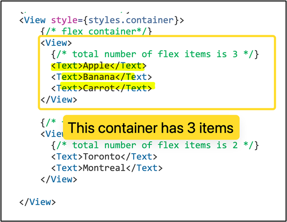

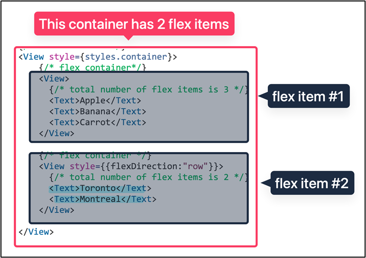

### Excercise

**How many flex items are in each flex containerHow many flex items are in each flex container?**


1.	How many flex containers are present?
2.	How many flex items are in each container?

```js

import { StyleSheet, Text, View } from 'react-native';

export default function App() {
 return (
   // {When you look at the code for a View,
   // they already put display:flex on that element
   // they also put flexDirection:"column"}
   <View style={styles.container}>
       <View style={{borderWidth:1, borderColor:"magenta"}}>
         <Text>Hello world</Text>
         {/* total number of flex items is 3 */}
         <Text>Apple</Text>         
         <Text>Banana</Text>
         <Text>Carrot</Text>
         <View style={{flexDirection:"row", borderWidth:1, borderColor:"brown"}}>
           {/* total number of flex items is 2 */}
           <Text>Toronto</Text>
           <Text>Montreal</Text>
           <View style={{flexDirection:"row", borderWidth:1, borderColor:"brown"}}>
             {/* total number of flex items is 2 */}
             <Text>Toronto</Text>
             <Text>Montreal</Text>
           </View>
         </View>
       </View>   
   </View>
 );
}

const styles = StyleSheet.create({
 container: {
   flex: 1,
   flexDirection:"column-reverse",
   backgroundColor: '#fff',
   alignItems: 'center',
   justifyContent: 'center',
   borderWidth:10,
   borderColor:"yellow",
 },
});
```
## Positioning and Spacing

In this section, we discuss:
1.	How to position elements inside the flex container
2.	How to control the spacing between elements in the flex container

Use this starter code to follow along:

```js
import { StyleSheet, Text, View } from 'react-native';

export default function App() {
 return (   
   <View style={styles.container}>
       <View style={{flexDirection:"row",
                     borderWidth:1,
                     borderColor:"magenta",
                     width:"100%",
                     paddingVertical:20}}>
         <Text style={{borderWidth:1}}>Apple</Text>        
         <Text style={{borderWidth:1}}>Banana</Text>        
         <Text style={{borderWidth:1}}>Carrot</Text>        
       </View>          
   </View>
 );
}

const styles = StyleSheet.create({
 container: {
   flex: 1,
   flexDirection:"column",
   backgroundColor: '#fff',
   alignItems: 'center',
   justifyContent: 'center',   
 }, 
});
```
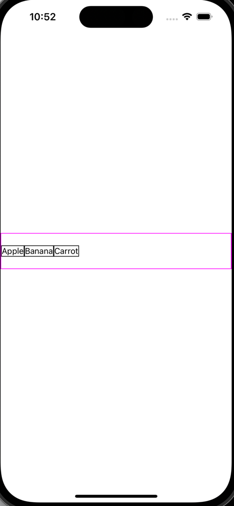 

NOTE: The following examples assume the the flexDirection = row!!!!!

### Space between each flex item:

By default, there is no space between each flex item. The space can be controlled using the properties:

- gap		
→ sets the space to a fixed amount
- justifyContent: space-between | space-around | space-evenly
→ automatically calculates the space between each flex item
→ the spacing is responsive (so if screen size changes, then space adjusts)

#### 1. Fixed spacing

- To set the space to a fixed amount, use the gap property. 

`<View style={{flexDirection:"row", gap:45}}></View>`

- The amount of space is fixed. This means that gap:45 will appear differently on devices with smaller  versus. larger screen sizes.


##### Example:  Add a space of 20 between each flex item

```js
import { StyleSheet, Text, View } from 'react-native';

export default function App() {
 return (   
   <View style={styles.container}>
       <View style={{flexDirection:"row",
                     borderWidth:2,
                     borderColor:"magenta",
                     width:"100%",
                     paddingVertical:20,
                     gap:20}}>
         <Text style={{borderWidth:1}}>Apple</Text>        
         <Text style={{borderWidth:1}}>Banana</Text>        
         <Text style={{borderWidth:1}}>Carrot</Text>        
       </View>          
   </View>
 );
}

const styles = StyleSheet.create({
 container: {
   flex: 1,
   flexDirection:"column",
   backgroundColor: '#fff',
   alignItems: 'center',
   justifyContent: 'center',   
 }, 
});

```
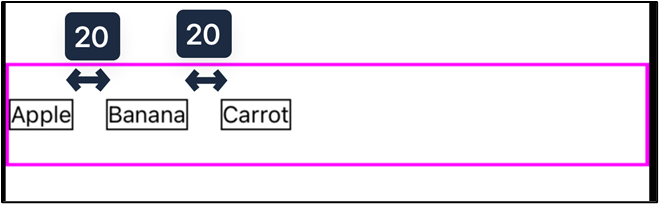

#### Responsive spacing

The justifyContent property is use to automatically calculate the amount of space between each flex item.  

This is useful when you want the spacing to be responsive to the device screen size.

##### `justifyContent:"space-between"`

- First item goes to the start of the container
- Last item goes to the end of the container
- All other items are equally distributed in between the first and last item

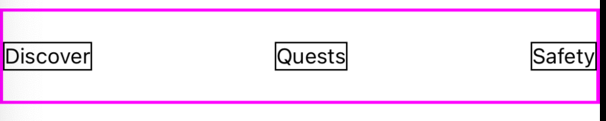

##### `justifyContent:"space-evenly"`
- Same amount of space around each element


##### `justifyContent:"space-around"`
- Similar to space-evenly, but uses a different formula for calculating the space around the first and last item.

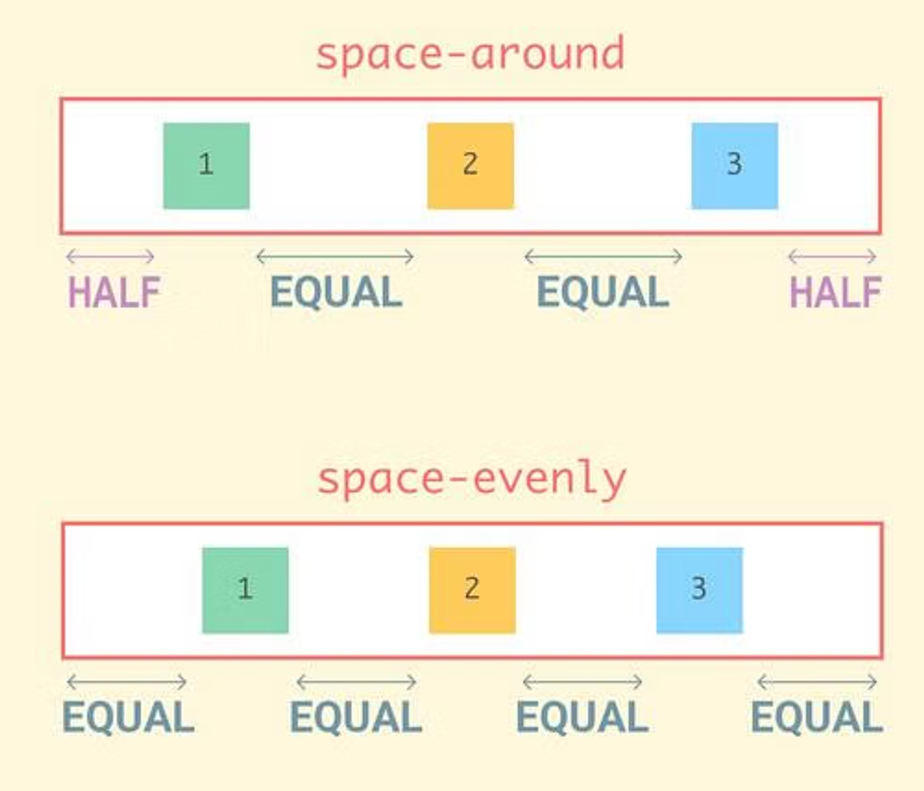

### Position of flex items inside the flex container

`justifyContent` is also used to position flex items within the container.   There are 3 possible values:
`justifyContent: flex-start | center | flex-end`

When flex-direction = row, the default position of the flex items is at the beginning of the flex 
container.

- Beginning is usually the left side
- This is known as the flex-start position


#### Example:  Demonstrating the default position is flex-start


- If you include flex-start, then the items are positioned at the beginning of the container
- If you do NOT include flex-start, you get the same result
- This demonstrates that the default position of items is flex-start.
```js
export default function App() {
 return (   
   <View style={styles.container}>
       <View style={{flexDirection:"row",
                     borderWidth:2,
                     borderColor:"magenta",
                     width:"100%",
                     paddingVertical:20,
                     justifyContent:"flex-start"}}>
         <Text style={{borderWidth:1}}>Apple</Text>        
         <Text style={{borderWidth:1}}>Banana</Text>        
         <Text style={{borderWidth:1}}>Carrot</Text>        
       </View>          
   </View>
 );
}
```

##### `justifyContent:"center"`

- Items are automatically moved to the center of the flex container:
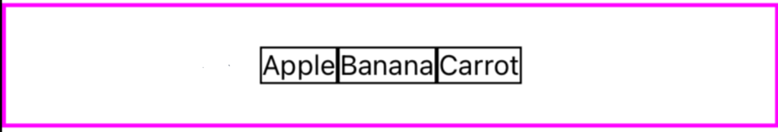

```js
export default function App() {
 return (   
   <View style={styles.container}>
       <View style={{flexDirection:"row",
                     borderWidth:2,
                     borderColor:"magenta",
                     width:"100%",
                     paddingVertical:20,
                     justifyContent:"center"}}>
         <Text style={{borderWidth:1}}>Apple</Text>        
         <Text style={{borderWidth:1}}>Banana</Text>        
         <Text style={{borderWidth:1}}>Carrot</Text>        
       </View>          
   </View>
 );
}

```

##### `justifyContent:"flex-end"`
- Items are automatically moved to the end of the flex container:

```js
export default function App() {
 return (   
   <View style={styles.container}>
       <View style={{flexDirection:"row",
                     borderWidth:2,
                     borderColor:"magenta",
                     width:"100%",
                     paddingVertical:20,
                     justifyContent:"flex-end"}}>
         <Text style={{borderWidth:1}}>Apple</Text>        
         <Text style={{borderWidth:1}}>Banana</Text>        
         <Text style={{borderWidth:1}}>Carrot</Text>        
       </View>          
   </View>
 );
}
```
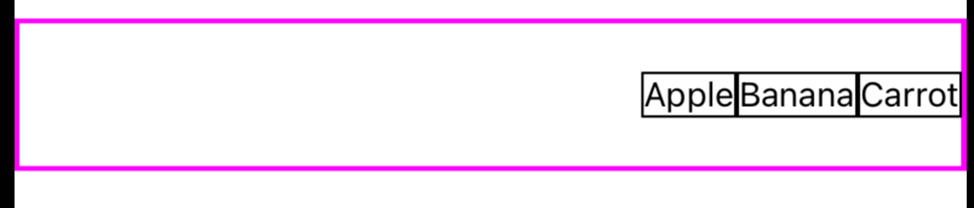

#### justifyContent for positioning AND spacing
NOTE:  The justify-content values for positioning CANNOT be combined with the justify-content values for spacing.


##### Example: This will NOT work
```js
export default function App() {
 return (   
   <View style={styles.container}>
       <View style={{flexDirection:"row",
                     borderWidth:2,
                     borderColor:"magenta",
                     width:"100%",
                     paddingVertical:20,
                     justifyContent:"flex-end"
  justifyContent:"space-around"}}>
         <Text style={{borderWidth:1}}>Apple</Text>        
         <Text style={{borderWidth:1}}>Banana</Text>        
         <Text style={{borderWidth:1}}>Carrot</Text>        
       </View>          
   </View>
 );
}
```
In this example, ReactNative will choose the last definition of justifyContent (justifyContent:space-around) and ignore flex-end.


 
## Practice #1: Combining gap and justify content

- Using justify-content and gap, create a menu that is centered & with space between each item
- For the menu items, use <Text> elements
- You only need 3-4 menu items


```js
export default function App() {
 return (   
   <View style={styles.container}>
       <View style={{flexDirection:"row",
                     borderWidth:2,
                     borderColor:"magenta",
                     width:"100%",
                     paddingVertical:20,
                     justifyContent:"center",
                     gap:30}}>
         <Text style={{borderWidth:1}}>Discover</Text>        
         <Text style={{borderWidth:1}}>Quests</Text>        
         <Text style={{borderWidth:1}}>Safety</Text>
         <Text style={{borderWidth:1}}>Support</Text>
       </View>          
   </View>
 );
}
```

## Practice #2: Using only justify-content

Using only justify-content, create this menu:

```js
export default function App() {
 return (   
   <View style={styles.container}>
       <View style={{flexDirection:"row",
                     borderWidth:2,
                     borderColor:"magenta",
                     width:"100%",
                     paddingVertical:20,
                     justifyContent:"space-evenly"}}>
         <Text style={{borderWidth:1}}>Discover</Text>        
         <Text style={{borderWidth:1}}>Quests</Text>        
         <Text style={{borderWidth:1}}>Safety</Text>
         <Text style={{borderWidth:1}}>Support</Text>
       </View>          
   </View>
 );
}
```

## What happens if `flexDirection:column`?

To visualize the gap and the justifycontent properties, you must ensure your flex container has a height

### Example:
```js
import { StyleSheet, Text, View } from 'react-native';

export default function App() {
 return (   
   <View style={styles.container}>
       <View style={{
                     borderWidth:2,
                     borderColor:"magenta",
                     width:"100%",
                     height:"50%",
                     paddingVertical:20,
                     flexDirection:"column",                         
                     }}>
         <Text style={{borderWidth:1}}>Discover</Text>        
         <Text style={{borderWidth:1}}>Quests</Text>        
         <Text style={{borderWidth:1}}>Safety</Text>         
       </View>         
   </View>
 );
}

const styles = StyleSheet.create({
 container: {
   flex: 1,
   flexDirection:"column",
   backgroundColor: '#fff',
   alignItems: 'center',
   justifyContent: 'center',   
 }, 
});
```
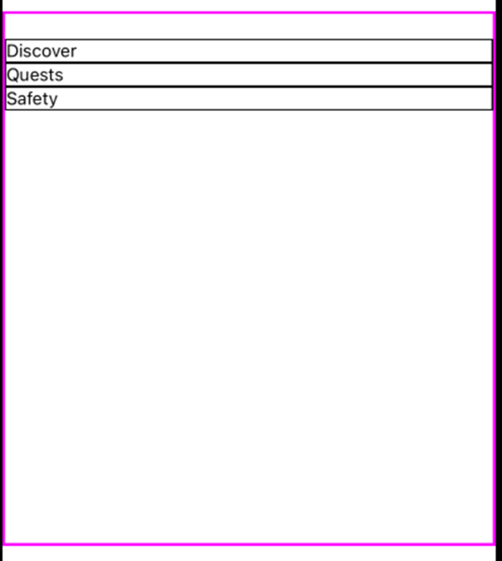

### Gap
```js
<View style={styles.container}>
       <View style={{
                     borderWidth:2,
                     borderColor:"magenta",
                     width:"100%",
                     height:"50%",
                     paddingHorizontal:20,
                     flexDirection:"column",
                     gap:100,                                              
                     }}>
         <Text style={{borderWidth:1}}>Discover</Text>        
         <Text style={{borderWidth:1}}>Quests</Text>        
         <Text style={{borderWidth:1}}>Safety</Text>         
       </View>         
   </View>
```


### justify content + column

flex-start:		top of the container
flex-end:		bottom of the container
center:		middle of the container

```js
<View style={styles.container}>
       <View style={{
                     borderWidth:2,
                     borderColor:"magenta",
                     width:"100%",
                     height:"50%",
                     paddingHorizontal:20,
                     flexDirection:"column",
                     justifyContent:"flex-end"                                          
                     }}>
         <Text style={{borderWidth:1}}>Discover</Text>        
         <Text style={{borderWidth:1}}>Quests</Text>        
         <Text style={{borderWidth:1}}>Safety</Text>         
       </View>         
   </View>
```


### justify-content for spacing + column

space-between
space-evenly
space-around
```js
import { StyleSheet, Text, View } from 'react-native';

export default function App() {
 return (   
   <View style={styles.container}>
       <View style={{
                     borderWidth:2,
                     borderColor:"magenta",
                     width:"100%",
                     height:"50%",
                     paddingHorizontal:20,
                     flexDirection:"column",
                     justifyContent:"space-around"
                     }}>
         <Text style={{borderWidth:1}}>Discover</Text>        
         <Text style={{borderWidth:1}}>Quests</Text>     
         <Text style={{borderWidth:1}}>Quests</Text>        
         <Text style={{borderWidth:1}}>Safety</Text>         
       </View>         
   </View>
 );
}

const styles = StyleSheet.create({
 container: {
   flex: 1,
   flexDirection:"column",
   backgroundColor: '#fff',
   alignItems: 'center',
   justifyContent: 'center',   
   borderWidth:10,
   borderColor:"orange",
 }, 
});
```
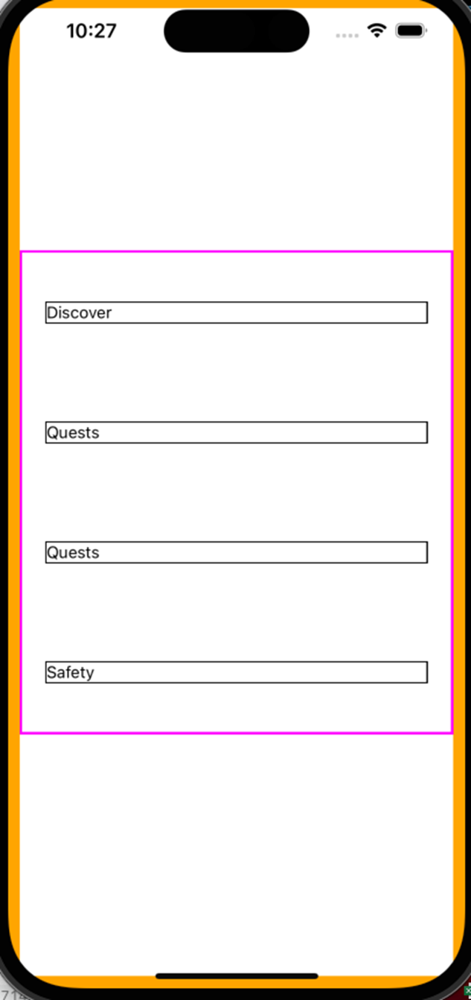

Which property controls the height of the parent container (orange box)?

The flex:1 property is used to automatically calculate the amount of space the element will occupy on the screen

Direction = column, space = height (flex:1 controls the height of the that element)
Direction = row, space = width (flex:1 controls the width of the element)

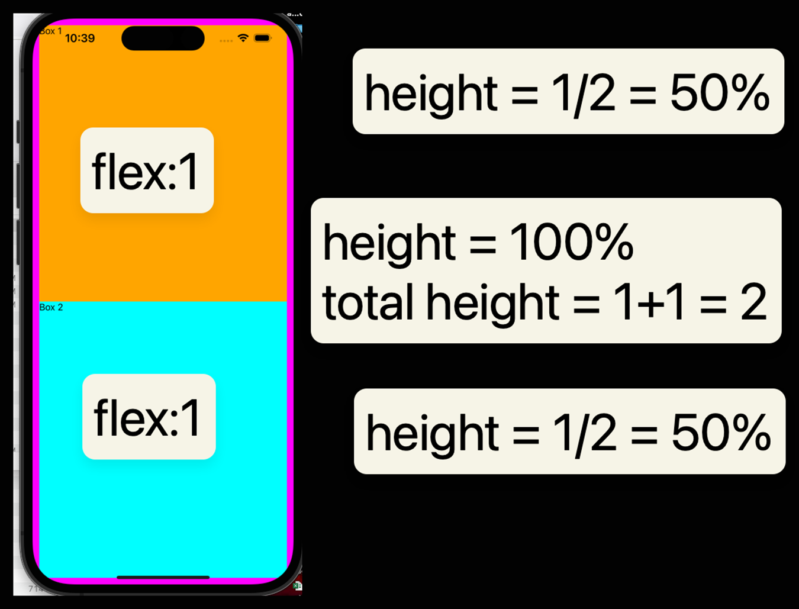


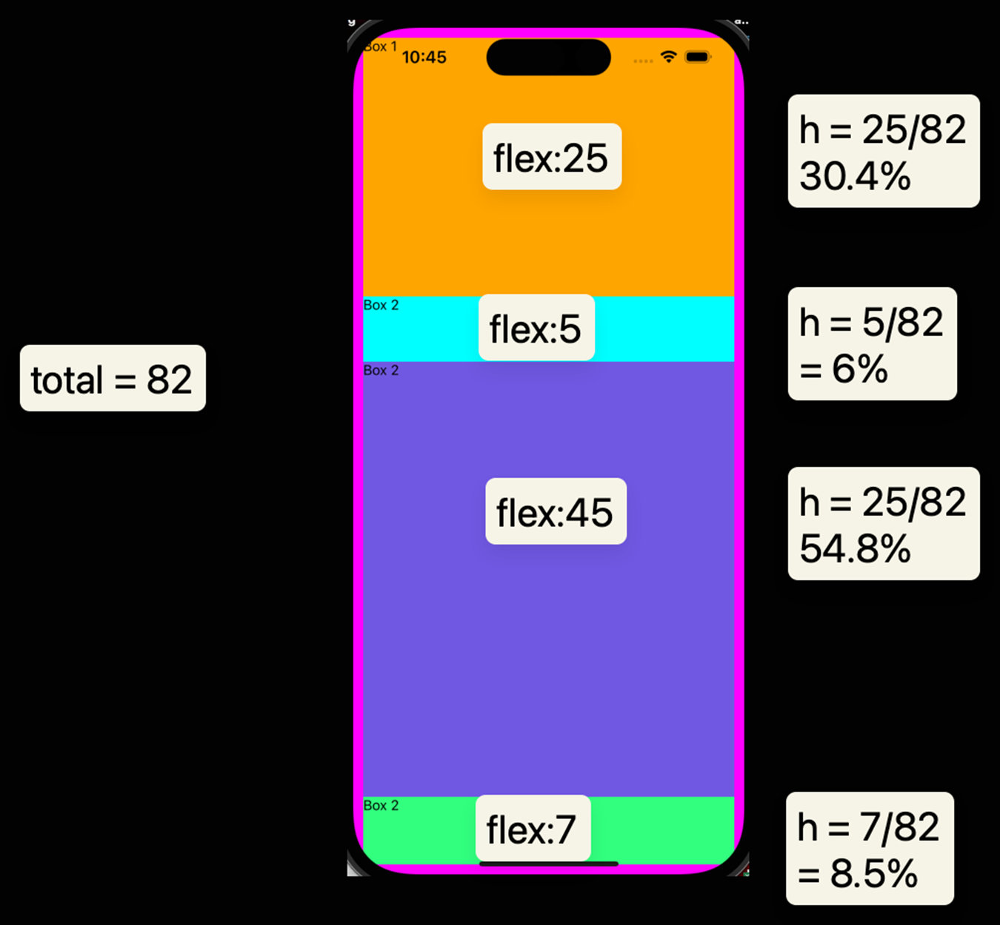

#### Final Code:
```js
import { StyleSheet, Text, View } from 'react-native';

export default function App() {
 return (   
   <View style={styles.container}>
       <View style={{backgroundColor:"orange", width:"100%", flex:25}}>
         <Text>Box 1</Text>
       </View>
       <View style={{backgroundColor:"cyan", width:"100%", flex:5}}>
         <Text>Box 2</Text>
       </View>
       <View style={{backgroundColor:"#7158e2", width:"100%", flex:45}}>
         <Text>Box 2</Text>
       </View> 
       <View style={{backgroundColor:"#32ff7e", width:"100%", flex:7}}>
         <Text>Box 2</Text>
       </View> 
   </View>
 );
}

const styles = StyleSheet.create({
 container: {
 
   flexDirection:"column",
   backgroundColor: '#fff',
   alignItems: 'center',
   justifyContent: 'center',   
   borderWidth:10,
   borderColor:"magenta",
   height:500,
   height:"100%",   
   flex:1   
 }, 
});
```

