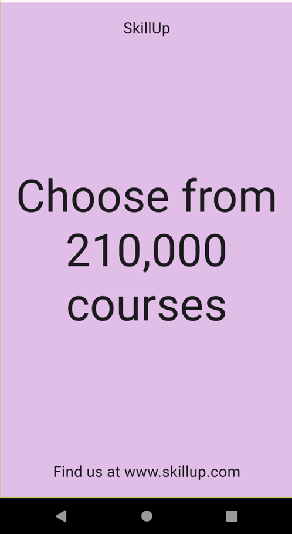
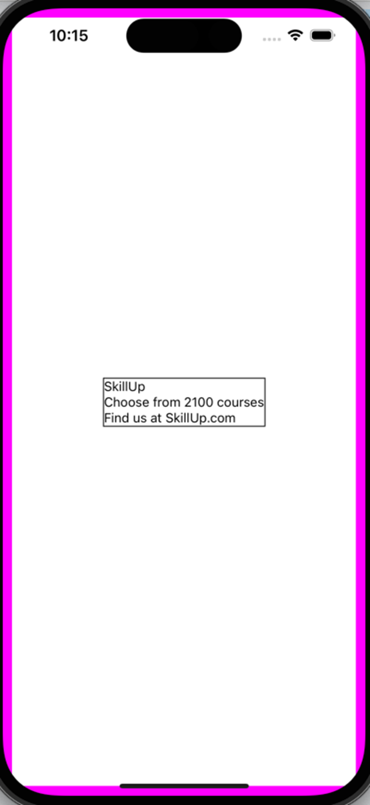
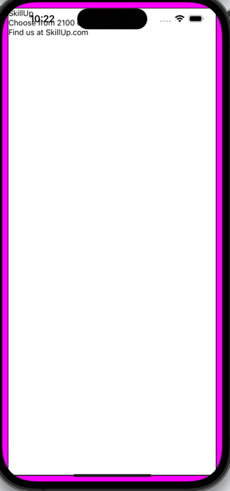
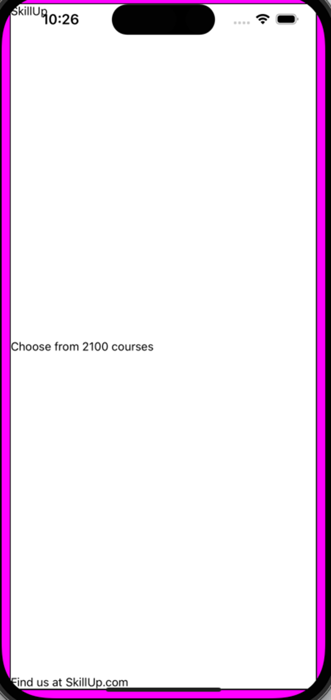
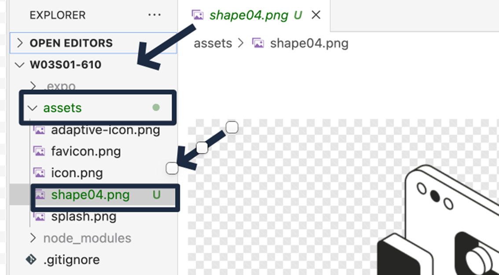

# BTP610: Layout Exercises

## Starter Code:

```js
import { StyleSheet, Text, View } from 'react-native';

export default function App() {
 return (
   <View style={styles.container}>
     <Text>Open up App.js to start working on your app!</Text>
   </View>
 );
}

const styles = StyleSheet.create({
 container: {
   marginTop:60,
   marginHorizontal:10,
   borderWidth:1,
   borderColor:"blue",
 },
});
```

### Review:
1.	Find the elements that you want to arrange in a row or column
2.	Surround the elements in a container element (example: <View>)
3.	On the container element (`<View>`), apply the flexbox properties:
	- flexDirection: row | column
	- justify-content: flex-start | flex-end | center | space-between | space-around | space-evenly
	- align-items: center
	- gap:25

## Exercise 1: Colored Boxes

Create a row with 3 boxes 
- Label the boxes “One”, “Two”, and “Three”
- Each box is is 50 width and 50 height
- Each box has a different background color 
- Around each box, apply a margin of 8
- Position the boxes at the end of the row.


### Solution:

1. Create the boxes

Choose colors from here: https://flatuicolors.com/

2. Update the layout of the boxes
 
## Exercise 2: Three Rows of Colored Boxes

Create 3 rows.

- Each row should have 3 boxes as described in the previous exercise.
- Each row should have a different main axis alignment (justify-content)


### Solution:
```js
import { StyleSheet, Text, View } from 'react-native';


export default function App() {
return (
  <View style={styles.container}>    
     <View style={{flexDirection:"row", justifyContent:"flex-end", borderWidth:1, marginVertical:10}}>       
       <Text style={{backgroundColor:"#12CBC4", height:50, width:50, fontSize:20, margin:8}}>One</Text>
       <Text style={{backgroundColor:"#D980FA", height:50, width:50, fontSize:20, margin:8}}>Two</Text>
       <Text style={{backgroundColor:"#F79F1F", height:50, width:50, fontSize:20, margin:8}}>Three</Text>     
     </View>
     <View style={{flexDirection:"row", justifyContent:"center", borderWidth:1, marginVertical:10}}>
       <Text style={{backgroundColor:"#12CBC4", height:50, width:50, fontSize:20, margin:8}}>One</Text>
       <Text style={{backgroundColor:"#D980FA", height:50, width:50, fontSize:20, margin:8}}>Two</Text>
       <Text style={{backgroundColor:"#F79F1F", height:50, width:50, fontSize:20, margin:8}}>Three</Text>     
     </View>
     <View style={{flexDirection:"row", justifyContent:"flex-start", borderWidth:1, marginVertical:10}}>
       <Text style={{backgroundColor:"#12CBC4", height:50, width:50, fontSize:20, margin:8}}>One</Text>
       <Text style={{backgroundColor:"#D980FA", height:50, width:50, fontSize:20, margin:8}}>Two</Text>
       <Text style={{backgroundColor:"#F79F1F", height:50, width:50, fontSize:20, margin:8}}>Three</Text>     
     </View>
  </View>
);
}


const styles = StyleSheet.create({
container: {
  marginTop:60,
  marginHorizontal:10,
  borderWidth:1,
  borderColor:"blue",
},
});
```

### Creating a reusable style for the blue box (box#1 in each row)
```js
import { StyleSheet, Text, View } from 'react-native';


export default function App() {
return (
  <View style={styles.container}>    
     <View style={{flexDirection:"row", justifyContent:"flex-end", borderWidth:1, marginVertical:10}}>       
       <Text style={styles.blueBox}>One</Text>
       <Text style={{backgroundColor:"#D980FA", height:50, width:50, fontSize:20, margin:8}}>Two</Text>
       <Text style={{backgroundColor:"#F79F1F", height:50, width:50, fontSize:20, margin:8}}>Three</Text>     
     </View>
     <View style={{flexDirection:"row", justifyContent:"center", borderWidth:1, marginVertical:10}}>
       <Text style={styles.blueBox}>One</Text>
       <Text style={{backgroundColor:"#D980FA", height:50, width:50, fontSize:20, margin:8}}>Two</Text>
       <Text style={{backgroundColor:"#F79F1F", height:50, width:50, fontSize:20, margin:8}}>Three</Text>     
     </View>
     <View style={{flexDirection:"row", justifyContent:"flex-start", borderWidth:1, marginVertical:10}}>
       <Text style={styles.blueBox}>One</Text>
       <Text style={{backgroundColor:"#D980FA", height:50, width:50, fontSize:20, margin:8}}>Two</Text>
       <Text style={{backgroundColor:"#F79F1F", height:50, width:50, fontSize:20, margin:8}}>Three</Text>     
     </View>
  </View>
);
}


const styles = StyleSheet.create({
container: {
  marginTop:60,
  marginHorizontal:10,
  borderWidth:1,
  borderColor:"blue",
},
blueBox: {
 backgroundColor:"#0a3d62",
 height:50,
 width:50,
 fontSize:20,
 margin:8
}
});

```
### Combining reusable and inline styles

```js
import { StyleSheet, Text, View } from 'react-native';

export default function App() {
return (
  <View style={styles.container}>    
     <View style={[styles.myRow, {justifyContent:"flex-end"}]}>       
       <Text style={styles.blueBox}>One</Text>
       <Text style={{backgroundColor:"#D980FA", height:50, width:50, fontSize:20, margin:8}}>Two</Text>
       <Text style={{backgroundColor:"#F79F1F", height:50, width:50, fontSize:20, margin:8}}>Three</Text>     
     </View>
    
     <View style={[styles.myRow, {justifyContent:"center"}]}>             
       <Text style={styles.blueBox}>One</Text>
       <Text style={{backgroundColor:"#D980FA", height:50, width:50, fontSize:20, margin:8}}>Two</Text>
       <Text style={{backgroundColor:"#F79F1F", height:50, width:50, fontSize:20, margin:8}}>Three</Text>     
     </View>
    
     <View style={[styles.myRow, {justifyContent:"flex-start"}]}>
       <Text style={styles.blueBox}>One</Text>
       <Text style={{backgroundColor:"#D980FA", height:50, width:50, fontSize:20, margin:8}}>Two</Text>
       <Text style={{backgroundColor:"#F79F1F", height:50, width:50, fontSize:20, margin:8}}>Three</Text>     
     </View>
  </View>
);
}


const styles = StyleSheet.create({
container: {
  marginTop:60,
  marginHorizontal:10,
  borderWidth:1,
  borderColor:"blue",
},
blueBox: {
 backgroundColor:"#0a3d62",
 height:50,
 width:50,
 fontSize:20,
 margin:8
},
myRow: {
 flexDirection:"row",
 borderWidth:1,
 marginVertical:10
}

});
```
### Example 2: 
```js
import { StyleSheet, Text, View } from 'react-native';

export default function App() {
return (
  <View style={styles.container}>    
     <View style={[styles.myRow, {justifyContent:"flex-end"}]}>       
       <Text style={styles.blueBox}>One</Text>
       <Text style={[styles.box, {backgroundColor:"#D980FA"}]}>Two</Text>     
       <Text style={[styles.box, {backgroundColor:"#F79F1F"}]}>Three</Text>     
     </View>
    
     <View style={[styles.myRow, {justifyContent:"center"}]}>             
       <Text style={styles.blueBox}>One</Text>
       <Text style={[styles.box, {backgroundColor:"#D980FA"}]}>Two</Text>  
       <Text style={[styles.box, {backgroundColor:"#F79F1F"}]}>Three</Text>     
     </View>
    
     <View style={[styles.myRow, {justifyContent:"flex-start"}]}>
       <Text style={styles.blueBox}>One</Text>
       <Text style={[styles.box, {backgroundColor:"#D980FA"}]}>Two</Text>  
       <Text style={[styles.box, {backgroundColor:"#F79F1F"}]}>Three</Text>     
     </View>
  </View>
);
}


const styles = StyleSheet.create({
container: {
  marginTop:60,
  marginHorizontal:10,
  borderWidth:1,
  borderColor:"blue",
},
blueBox: {
 backgroundColor:"#0a3d62",
 height:50,
 width:50,
 fontSize:20,
 margin:8
},
myRow: {
 flexDirection:"row",
 borderWidth:1,
 marginVertical:10
},
box: {
 height:50,
 width:50,
 fontSize:20,
 margin:8
}

});
```
## Exercise 3: Skillup

Create an “About Us” page for an education app.  

The screen contains a column with:
- The name of the app 		(Skillup)
- Description of the app		(Choose from 210,000 courses)
- App Website			(Find us at www.skillup.com)

The Column has padding on all sides.


Credit: https://dribbble.com/shots/24507418-Skills-Up-branding


1. Create the elements and add some borders so you can see where the containers are:

```js
import { StatusBar } from 'expo-status-bar';
import { StyleSheet, Text, View } from 'react-native';

export default function App() {
 return (
   <View style={styles.container}>
     <View style={{borderWidth:1}}>
       <Text>SkillUp</Text>
       <Text>Choose from 2100 courses</Text>
       <Text>Find us at SkillUp.com</Text>
     </View>
   </View>
 );
}

const styles = StyleSheet.create({
 container: {
   flex: 1,
   backgroundColor: '#fff',
   alignItems: 'center',
   justifyContent: 'center',
   borderWidth:10,
   borderColor:"magenta",
 },
});
```



2. Delete the justifycontent and alignitems properties form teh .container, because they are not helping us:

```js
import { StatusBar } from 'expo-status-bar';
import { StyleSheet, Text, View } from 'react-native';

export default function App() {
 return (
   <View style={styles.container}>
     <View style={{borderWidth:1, height:"100%"}}>
       <Text>SkillUp</Text>
       <Text>Choose from 2100 courses</Text>
       <Text>Find us at SkillUp.com</Text>
     </View>
   </View>
 );
}

const styles = StyleSheet.create({
 container: {
   flex: 1,
   backgroundColor: '#fff',
   borderWidth:10,
   borderColor:"magenta", 
 },
});
```



3. Create the space between each element

After much trial and error, we concluded that on an iPhone15, the gap of 385 looks correct:
- It may not look the same on other phones
- If you change the text size, the gap will change as well

You will encounter similar issues if you use marginVertical on the #2 <Text>
```js
import { StatusBar } from 'expo-status-bar';
import { StyleSheet, Text, View } from 'react-native';

export default function App() {
 return (
   <View style={styles.container}>
     <View style={{borderWidth:1, height:"100%", gap:385}}>
       <Text>SkillUp</Text>
       <Text>Choose from 2100 courses</Text>
       <Text>Find us at SkillUp.com</Text>
     </View>
   </View>
 );
}

const styles = StyleSheet.create({
 container: {
   flex: 1,
   backgroundColor: '#fff',
   borderWidth:10,
   borderColor:"magenta", 
 },
});
```
 
**Redo with justify content**
```js
import { StatusBar } from 'expo-status-bar';
import { StyleSheet, Text, View } from 'react-native';

export default function App() {
 return (
   <View style={styles.container}>
     <View style={{borderWidth:1, height:"100%", justifyContent:"space-between"}}>
       <Text>SkillUp</Text>
       <Text>Choose from 2100 courses</Text>
       <Text>Find us at SkillUp.com</Text>
     </View>
   </View>
 );
}

const styles = StyleSheet.create({
 container: {
   flex: 1,
   backgroundColor: '#fff',
   borderWidth:10,
   borderColor:"magenta", 
 },
});
```



**Padding around the entire container**
```js
import { StatusBar } from 'expo-status-bar';
import { StyleSheet, Text, View } from 'react-native';

export default function App() {
 return (
   <View style={styles.container}>
     <View style={{borderWidth:1, height:"100%", justifyContent:"space-between"}}>
       <Text>SkillUp</Text>
       <Text>Choose from 2100 courses</Text>
       <Text>Find us at SkillUp.com</Text>
     </View>
   </View>
 );
}

const styles = StyleSheet.create({
 container: {
   flex: 1,
   backgroundColor: "#fff",
   borderWidth:10,
   borderColor:"magenta",
   padding:20,
 },
});
```

**Apply a text size and background color**
```js
import { StatusBar } from 'expo-status-bar';
import { StyleSheet, Text, View } from 'react-native';

export default function App() {
 return (
   <View style={styles.container}>
     <View style={{borderWidth:1, height:"100%", justifyContent:"space-between"}}>
       <Text style={{fontSize:28, textAlign:"center"}}>SkillUp</Text>
       <Text style={{fontSize:60, textAlign:"center"}}>Choose from 2100 courses</Text>
       <Text style={{fontSize:28, textAlign:"center"}}>Find us at SkillUp.com</Text>
     </View>
   </View>
 );
}

const styles = StyleSheet.create({
 container: {
   flex: 1,
   backgroundColor: "#D6A2E8",
   borderWidth:10,
   borderColor:"magenta",
   padding:20,
 },
});
```


## Exercise

**What is the code to produce this layout?**

- For the outside <View>:		
    - justify-content:”center”;
- For the yellow <View>:
    - flexDirection:”row”
    - justify-content:”flex-end”


## Exercise 4:   Welcome Screen

Create a Welcome screen for a mobile application:


The screen must display a column containing:
- A image file 		(choose any image that is local on your computer)
- A “Welcome” text
- A welcome message

All elements must be centered on the screen. You must use justifyContent and/or alignItems to center the items.

### Solution:
1. Put the images in the assets folder:

2. Write the code:

```js 
import { StyleSheet, Text, View, Image} from 'react-native';

export default function App() {
 return (
   <View style={[styles.container, {justifyContent:"center", alignItems:"center", gap:10}]}>
     <Image
       source={require("./assets/shape01.png")}
       style={{width:200, height:200, borderWidth:1}}
     />
     <Text style={{borderWidth:1, fontSize:40, fontWeight:"bold"}}>Welcome</Text>
     <Text style={{borderWidth:1, fontSize:20, fontStyle:"italic"}}>We are so glad you are here</Text>
   </View>
 );
}

const styles = StyleSheet.create({
 container: {
   flex: 1,
   backgroundColor: "#fff200",
   borderWidth:10,
   borderColor:"magenta",    
   marginTop:60,
 },
 centered: {
   // textAlign:"center"
 }
});
```

## Exercise 5: Game Box

Create a screen that displays information about a game

The screen must show:
- Game Image
- Category (action, adventure, sports, etc)
- Game name 	

Enclose the game information in a container that has:
- A black border
- Padding 
- White background 

Here is a sample image:
https://www.cbc.ca/kids/images/bouncing_ball_v2_thumb_1050.jpg

	 
## Exercise 6: Google Search Page Header

Create a screen that mimics the homepage of the Google search app:
The screen contains 2 rows.

Row 1 shows:
- Text labeled “Gmail”
- Text labeled “Images”
- Image for the “apps”
- Text containing the initials of a person’s name. In the example below, the person’s initials are “KP”
    - The Text should be styled a a circle with a background color
	
Row 2 shows:
- A Google “doodle” image: https://www.google.com/logos/doodles/2023/2023-womens-world-cup-opening-day-6753651837110060-2xa.gif


Icons come form here:
https://icons.expo.fyi/Index


### Solution

1.	Put elements on the car
```js
import { StyleSheet, Text, View, Image} from 'react-native';

export default function App() {
 return (
   <View style={[styles.container]}>
     <View>
       <Text>Gmail</Text>
       <Text>Images</Text>
       <Text>Dots</Text>
       <Text>KP</Text>
     </View>
     <Image
       source={{uri:"https://www.google.com/logos/doodles/2023/2023-womens-world-cup-opening-day-6753651837110060-2xa.gif"}}
       style={{height:100, width:100}} 
     />
   </View>
 );
}

const styles = StyleSheet.create({
 container: {
   flex: 1,   
   borderWidth:10,
   borderColor:"magenta",    
   marginTop:60,
 },
 centered: {
   // textAlign:"center"
 }
});
```

2. Put in an icon

```js
import { StyleSheet, Text, View, Image} from 'react-native';
import AntDesign from '@expo/vector-icons/AntDesign';
import MaterialCommunityIcons from '@expo/vector-icons/MaterialCommunityIcons';

export default function App() {
 return (
   <View style={[styles.container]}>
     <AntDesign name="rightcircleo" size={24} color="black" style={{fontSize:50, color:"orange"}}/>
     <View style={{borderWidth:1, flexDirection:"row", justifyContent:"flex-end", gap:20}}>
       <Text>Gmail</Text>
       <Text>Images</Text>
       <MaterialCommunityIcons name="dots-grid" size={50} color="black" />
       <Text>KP</Text>
     </View>
     <Image
       source={{uri:"https://www.google.com/logos/doodles/2023/2023-womens-world-cup-opening-day-6753651837110060-2xa.gif"}}
       style={{height:100, width:100}} 
     />
   </View>
 );
}

const styles = StyleSheet.create({
 container: {
   flex: 1,   
   borderWidth:10,
   borderColor:"magenta",    
   marginTop:60,
 },
 centered: {
   // textAlign:"center"
 }
});
```
3. Final styling for the top bar:
```js
import { StyleSheet, Text, View, Image} from 'react-native';
import AntDesign from '@expo/vector-icons/AntDesign';
import MaterialCommunityIcons from '@expo/vector-icons/MaterialCommunityIcons';

export default function App() {
 return (
   <View style={[styles.container]}>
     <AntDesign name="rightcircleo" size={24} color="black" style={{fontSize:50, color:"orange"}}/>
     <View style={{borderWidth:3, borderColor:"blue", flexDirection:"row", gap:20,
       justifyContent:"flex-end",      // left, middle, right
       alignItems:"flex-start", // top
       alignItems:"flex-end",    // bottom
       alignItems:"center",    //center       
       }}>
       <Text style={{borderWidth:1}}>Gmail</Text>       
       <MaterialCommunityIcons name="dots-grid" size={50} color="black" style={{borderWidth:1}} />
       <View style={{borderWidth:1, height:50, width:50, borderRadius:25, justifyContent:"center", alignItems:"center", backgroundColor:"#18dcff"}}>
         <Text style={{borderWidth:1}}>KP</Text>       
       </View>
     </View>
     <Image
       source={{uri:"https://www.google.com/logos/doodles/2023/2023-womens-world-cup-opening-day-6753651837110060-2xa.gif"}}
       style={{height:100, width:100}} 
     />
   </View>
 );
}

const styles = StyleSheet.create({
 container: {
   flex: 1,   
   borderWidth:10,

   marginTop:60,
 },
 centered: {
   // textAlign:"center"
 }
});
```


