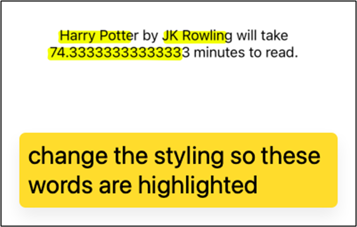

#BTP610; Wk4: User Input and Output

## What is User Interactivity?

Mobile apps are interactive. This means that users can perform actions in the application and the app will respond. The goal of interactivity is to create an experience where users can easily navigate, make choices, and get the results they expect.

Here are examples of interactivity in an app:

### Buttons on a form

You are presented with a login form. The interactivity occurs when you enter your login details and press the “Login” button. When the button is pressed, the app will respond by validating your login details. If correct, then the app will navigate you to the next screen. Otherwise, the screen updates to show an error message.


### Sliding Controls on a Smartphone:
Interactivity occurs when you adjust the brightness on your smartphone by moving a slider back and forth. Your action (sliding) causes the phone to change the screen's brightness level.


### Website links or buttons.

You can interact with a website’s navigation links by clicking on a link or button.  When you click, the website responds by taking you to the appropriate section of the website or app.


### Video Player Controls:

When you're watching a video online and you can pause, play, rewind, or adjust the volume using the on-screen controls, this is another form of user interactivity. The video player responds immediately to your inputs.


## Implementing Interactivity in a Mobile App

In a mobile app, interactivity is implemented by creating a user interface that responds to user actions, such as taps, swipes, or text input.  Common responses to user actions include:
- Displaying a new message on the screen
- Refreshing the contents of the screen 
- Navigating the user to another screen
- Performing a calculation and displaying the result

React Native uses state variables to create interactivity.


### What is a State Variable?

In React Native, a state variable is a special type of variable that is used to manage user interactivity.

State variables are responsible for:
1. Managing State
State variables maintain a state object that holds information that can change during the lifetime of the widget. This is essential for tracking user input and other dynamic changes.
2. Rebuilding the UI
When the value of a state variable changes, React Native will automatically refresh the user interface. This ensures that the user interface always consistent with the underlying data.
3. Handling User Input or output messages to screen
State variables can capture user input and make the data available to the application for processing.


 
### Creating a State Variable

State variables need to be created

State variables need to be assigned an initial value

To create a state variable:

1. Import the `useState()` function

This function is used to create state variables.

`import {useState} from "react"`


2. Use the useState() variable to create the state variable

This code creates a state variable called “x”, and a state update function called setX()
`const [x, setX] = useState()`

A state variable consists of two parts:
a.	The state variable			→	Stores the variable’s value (access the variable’s value)
b.	The state update function	→ 	Function used to update the value of the state variable

3. Use the state variable in your logic

Common uses of state variables include:
- Used to output messages to the screen
- Used to capture user input


#### Example:
```js
import { StyleSheet, Text, View, Button } from 'react-native';
import {useState} from "react"

export default function App() {

 // declare your state variables here
 // create a state variable that is
 // initially set to a string
 // create a string state variable
 const [x, setX] = useState("abcdefgh")
 // setY = is a function
 // you can call the function anything you want
 const [y, setY] = useState(3.14159)
 // const [abcdef, setAbcdef] = useState()
 const [z, setZ] = useState(true)

 // create an array state variable
 // (state variable that is initialzed to an array)
 const [a, setA] = useState(["Apple","Banana"])

 // object literals (objects)
 const [b, setB] = useState(
   {model:"Tesla Model X", licensePlate:"ABDF253"}
 )

 console.log(b)
 console.log(b.model)
 console.log(b.licensePlate)


 // click handler for the button
 const buttonPressed = () => {
   console.log("Hello") 
   // one of teh properites of state variables is that you can't directly update it 
   // x = 5   // ERROR:
   // react native will provide you with a different method to update that variable
   // (because as we can see , using the = sign doesn't work)

   // instead, use the state update function
   setX(999)     //  equivalent of doing x = 999
                 // setX also will refresh the screen
   console.log(x)
 }

 return (
   <View style={styles.container}>
     <Text style={styles.heading}>User Input and Output</Text>
     <Text style={styles.text}>Press the button to see output:</Text>
     <Button onPress={buttonPressed} title="Click Me!"/>          
     <Text style={styles.text}></Text>
   </View>
 );
}

const styles = StyleSheet.create({
 container: {
   flex: 1,
   backgroundColor: '#fff',
   marginTop:60,   
 },
 heading: {
   fontSize:20, 
   marginVertical:8, 
   textAlign:"center",
 },
 text: {
   fontSize:16,
   marginVertical:8,
   textAlign:"center"
 }
});
```

#### Starter Code:
```js

import { StyleSheet, Text, View, Button } from 'react-native';

export default function App() {

 // click handler for the button
 const buttonPressed = () => {
   console.log("Hello")   
 }


 return (
   <View style={styles.container}>
     <Text style={styles.heading}>User Input and Output</Text>
     <Text style={styles.text}>Press the button to see output:</Text>
     <Button onPress={buttonPressed} title="Click Me!"/>          
     <Text style={styles.text}></Text>
   </View>
 );
}

const styles = StyleSheet.create({
 container: {
   flex: 1,
   backgroundColor: '#fff',
   marginTop:60,   
 },
 heading: {
   fontSize:20, 
   marginVertical:8, 
   textAlign:"center",
 },
 text: {
   fontSize:16,
   marginVertical:8,
   textAlign:"center"
 }
});
```


#### Native button:
```js
import { StyleSheet, Text, View, Button } from 'react-native';

export default function App() {

// click handler for the button
const buttonPressed = () => {
  console.log("Hello")  
}

return (
  <View style={styles.container}>
    <Text style={styles.heading}>User Input and Output</Text>
    <Text style={styles.text}>Press the button to see output:</Text>
    <Button
     onPress={buttonPressed}
     title="Click Me!"
     style={{backgroundColor:"yellow", fontSize:20, borderWidth:5}}/>         
    <Text style={styles.text}></Text>
  </View>
);
}


const styles = StyleSheet.create({
container: {
  flex: 1,
  backgroundColor: '#fff',
  marginTop:60,  
},
heading: {
  fontSize:20,
  marginVertical:8,
  textAlign:"center",
},
text: {
  fontSize:16,
  marginVertical:8,
  textAlign:"center"
}
});

```
### Styled Button

1. Basic code to create a pressable (style dbutton)
```js
import { StyleSheet, Text, View, Button, Pressable } from 'react-native';
export default function App() {

// click handler for the button
const buttonPressed = () => {
  console.log("Hello")  
}

const buttonPressed2 = () => {
 alert("Clicked!")
}

return (
  <View style={styles.container}>
    <Text style={styles.heading}>User Input and Output</Text>
    <Text style={styles.text}>Press the button to see output:</Text>
    <Button
     onPress={buttonPressed}
     title="Click Me!"
     style={{backgroundColor:"yellow", fontSize:20, borderWidth:5}}/>         
   
   <Pressable
     onPress={buttonPressed2}
     style={{borderWidth:1}}>
     <Text style={{backgroundColor:"yellow"}}>sdfsdfs</Text>
   </Pressable>
   
   
    <Text style={styles.text}></Text>

  </View>
);
}


const styles = StyleSheet.create({
container: {
  flex: 1,
  backgroundColor: '#fff',
  marginTop:60,  
},
heading: {
  fontSize:20,
  marginVertical:8,
  textAlign:"center",
},
text: {
  fontSize:16,
  marginVertical:8,
  textAlign:"center"
}
});
```
 
### Final code styled:
```js
import { StyleSheet, Text, View, Button, Pressable } from 'react-native';
export default function App() {

// click handler for the button
const buttonPressed = () => {
  console.log("Hello")  
}

const buttonPressed2 = () => {
 alert("Clicked!")
}

return (
  <View style={styles.container}>
    <Text style={styles.heading}>User Input and Output</Text>
    <Text style={styles.text}>Press the button to see output:</Text>
    <Button
     onPress={buttonPressed}
     title="Click Me!"
     style={{backgroundColor:"yellow", fontSize:20, borderWidth:5}}/>         
   
   <Pressable
     onPress={buttonPressed2}
     style={styles.btn}>
     <Text style={styles.btnText}>sdfsdfs</Text>
   </Pressable>
   
    <Text style={styles.text}></Text>
  </View>
);
}


const styles = StyleSheet.create({
 btn: {
   width:200,
   backgroundColor:"#2c3e50",
   paddingVertical:10,   
   borderWidth:1,
   borderRadius:5   
 },
 btnText: {
   fontSize:20,  
   color:"white",
   textAlign:"center",
 },
container: {
  flex: 1,
  backgroundColor: '#fff',
  marginTop:60,  
},
heading: {
  fontSize:20,
  marginVertical:8,
  textAlign:"center",
},
text: {
  fontSize:16,
  marginVertical:8,
  textAlign:"center"
}
});
```
## How to output to the screen

1. You need a `<Text>`		→ text is going to display your message that you want to output to the screen
```js
<Text style={styles.text}></Text>
```

2. You need a state variable	→ state variable will store the message that should go in the <text>
```js
import {useState} from "react"

const [msg, setMsg] = useState("hello")
```

3. Attach the state variable to the `<Text>`
```js
<Text style={styles.text}>
     {msg}
</Text>
```

4. When the button is pressed, assign a value to the state variable
```js
// click handler for the button
const buttonPressed = () => {
  console.log("Hello")  

  // randomly generate a number, and output to the screen
  // 5 - 200
 const randomValue = Math.floor(Math.random() * (200 - 5 + 1) + 5);
 setMsg(`your lucky number is : ${randomValue}`)
}
```


## Exercise 2:  Output the reading rate

Create an app that calculates how long it will take the user to finish reading a book.

Provide a `<Button>` for the user to click
When the `<Button>` is pressed:
1.	Create a book object literal. Every book has a title, author, and number of pages.
2.	Based on the number of pages, calculate the time to finish reading a book. 
Assume a reading rate of 3 pages per minute.
3.	Display the book information and reading rate to the screen in a `<Text>` component

### Sample output:

- Ensure you style the keywords with a yellow background and a blue color

```text
Harry Potter by JK Rowling has 223 pages and will take an estimated 74.33333 minutes to complete.
```

### Possible Solution


1. Create the book literal
```js
const calculateReadingRate = () => {
   // 1. creating an object literal
   const book = {
     title:"Harry Potter",
     author:"JK Rowling",
     numPages:223
   }
   // 2. calculate the reading rate
   // 3 page per minute
   // num pages / page per minute = minuets
   const minutes = book.numPages / 3

   // 3. output
   setResult(`${book.title} by ${book.author} will take ${minutes} minutes to read.`)
}
```

Your Turn:



### Code:
```js
import { StyleSheet, Text, View, Button, Pressable } from 'react-native';
import {useState} from "react"

export default function App() {
 // create a state variable
 // variables need a name
 // variables need a initial value
 // const msg = "hello"
 const [msg, setMsg] = useState("hello")
 // the initial value of the state variable is "hello"
 // msg = the name of your state variable
 // setMsg = this a a FUNCTION provided by react that we use to update the value of the state variable

 // regular js
 // let msg = "hello"
 // msg = "world!"

 // react
 // const [msg, setMsg] = useState('hello')
 // setMsg("world!")

 /// msg = "world" // does not work


 // set the initial value to an empty string b/c i don't have anything
 // i want to output initially
 const [result, setResult] = useState("")

 // let result = ""
 // result = `${book.title} by ${book.author} will take ${minutes} minutes to read.`

// click handler for the button
const buttonPressed = () => {
  console.log("Hello")  

  // randomly generate a number, and output to the screen
  // 5 - 200
 const randomValue = Math.floor(Math.random() * (200 - 5 + 1) + 5);
 setMsg(`your lucky number is : ${randomValue}`)
}

const buttonPressed2 = () => {
 alert("Clicked!")
}

const calculateReadingRate = () => {
   // 1. creating an object literal
   const book = {
     title:"Harry Potter",
     author:"JK Rowling",
     numPages:223
   }
   // 2. calculate the reading rate
   // 3 page per minute
   // num pages / page per minute = minuets
   const minutes = book.numPages / 3

   // 3. output
   setResult(`${book.title} by ${book.author} will take ${minutes} minutes to read.`)
}

return (
  <View style={styles.container}>
    <Text style={styles.heading}>User Input and Output</Text>
    <Text style={styles.text}>Press the button to see output:</Text>
    <Button
     onPress={buttonPressed}
     title="Click Me!"
     style={{backgroundColor:"yellow", fontSize:20, borderWidth:5}}/>         
  
   <Text style={styles.text}>
     {msg}
   </Text>

   <Button
     onPress={calculateReadingRate}
     title="What is the reading rate?" />   

   <Text style={styles.text}>
     {result}
   </Text>


{/*
   <Pressable
     onPress={buttonPressed2}
     style={styles.btn}>
     <Text style={styles.btnText}>sdfsdfs</Text>
   </Pressable>
     */}

  </View>
);
}


const styles = StyleSheet.create({
 btn: {
   width:200,
   backgroundColor:"#2c3e50",
   paddingVertical:10,   
   borderWidth:1,
   borderRadius:5   
 },
 btnText: {
   fontSize:20,  
   color:"white",
   textAlign:"center",
 },
container: {
  flex: 1,
  backgroundColor: '#fff',
  marginTop:60,  
},
heading: {
  fontSize:20,
  marginVertical:8,
  textAlign:"center",
},
text: {
  fontSize:16,
  marginVertical:8,
  textAlign:"center"
}
});
```

## Getting Text Input From the User
```js
import { StyleSheet, Text, View, Button, Pressable, TextInput } from 'react-native';
import {useState} from "react"

const [nameFromUI, setNameFromUI] = useState("")

const nameInput = “peter”

{/* attached to a state variable */}
   <TextInput
     style={{borderWidth:1, marginHorizontal:20, paddingVertical:10,
       paddingHorizontal:8,fontSize:20}}
     value={nameInput} onChangeText={setNameFromUI}
     placeholder="Enter your name"
     keyboardType="numeric"
   />

```
### Why do you need to attach a state variable to a textbox?

1.	Detect when the user press a key on their keypad/keyboard into the textbox
```js
<TextInput
     style={{borderWidth:1, marginHorizontal:20, paddingVertical:10,
       paddingHorizontal:8,fontSize:20}}
     value={nameInput}
     onChangeText={
       ()=>{
         // when you detect a change, do something
         console.log("something changed")
       }
     }
     placeholder="Enter your name"
     keyboardType="numeric"
   />
```


2.	Save the new value somewhere
3.	Update the textbox to show the new value

### Making a Switch

```js
import { StyleSheet, Text, View, Button, Pressable, TextInput, Switch } from 'react-native';
```

1.	Detect when the person presses the switch 
```js
<Switch value={false} onValueChange={} />
```
2.	Update the value to be the opposite value
3.	And redraw the Switch so it looks different
```js
const [airplaneModeFromUI, setAirplaneModeFromUI] = useState(false)

<Switch value={airplaneModeFromUI} onValueChange={setAirplaneModeFromUI} />
```
4. Bonus, get the value from the switch:
```js
const buttonPressed3 = () => {
 alert(`Hello ${nameFromUI}. Airplane mode on? ${airplaneModeFromUI}`)
 // clear the textbox
 setNameFromUI("")
 // reset the switch to a default value after
 setAirplaneModeFromUI(false)
}
```

#### Full code:

```js
import { StyleSheet, Text, View, Button, Pressable, TextInput, Switch } from 'react-native';
import {useState} from "react"

export default function App() {
 // create a state variable
 // variables need a name
 // variables need a initial value
 // const msg = "hello"
 const [msg, setMsg] = useState("hello")
 // the initial value of the state variable is "hello"
 // msg = the name of your state variable
 // setMsg = this a a FUNCTION provided by react that we use to update the value of the state variable

 // regular js
 // let msg = "hello"
 // msg = "world!"

 // react
 // const [msg, setMsg] = useState('hello')
 // setMsg("world!")

 /// msg = "world" // does not work


 // set the initial value to an empty string b/c i don't have anything
 // i want to output initially
 const [result, setResult] = useState(<Text></Text>)

 const [titleForUI, setTitleForUI] = useState("")
 const [authorForUI, setAuthorForUI] = useState("")
 const [rateForUI, setRateForUI] = useState("")

 // let result = ""
 // result = `${book.title} by ${book.author} will take ${minutes} minutes to read.`

// click handler for the button
const buttonPressed = () => {
  console.log("Hello")  

  // randomly generate a number, and output to the screen
  // 5 - 200
 const randomValue = Math.floor(Math.random() * (200 - 5 + 1) + 5);
 setMsg(`your lucky number is : ${randomValue}`)
}

const buttonPressed2 = () => {
 alert("Clicked!")
}

const calculateReadingRate = () => {
   // 1. creating an object literal
   const book = {
     title:"Atomic Habits",
     author:"James Clear",
     numPages:500
   }
   // 2. calculate the reading rate
   // 3 page per minute
   // num pages / page per minute = minuets
   const minutes = book.numPages / 3

   // 3. output
   setResult(`${book.title} by ${book.author} will take ${minutes} minutes to read.`)

   setAuthorForUI(book.author)
   setTitleForUI(book.title)
   setRateForUI(`${minutes} min`)

   setResult(<>Hello World!</>)

   return(<Text>sdfsdf</Text>)
}

/*  state variable   
state variable update function (setter function) */
const [nameFromUI, setNameFromUI] = useState("abcd")
const [airplaneModeFromUI, setAirplaneModeFromUI] = useState(false)
const buttonPressed3 = () => {
 alert(`Hello ${nameFromUI}. Airplane mode on? ${airplaneModeFromUI}`)
 // clear the textbox
 setNameFromUI("")
 // reset the switch to a default value after
 setAirplaneModeFromUI(false)
}

return (
  <View style={styles.container}>
   {/* attached to a state variable */}
   <TextInput
     style={{borderWidth:1, marginHorizontal:20, paddingVertical:10,
       paddingHorizontal:8,fontSize:20}}
     value={nameFromUI}
     onChangeText={setNameFromUI}
     placeholder="Enter your name"
     keyboardType="numeric"

   />

   <Text>Turn airplane mode on?</Text>
   <Switch value={airplaneModeFromUI} onValueChange={setAirplaneModeFromUI} />
  


   <Button title="Get name!" onPress={buttonPressed3}/>

   <Text style={styles.heading}>User Input and Output</Text>
   <Text style={styles.text}>Press the button to see output:</Text>
   <Button
     onPress={buttonPressed}
     title="Click Me!"
     style={{backgroundColor:"yellow", fontSize:20, borderWidth:5}}
   />         
    <Text style={styles.text}>
     {msg}
   </Text>

   <Button
     onPress={calculateReadingRate}
     title="What is the reading rate?" />   

   <Text style={styles.text}>
     {result}
   </Text>

   <Text style={styles.text}>
     <Text style={{backgroundColor:"yellow"}}>{titleForUI}</Text> by <Text style={{backgroundColor:"yellow"}}>{authorForUI}</Text> will take <Text style={{backgroundColor:"yellow"}}>{rateForUI} min</Text> to read
   </Text>


   <Text>
     Hello world, <Text style={{backgroundColor:"yellow"}}>how</Text> are you?
   </Text>


  


{/*
   <Pressable
     onPress={buttonPressed2}
     style={styles.btn}>
     <Text style={styles.btnText}>sdfsdfs</Text>
   </Pressable>
     */}

  </View>
);
}

const styles = StyleSheet.create({
 btn: {
   width:200,
   backgroundColor:"#2c3e50",
   paddingVertical:10,   
   borderWidth:1,
   borderRadius:5   
 },
 btnText: {
   fontSize:20,  
   color:"white",
   textAlign:"center",
 },
container: {
  flex: 1,
  backgroundColor: '#fff',
  marginTop:60,  
},
heading: {
  fontSize:20,
  marginVertical:8,
  textAlign:"center",
},
text: {
  fontSize:16,
  marginVertical:8,
  textAlign:"center"
}
});
```

### Conditional Styling based on OS


https://stackoverflow.com/questions/51436886/how-to-use-platform-os-to-elements-in-react-native
```js
import { StyleSheet, Text, View, Button, Pressable, TextInput, Switch, Platform } from 'react-native';
import {useState} from "react"

export default function App() {
   const [nameFromUI, setNameFromUI] = useState("abcd")
   const [airplaneModeFromUI, setAirplaneModeFromUI] = useState(false)

   const buttonPressed3 = () => {

   }

   return(
     <View style={styles.container}>
       <TextInput
       style={{borderWidth:1, marginHorizontal:20, paddingVertical:10,
         paddingHorizontal:8,fontSize:20}}
       value={nameFromUI}
       onChangeText={setNameFromUI}
       placeholder="Enter your name"
       />
       <Text>Turn airplane mode on?</Text>
       <Switch value={airplaneModeFromUI} onValueChange={setAirplaneModeFromUI} />
       <Button title="Get name!" onPress={buttonPressed3}/>
     </View>
   )
}

// if the person is using ios,
// then put padding at the top of the screen to pus the content down

const styles = StyleSheet.create({
 container: {

 },
 btn: {
   width:200,
   backgroundColor:"#2c3e50",
   paddingVertical:10,   
   borderWidth:1,
   borderRadius:5   
 },
 btnText: {
   fontSize:20,  
   color:"white",
   textAlign:"center",
 },
heading: {
  fontSize:20,
  marginVertical:8,
  textAlign:"center",
},
text: {
  fontSize:16,
  marginVertical:8,
  textAlign:"center"
}
});
```

#### Code to show different background color depending on ios or android

```js
import { StyleSheet, Text, View, Button, Pressable, TextInput, Switch, Platform } from 'react-native';
import {useState} from "react"

export default function App() {
   const [nameFromUI, setNameFromUI] = useState("abcd")
   const [airplaneModeFromUI, setAirplaneModeFromUI] = useState(false)

   const buttonPressed3 = () => {

   }

   return(
     <View style={styles.container}>
       <TextInput
       style={{borderWidth:1, marginHorizontal:20, paddingVertical:10,
         paddingHorizontal:8,fontSize:20}}
       value={nameFromUI}
       onChangeText={setNameFromUI}
       placeholder="Enter your name"
       />
       <Text>Turn airplane mode on?</Text>
       <Switch value={airplaneModeFromUI} onValueChange={setAirplaneModeFromUI} />
       <Button title="Get name!" onPress={buttonPressed3}/>
     </View>
   )
}

// if the person is using ios,
// then put padding at the top of the screen to pus the content down

const styles = StyleSheet.create({
 container: {
   backgroundColor: (Platform.OS === "ios") ? "#FF00FF" : "#FFFF000",
 },
 btn: {
   width:200,
   backgroundColor:"#2c3e50",
   paddingVertical:10,   
   borderWidth:1,
   borderRadius:5   
 },
 btnText: {
   fontSize:20,  
   color:"white",
   textAlign:"center",
 },
heading: {
  fontSize:20,
  marginVertical:8,
  textAlign:"center",
},
text: {
  fontSize:16,
  marginVertical:8,
  textAlign:"center"
}
});
```

#### Programmatically setting the margin on the top of the device so it looks almost the same on ios and android
```js

import { StyleSheet, Text, View, Button, Pressable, TextInput, Switch, Platform } from 'react-native';
import {useState} from "react"

export default function App() {
   const [nameFromUI, setNameFromUI] = useState("abcd")
   const [airplaneModeFromUI, setAirplaneModeFromUI] = useState(false)

   const buttonPressed3 = () => {

   }

   return(
     <View style={styles.container}>
       <TextInput
       style={{borderWidth:1, marginHorizontal:20, paddingVertical:10,
         paddingHorizontal:8,fontSize:20}}
       value={nameFromUI}
       onChangeText={setNameFromUI}
       placeholder="Enter your name"
       />
       <Text>Turn airplane mode on?</Text>
       <Switch value={airplaneModeFromUI} onValueChange={setAirplaneModeFromUI} />
       <Button title="Get name!" onPress={buttonPressed3}/>
     </View>
   )
}

// if the person is using ios,
// then put padding at the top of the screen to pus the content down

const styles = StyleSheet.create({
 container: {
   backgroundColor: (Platform.OS === "ios") ? "#FF00FF" : "#FFFF000",
   marginTop: (Platform.OS === "android") ? 40 : 0,
 },
 btn: {
   width:200,
   backgroundColor:"#2c3e50",
   paddingVertical:10,   
   borderWidth:1,
   borderRadius:5   
 },
 btnText: {
   fontSize:20,  
   color:"white",
   textAlign:"center",
 },
heading: {
  fontSize:20,
  marginVertical:8,
  textAlign:"center",
},
text: {
  fontSize:16,
  marginVertical:8,
  textAlign:"center"
}
});
```

### Conditionally Rendering elements on the page
#### Example 1: Using the LOGICAL AND approach:

- The condition is true, so the <Text> WILL be shown
```js
{ (50 > 3) &&
<Text style={{backgroundColor:"yellow"}}>Here is some text!</Text>
}
```

- In this case, teh <Text> will NOT be shown because the condition is false
```js
{ (5 > 30000) &&
<Text style={{backgroundColor:"yellow"}}>Here is some text!</Text>
}
```

##### Example:  
**Person types something into the text box and presses button**
If they type in a number is larger than 20, then show the <text> element
Otherwise, show an alert that says a message:

```js
import { StyleSheet, Text, View, Button, Pressable, TextInput, Switch, Platform } from 'react-native';
import {useState} from "react"

export default function App() {
   const [nameFromUI, setNameFromUI] = useState("abcd")
   const [airplaneModeFromUI, setAirplaneModeFromUI] = useState(false)

   // state variable to control whether to show or hide that textbox
   const [showText, setShowText] = useState(false)

   const buttonPressed3 = () => {
     // 1. Get the value in the textbox
     console.log(nameFromUI)
     // 2. Convert the value to a number
     // (all values from textboxes are saved as STRINGS)
     const input = parseInt(nameFromUI)

     // 3. because we want to do math operations (>), compare numbers with numbers
     if (input > 20) {
       // show the textbox yellow
       setShowText(true)
     } else {
       alert("HELLO WORLD!")
       setShowText(false)
     }
    
   }

   return(
     <View style={styles.container}>
       <TextInput
       style={{borderWidth:1, marginHorizontal:20, paddingVertical:10,
         paddingHorizontal:8,fontSize:20}}
       value={nameFromUI}
       onChangeText={setNameFromUI}
       placeholder="Enter your name"
       />
       <Text>Turn airplane mode on?</Text>
       <Switch value={airplaneModeFromUI} onValueChange={setAirplaneModeFromUI} />
       <Button title="Get name!" onPress={buttonPressed3}/>


       {/* conditional rendering based on a logical and */}
       {
         (showText === true) &&
           <Text style={{backgroundColor:"yellow"}}>Here is some text!</Text>
       }

     </View>
   )
}

// if the person is using ios,
// then put padding at the top of the screen to pus the content down

const styles = StyleSheet.create({
 container: {
   // backgroundColor: (Platform.OS === "ios") ? "#FF00FF" : "#FFFF000",
   marginTop: (Platform.OS === "android") ? 40 : 0,
   flex:1,
   borderWidth:5,
   borderColor:"magenta",
 },
 btn: {
   width:200,
   backgroundColor:"#2c3e50",
   paddingVertical:10,   
   borderWidth:1,
   borderRadius:5   
 },
 btnText: {
   fontSize:20,  
   color:"white",
   textAlign:"center",
 },
heading: {
  fontSize:20,
  marginVertical:8,
  textAlign:"center",
},
text: {
  fontSize:16,
  marginVertical:8,
  textAlign:"center"
}
});
```

#### Example 2: Using  TERNARY OPERATOR

Here is an example of a ternary operator in Javascript:
```js
(x > 5) ? console.log("Hello") : console.log("Goodbye")
```
This is equivalent to:
```js
if (x > 5) {
   console.log("HELLO")
 } else {
   console.log("GOODBYE")
 }
```

**Here’s how the ternary operator works:**

1.	Evaluate the condition:					(x > 5)
2.	If true, execute the code after the ? symbol		console.log("Hello")
3.	If false, execute the code after the : symbol		console.log("Goodbye")


**How do we apply ternary operators to our user interface?**
```js
{
   (999999 > 100)
   ?
   <Text style={{backgroundColor:"cyan"}}>Hello</Text>
   :
   <Text style={{backgroundColor:"magenta"}}>Goodbye</Text>
}
```

- If the condition is true, show the HELLO 
- Otherwise, show the GOODBYE

#### Conditional Rendering Example with Ternary operator:
```js
import { StyleSheet, Text, View, Button, Pressable, TextInput, Switch, Platform } from 'react-native';
import {useState} from "react"

export default function App() {
   const [nameFromUI, setNameFromUI] = useState("abcd")
   const [airplaneModeFromUI, setAirplaneModeFromUI] = useState(false)

   // state variable to control whether to show or hide that textbox
   const [showText, setShowText] = useState(false)

   const buttonPressed3 = () => {
     // 1. Get the value in the textbox
     console.log(nameFromUI)
     // 2. Convert the value to a number
     // (all values from textboxes are saved as STRINGS)
     const input = parseInt(nameFromUI)

     // 3. because we want to do math operations (>), compare numbers with numbers
     if (input > 20) {
       // show the textbox yellow
       setShowText(true)
     } else {
       alert("HELLO WORLD!")
       setShowText(false)
     }
    
   }

   return(
     <View style={styles.container}>
       <TextInput
       style={{borderWidth:1, marginHorizontal:20, paddingVertical:10,
         paddingHorizontal:8,fontSize:20}}
       value={nameFromUI}
       onChangeText={setNameFromUI}
       placeholder="Enter your name"
       />
       <Text>Turn airplane mode on?</Text>
       <Switch value={airplaneModeFromUI} onValueChange={setAirplaneModeFromUI} />
       <Button title="Get name!" onPress={buttonPressed3}/>


       {/* conditional rendering based on a logical AND */}
       {
         (showText === true) &&
           (
             <View>
               <Text style={{backgroundColor:"yellow"}}>Here is some text!</Text>
               <Text style={{backgroundColor:"yellow"}}>Here is some text!</Text>
               <Text style={{backgroundColor:"yellow"}}>Here is some text!</Text>
               <Text style={{backgroundColor:"yellow"}}>Here is some text!</Text>
               <Text style={{backgroundColor:"yellow"}}>Here is some text!</Text>
             </View>
           )
       }

       {
         (showText === true)
         ?  
           (
             <View>
               <Text style={{backgroundColor:"cyan"}}>Your number is {nameFromUI}</Text>
               <Text style={{backgroundColor:"cyan"}}>This is greater than 20</Text>
             </View>
           )      
          
         :
         <Text style={{backgroundColor:"magenta"}}>Your number is lesss than 20</Text>
       }


     </View>
   )
}

// if the person is using ios,
// then put padding at the top of the screen to pus the content down

const styles = StyleSheet.create({
 container: {
   // backgroundColor: (Platform.OS === "ios") ? "#FF00FF" : "#FFFF000",
   marginTop: (Platform.OS === "android") ? 40 : 100,
   flex:1,
   borderWidth:5,
   borderColor:"magenta",
 },
 btn: {
   width:200,
   backgroundColor:"#2c3e50",
   paddingVertical:10,   
   borderWidth:1,
   borderRadius:5   
 },
 btnText: {
   fontSize:20,  
   color:"white",
   textAlign:"center",
 },
heading: {
  fontSize:20,
  marginVertical:8,
  textAlign:"center",
},
text: {
  fontSize:16,
  marginVertical:8,
  textAlign:"center"
}
});
```


