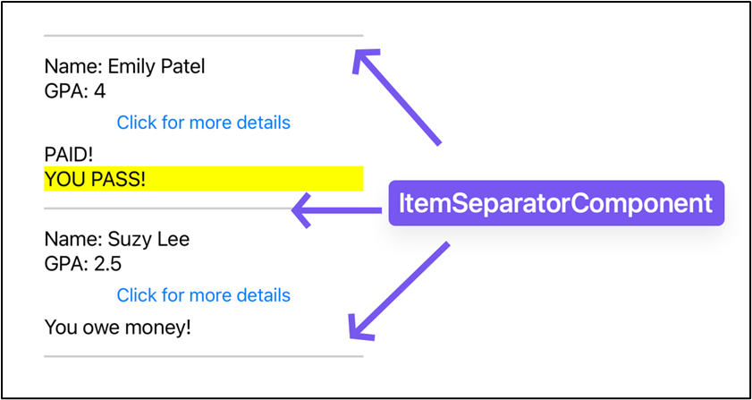
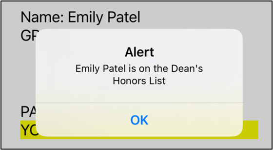
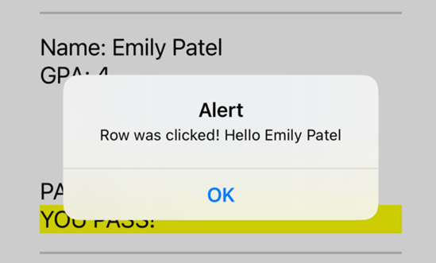

# BTP610; Wk05: Flatlist Component

## What is a List?
A common user interface pattern in mobile development is to display a list of data:


## Working with a `<FlatList>`
A `<FlatList>` is a React Native component that displays a list of data
Documentation: https://reactnative.dev/docs/flatlist


1.  Create a data source 

- The data source should be an array of objects that contain the information you want to show in your list
```js
const studentList = [
    {name:"Peter", gpa:3.0, tuitionPaid:true},
    {name:"Emily", gpa:4.0, tuitionPaid:true},
    {name:"Suzy", gpa:2.5, tuitionPaid:false},
    {name:"Peter", gpa:2.5, tuitionPaid:false},
]
```

- Each object in the array needs to have a property that will uniquely identify that object
    - By default, the FlatList searches for an attribute called “key”

_Modify the list of data to include a property that is a unique identifier
You must include 1 property where every value is unique_
```js
const studentList = [
   {name:"Peter", gpa:3.0, tuitionPaid:true, userid:"psmith"},
   {name:"Emily Patel", gpa:4.0, tuitionPaid:true, userid:"epatel"},
   {name:"Suzy Lee", gpa:2.5, tuitionPaid:false, userid:"slee"},
   {name:"Peter", gpa:2.5, tuitionPaid:false, userid:"pdiaz"},
]
```

2. In the screen, import the FlatList from ‘react-native’
```js
import { StyleSheet, Text, View, SafeAreaView, Platform, StatusBar, FlatList} from 'react-native';
```

3. Add properties to the FlatList

- data → provide the array of objects the Flatlist should display
- keyExtractor → use this to specify which property in the data source will uniquely identify each object (required if you don’t have a “key” property)
- renderItem → specify the layout of each row in the list
- ItemSeparatorComponent → (optional):  displays ui between each row item

```js
<FlatList
   data={studentList}
   keyExtractor={(item)=>{ return item.userid }}
   renderItem={
         ({item})=>{
           return(
             <Text>{item.name}</Text>
           )
         }
       }
/>
```
### Code Example: Displaying a list of student names


```js
import { StyleSheet, Text, View, FlatList } from 'react-native';

// outside of your component, create a list of data
const studentList = [
 {name:"Peter", gpa:3.0, tuitionPaid:true, userid:"psmith"},
 {name:"Emily Patel", gpa:4.0, tuitionPaid:true, userid:"epatel"},
 {name:"Suzy Lee", gpa:2.5, tuitionPaid:false, userid:"slee"},
 {name:"Peter", gpa:2.5, tuitionPaid:false, userid:"pdiaz"},
]


export default function App() {

  return (
   <View style={styles.container}>
     <Text>test</Text>  
     <FlatList style={{marginVertical:70, borderWidth:1}}
       data={studentList}
       keyExtractor={(item)=>{ return item.userid }}
       renderItem={
        ({item})=>{
          return(
            <Text>{item.name}</Text>
          )
        }
      }
   />
 
   </View>
 );
}

const styles = StyleSheet.create({
 container: {
   flex: 1,
   backgroundColor: '#fff',
   alignItems: 'center',
   justifyContent: 'center',
 },
});
```

**Warning**


### Customizing the User Interface for Each Row of the FlatList
#### Example 1: Each row shows a name, gpa, and button. 

- Name and gpa should be on the left
- Button should be on the right

```js
import { StyleSheet, Text, View, FlatList, Button } from 'react-native';

// outside of your component, create a list of data
const studentList = [
 {name:"Peter", gpa:3.0, tuitionPaid:true, userid:"psmith"},
 {name:"Emily Patel", gpa:4.0, tuitionPaid:true, userid:"epatel"},
 {name:"Suzy Lee", gpa:2.5, tuitionPaid:false, userid:"slee"},
 {name:"Peter", gpa:2.5, tuitionPaid:false, userid:"pdiaz"}, 
]

export default function App() {

 return (
   <View style={styles.container}>
     <Text>test</Text>  
     <FlatList style={{marginVertical:70, borderWidth:1}}
       data={studentList}
       keyExtractor={
         (item)=>{       
           return item.userid
         }
       }
       renderItem={
        ({item})=>{
           console.log("What is item?")
           console.log(item)
           return(
             <View style={{flexDirection:"row", justifyContent:"space-between"}}>
               <View style={{borderWidth:1}}>
                 <Text style={styles.text}>Name: {item.name}</Text>
                 <Text style={styles.text}>GPA: {item.gpa}</Text>
               </View>
               <Button title="Click for more details"/>
             </View>
           )
        }
      }
   />
 
   </View>
 );
}

const styles = StyleSheet.create({
 container: {
   flex: 1,
   backgroundColor: '#fff',
   alignItems: 'center',
   justifyContent: 'center',
 },
 text: {
   fontSize:18,
 }
});
```

#### Example 2:  Here is a list of vehicles as developed in class

```js
import { StatusBar } from 'expo-status-bar';
import { StyleSheet, Text, View, FlatList } from 'react-native';
import FontAwesome from '@expo/vector-icons/FontAwesome';

export default function App() {
 // list of data = Javascript array
 // Step 2 : ensure each item has a property that uniquely identifies it
 // Enables to you prevent "duplicates"
 const studentList = [
   {name:"Peter Patel", userid:"ppatel", studentNo:999, id:1},
   {name:"Emily Lee", userid:"elee", studentNo:100, id:2},
   {name:"Aisha W", userid:"aishaw", studentNo:101, id:3},
   {name:"Peter Patel", userid:"p2p", studentNo:102, id:4},   
 ]

 const cities = [
   {name:"London", id:0, airportCode:"LHR"},
   {name:"London", id:0, airportCode:"YXU"},
   {name:"Paris", id:1, airportCode:"CDG"},
   {name:"Toronto", id:2, airportCode:"YYZ"}  
 ]

 const vehicles = [
   {make:"Tesla", model:"Model X", licensePlate:"TESLA101"},
   {make:"Tesla", model:"Model S", licensePlate:"TESLA102"},
   {make:"Ford", model:"Focus", licensePlate:"FORD999"},
   {make:"Toyota", model:"RAV 4", licensePlate:"TOY000"},
   {make:"Toyota", model:"RAV 4", licensePlate:"TOY133"},
 ]

 return (
   <View style={styles.container}>
     <Text>This is a demo of a flatlist</Text>
     {/* Returning in 2 min to discuss these FlatList attributes */}
     <FlatList
       style={{borderWidth:1}}
       data={vehicles}
       /* Tell the flat list which proeprty in your object is the unique identifier */
       keyExtractor={(item)=>{ return item.licensePlate }}
       /* Controls the appearance of each row in the flat list */
       renderItem={
             ({item})=>{
               return(
                 <View style={styles.rowItem}>
                   <FontAwesome name="car" size={24} color="black" />
                   <Text>{item.make} {item.model}</Text>
                   <Text>{item.licensePlate}</Text>
                 </View>
               )
             }
           }
     />
      <Text>This is a demo of a flatlist</Text>

   </View>
 );
}

const styles = StyleSheet.create({
 rowItem : {
   flexDirection:"row",
   justifyContent:"space-between",
 },
 container: {
   flex: 1,
   backgroundColor: '#fff',   
   justifyContent: 'center',
   marginTop:80,
   marginBottom:20,
   padding:20,
 },
});
```

#### Example 3: Conditional Rendering
Documentation: https://react.dev/learn/conditional-rendering


**a. Use a ternary operator to produce this output:**
- If the student paid tuition, then show a label that says “tutition paid!”
- Otherwise, show a label that says : “Not paid!”

```js
<FlatList
       style={{borderWidth:1}}
       data={studentList}
       /* Tell the flat list which proeprty in your object is the unique identifier */
       keyExtractor={(item)=>{ return item.userid }}
       /* Controls the appearance of each row in the flat list */
       renderItem={
             ({item})=>{
               return(
                 <View style={styles.rowItem}>
                   <Text>{item.name} {item.gpa}</Text>
                   {/* 3a: conditionally rendering the icon using ternary operators */}
                   {
                     (item.tuitionPaid === true)
                       ?
                       <AntDesign name="checkcircle" size={24} color="black" />
                       :
                       <AntDesign name="exclamationcircleo" size={24} color="black" />
                   }
                 </View>
               )
             }
           }
     />
```
**b. Use the “LOGICAL AND &&” operator to produce this output:**
- If the student has a GPA of 2.5 or above, then show a “PASS” in the text
- Otherwise, show nothing
```js

<FlatList
       style={{borderWidth:1}}
       data={studentList}
       /* Tell the flat list which property in your object is the unique identifier */
       keyExtractor={(item)=>{ return item.userid }}
       /* Controls the appearance of each row in the flat list */
       renderItem={
             ({item})=>{
               return(
                 <View style={styles.rowItem}>
                   <Text>{item.name} {item.gpa}</Text>
                   {
                     (item.gpa >= 2.8) &&
                     <Text>PASS!</Text>
                   }

                   {/* 3a: conditionally rendering the icon using ternary operators */}
                   {
                     (item.tuitionPaid === true)
                       ?
                       <AntDesign name="checkcircle" size={24} color="black" />
                       :
                       <AntDesign name="exclamationcircleo" size={24} color="black" />
                   }
                 </View>
               )
             }
           }
     />
```
#### Final code:  
```js

import { StatusBar } from 'expo-status-bar';
import { StyleSheet, Text, View, FlatList } from 'react-native';
import FontAwesome from '@expo/vector-icons/FontAwesome';
import AntDesign from '@expo/vector-icons/AntDesign';

export default function App() {
 // list of data = Javascript array
 // Step 2 : ensure each item has a property that uniquely identifies it
 // Enables to you prevent "duplicates"


 const cities = [
   {name:"London", id:0, airportCode:"LHR"},
   {name:"London", id:0, airportCode:"YXU"},
   {name:"Paris", id:1, airportCode:"CDG"},
   {name:"Toronto", id:2, airportCode:"YYZ"}  
 ]

 const vehicles = [
   {make:"Tesla", model:"Model X", licensePlate:"TESLA101"},
   {make:"Tesla", model:"Model S", licensePlate:"TESLA102"},
   {make:"Ford", model:"Focus", licensePlate:"FORD999"},
   {make:"Toyota", model:"RAV 4", licensePlate:"TOY000"},
   {make:"Toyota", model:"RAV 4", licensePlate:"TOY133"},
 ]

 // outside of your component, create a list of data
 const studentList = [
 {name:"Peter", gpa:3.0, tuitionPaid:true, userid:"psmith"},
 {name:"Emily Patel", gpa:4.0, tuitionPaid:true, userid:"epatel"},
 {name:"Suzy Lee", gpa:2.5, tuitionPaid:false, userid:"slee"},
 {name:"Peter", gpa:2.5, tuitionPaid:false, userid:"pdiaz"},
]
 return (
   <View style={styles.container}>
     <Text>This is a demo of a flatlist</Text>
     {/* Returning in 2 min to discuss these FlatList attributes */}
     <FlatList
       style={{borderWidth:1}}
       data={studentList}
       /* Tell the flat list which proeprty in your object is the unique identifier */
       keyExtractor={(item)=>{ return item.userid }}
       /* Controls the appearance of each row in the flat list */
       renderItem={
             ({item})=>{
               return(
                 <View style={styles.rowItem}>
                   <Text>{item.name} {item.gpa}</Text>
                   {
                     (item.gpa >= 2.8) &&
                     <Text>PASS!</Text>
                   }

                   {/* 3a: conditionally rendering the icon using ternary operators */}
                   {
                     (item.tuitionPaid === true)
                       ?
                       <AntDesign name="checkcircle" size={24} color="black" />
                       :
                       <AntDesign name="exclamationcircleo" size={24} color="black" />
                   }
                 </View>
               )
             }
           }
     />
      <Text>This is a demo of a flatlist</Text>

   </View>
 );
}

const styles = StyleSheet.create({
 rowItem : {
   flexDirection:"row",
   justifyContent:"space-between",
 },
 container: {
   flex: 1,
   backgroundColor: '#fff',   
   justifyContent: 'center',
   marginTop:80,
   marginBottom:20,
   padding:20,
 },
});
```
#### Example 3: Adding a separator between each row

Add the ItemSeparatorComponent property and set it to a arrow function
```js
ItemSeparatorComponent={
  ()=>{}
}
```

Inside the function, you will return the user interface elements you want to include in between each row item
```js
ItemSeparatorComponent={
 ()=>{
   return(
     <View style={{flexDirection:"row", justifyContent:"center", gap:20}}>
       <Text>+++++++++++++</Text>
       <Text>❤️❤️❤️❤️❤️❤️❤️❤️❤️❤️</Text>
     </View>
 )
}
```
 
```js
<FlatList
       style={{borderWidth:1}}
       data={studentList}
       /* Tell the flat list which proeprty in your object is the unique identifier */
       keyExtractor={(item)=>{ return item.userid }}
       ItemSeparatorComponent={
         ()=>{
           return (             
             <View>
               <Text>❤️❤️❤️❤️❤️❤️❤️❤️❤️❤️</Text>
               {/* this does not make sense but showing it as an example to you */}
               <Button title="CLICK"/>
             </View>
           )
         }
       }
       /* Controls the appearance of each row in the flat list */
       renderItem={
             ({item})=>{
               return(
                 <View style={styles.rowItem}>
                   <Text>{item.name} {item.gpa}</Text>
                   {
                     (item.gpa >= 2.8) &&
                     <Text>PASS!</Text>
                   }

                   {/* 3a: conditionally rendering the icon using ternary operators */}
                   {
                     (item.tuitionPaid === true)
                       ?
                       <AntDesign name="checkcircle" size={24} color="black" />
                       :
                       <AntDesign name="exclamationcircleo" size={24} color="black" />
                   }
                 </View>
               )
             }
           }
     />
```
 
#### Example 4: Creating a “traditional” looking separator

Update the ItemSeparatorComponent so it displays a thin grey line between each row

```js
ItemSeparatorComponent={
         ()=>{
           return (             
             <View style={{borderWidth:1, borderColor:"#cccccc", marginVertical:16}}></View>
           )
         }
       }
```
##### Accessing the current row item in a click handler
You can access the object that belongs to row using a click handler function

1.	Create a click handler function that accepts 1 parameter
```js
const btnPressed = (myObject) => {
console.log(myObject)
}
```

2.	When calling the function, pass the item into the function parameter
```js
<Button onPress={()=>{btnPressed(item)}} title="Click for more details"/>
```


- When you pass the “item” into the function parameter, you are sending the entire object to the function
- The function can then access the object and its properties
```js
import { StatusBar } from 'expo-status-bar';
import { StyleSheet, Text, View, FlatList, Button } from 'react-native';
import FontAwesome from '@expo/vector-icons/FontAwesome';
import AntDesign from '@expo/vector-icons/AntDesign';

export default function App() {
 // list of data = Javascript array
 // Step 2 : ensure each item has a property that uniquely identifies it
 // Enables to you prevent "duplicates"


 const cities = [
   {name:"London", id:0, airportCode:"LHR"},
   {name:"London", id:0, airportCode:"YXU"},
   {name:"Paris", id:1, airportCode:"CDG"},
   {name:"Toronto", id:2, airportCode:"YYZ"}  
 ]

 const vehicles = [
   {make:"Tesla", model:"Model X", licensePlate:"TESLA101"},
   {make:"Tesla", model:"Model S", licensePlate:"TESLA102"},
   {make:"Ford", model:"Focus", licensePlate:"FORD999"},
   {make:"Toyota", model:"RAV 4", licensePlate:"TOY000"},
   {make:"Toyota", model:"RAV 4", licensePlate:"TOY133"},
 ]

 // outside of your component, create a list of data
 const studentList = [
 {name:"Peter", gpa:3.0, tuitionPaid:true, userid:"psmith"},
 {name:"Emily Patel", gpa:4.0, tuitionPaid:true, userid:"epatel"},
 {name:"Suzy Lee", gpa:2.5, tuitionPaid:false, userid:"slee"},
 {name:"Peter", gpa:2.5, tuitionPaid:false, userid:"pdiaz"},
]
const btnPressed = (objFromFlatList) => {
   console.log("DEBUG: WHat object did i receive?")
   console.log(objFromFlatList)
   // if you click on row #4, then
   // objFromFlatList = {name:"Peter", gpa:2.5, tuitionPaid:false, userid:"pdiaz"
   alert(`Hello ${objFromFlatList.name}! Did you pay? ${objFromFlatList.tuitionPaid}`)
}

 return (
   <View style={styles.container}>
     <Text>This is a demo of a flatlist</Text>
     {/* Returning in 2 min to discuss these FlatList attributes */}
     <FlatList
       style={{borderWidth:1}}
       data={studentList}
       /* Tell the flat list which proeprty in your object is the unique identifier */
       keyExtractor={(item)=>{ return item.userid }}
       ItemSeparatorComponent={
         ()=>{
           return (             
             <View style={{borderWidth:1, borderColor:"#cccccc", marginVertical:16}}></View>
           )
         }
       }
       /* Controls the appearance of each row in the flat list */
       renderItem={
             ({item})=>{
               return(
                 <View style={styles.rowItem}>
                   <Text>Row demo: {item.userid}</Text>
                   <Button onPress={()=>{btnPressed(item)}} title="Click for more details"/>
                 </View>
               )
             }
           }
     />
      <Text>This is a demo of a flatlist</Text>

   </View>
 );
}

const styles = StyleSheet.create({
 rowItem : {
   flexDirection:"row",
   justifyContent:"space-between",
 },
 container: {
   flex: 1,
   backgroundColor: '#fff',   
   justifyContent: 'center',
   marginTop:80,
   marginBottom:20,
   padding:20,
 },
});
```
#### Review: How to call a function with parameter

1.	Define the function with parameters
```js
 const addNumbers = (a,b) => {
   alert(`The sum is ${a+b}`)
  }
```
2.	Set the onPress to an anonymous function
```js
<Button onPress={()=>{}} title="Add"/>
```
3.	Inside the anonymous function, call your function with parameters
```js
<Button onPress={()=>{addNumbers(10, 5)}} title="Add"/>
```

##### Example 1:  Clicking on a button in the row

In our example, each row has a button
```js
<Button onPress={btnPressed} title="Click for more details"/>
```


When button pressed, show an alert with the student name and information about whether they are on the Dean’s Honors List


##### Example 2:  Click on the entire row


Follow the same process as Example 1, but attach your click handler to a <Pressable>

- Review: <Pressable> is a generic container (similar to  a <view>), but it can be styled, and it is primarily used to detect gestures / clicks from the user


1. Surround your row user interface code with a <Pressable>

```js
<Pressable>
<View style={styles.row}>
</View>
</Pressable>
```
2. Attach the click handler to the <Pressable>
```js
<Pressable onPress={rowClicked}>
<View style={styles.row}>
</View>
</Pressable>
```

3. If you want the click handler to get access to the row data, pass the item to the click handler
```js
<Pressable onPress={()=>{rowClicked2(item)}}>
<View style={styles.row}>
</View>
</Pressable> 
```
##### Final Code

```js
import { StatusBar } from 'expo-status-bar';
import { StyleSheet, Text, View, FlatList, Button, Pressable } from 'react-native';
import FontAwesome from '@expo/vector-icons/FontAwesome';
import AntDesign from '@expo/vector-icons/AntDesign';

export default function App() {
 // list of data = Javascript array
 // Step 2 : ensure each item has a property that uniquely identifies it
 // Enables to you prevent "duplicates"


 const cities = [
   {name:"London", id:0, airportCode:"LHR"},
   {name:"London", id:0, airportCode:"YXU"},
   {name:"Paris", id:1, airportCode:"CDG"},
   {name:"Toronto", id:2, airportCode:"YYZ"}  
 ]

 const vehicles = [
   {make:"Tesla", model:"Model X", licensePlate:"TESLA101"},
   {make:"Tesla", model:"Model S", licensePlate:"TESLA102"},
   {make:"Ford", model:"Focus", licensePlate:"FORD999"},
   {make:"Toyota", model:"RAV 4", licensePlate:"TOY000"},
   {make:"Toyota", model:"RAV 4", licensePlate:"TOY133"},
 ]

 // outside of your component, create a list of data
 const studentList = [
 {name:"Peter", gpa:3.0, tuitionPaid:true, userid:"psmith"},
 {name:"Emily Patel", gpa:4.0, tuitionPaid:true, userid:"epatel"},
 {name:"Suzy Lee", gpa:2.5, tuitionPaid:false, userid:"slee"},
 {name:"Peter", gpa:2.5, tuitionPaid:false, userid:"pdiaz"},
]
const btnPressed = (objFromFlatList) => {
   console.log("DEBUG: WHat object did i receive?")
   console.log(objFromFlatList)
   // if you click on row #4, then
   // objFromFlatList = {name:"Peter", gpa:2.5, tuitionPaid:false, userid:"pdiaz"
   alert(`Hello ${objFromFlatList.name}! Did you pay? ${objFromFlatList.tuitionPaid}`)
}

 return (
   <View style={styles.container}>
     <Text>This is a demo of a flatlist</Text>
     {/* Returning in 2 min to discuss these FlatList attributes */}
     <FlatList
       style={{borderWidth:1}}
       data={studentList}
       /* Tell the flat list which proeprty in your object is the unique identifier */
       keyExtractor={(item)=>{ return item.userid }}
       ItemSeparatorComponent={
         ()=>{
           return (             
             <View style={{borderWidth:1, borderColor:"#cccccc", marginVertical:16}}></View>
           )
         }
       }
       /* Controls the appearance of each row in the flat list */
       renderItem={
             ({item})=>{
               return(
                 <Pressable onPress={()=>{btnPressed(item)}}>
                   <View style={styles.rowItem}>
                     <Text>Row demo: {item.userid}</Text>
                     <Button onPress={()=>{btnPressed(item)}} title="Click for more details"/>
                   </View>
                 </Pressable>
               )
             }
           }
     />
      <Text>This is a demo of a flatlist</Text>

   </View>
 );
}

const styles = StyleSheet.create({
 rowItem : {
   flexDirection:"row",
   justifyContent:"space-between",
 },
 container: {
   flex: 1,
   backgroundColor: '#fff',   
   justifyContent: 'center',
   marginTop:80,
   marginBottom:20,
   padding:20,
 },
});
```

##### Getting the position of the row
- Update  the renderItem property:
```js
renderItem={(rowData) => {
   console.log(rowData)
   return (
      <View style={styles.listItemRow}>
         <Text>{rowData.item.name}</Text>   
         <Button title="Delete" onPress={deleteStudent}/>
      </View>
   )
}}
```

- Rerun the application and observe the output in the Terminal


- Notice the rowData variable contains the complete information that is being used to draw the row on the screen:
```js
{"index": 1, "item": {"id": "kw515", "name": "Kwame"}, "separators": {"highlight": [Function highlight], "unhighlight": [Function unhighlight], "updateProps": [Function updateProps]}}
```