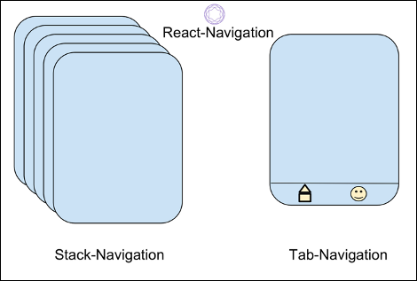

# BTP610; Wk06: Multicreen Apps

## Intro to Multiscreen Apps

### Learning outcomes:

- What are navigators?
- How to add additional screens to your app
- Stack Navigation: How to navigate between your screens 
- Stack Navigation: How to pass data (communicate information) between the screens of your application
- Nested Navigators


### What is a Navigator?

A navigator is a component that implements a navigation pattern.

A navigation pattern is a design pattern that describes how screens are linked together.

In mobile applications, there are typically two types of navigation patterns:

1.	Stack Navigation Pattern

    - The user navigates sequentially through a series of screens
    - The user can move “forward” and “backwards” through the screens


2.	Tab Navigation Pattern

    - The user “flips” between screens
    - There is no concept of “forward” or “backwards”


[Image Credit](https://medium.com/@panktip85/react-navigation-stack-navigation-with-tab-navigation-25578d653632)

Where To Get a Navigator Component?

The React Navigation plugin provides components, objects, and functions to implement stack or tab based navigation.

Documentation:  https://reactnavigation.org/


## How to use Multiscreen
:

### Install Dependencies

Install the required libraries into the project:
```sh
npm install @react-navigation/native
npx expo install react-native-screens react-native-safe-area-context
npm install @react-navigation/stack
npx expo install react-native-gesture-handler
```

### How to Add a New Screen
1. Add a new Javascript file to the project

Add a new Javascript file to the project.

Add the word “Screen” to your filename to indicate that this component is a screen (not some other standalone component)


2. Add the boilerplate for a new component

React components are created using the function keyword or the arrow function syntax.

**See examples below:**

#### Using function keyword
```js
import { StyleSheet, Text, View } from 'react-native';

export default function Screen2() {
   return(
      <View style={styles.container}>
         <Text>
          Here is the Screen 2
         </Text>
      </View>
   )
}

const styles = StyleSheet.create({
   container: {
      flex: 1,
      backgroundColor: '#fff',
   },
});
```

#### Using arrow function
```js
import { StyleSheet, Text, View } from 'react-native';

const Screen2 = () => {
   return(
      <View style={styles.container}>
         <Text>
          Here is the Screen #2
         </Text>
      </View>
   )
}

const styles = StyleSheet.create({
   container: {
      flex: 1,
      backgroundColor: '#fff',
   },
});

export default Screen2
```

3.  Put your screens in a folder

As your application increases in complexity, consider putting your screens in their own folder:


### Stack Navigation Code:
```js  
//App.js

import { StyleSheet, Text, View } from 'react-native';

import 'react-native-gesture-handler';

import { NavigationContainer } from '@react-navigation/native';
import { createStackNavigator } from '@react-navigation/stack';

import HomeScreen from './screens/HomeScreen';
import DetailsScreen from './screens/DetailsScreen';

const Stack = createStackNavigator();

export default function App() {
return (
<NavigationContainer>
<Stack.Navigator initialRouteName="Home">
<Stack.Screen name="Home" component={Screen2} />
<Stack.Screen name="Details" component={Screen3} />
</Stack.Navigator>
</NavigationContainer>
);
}

const styles = StyleSheet.create({
container: {
flex: 1,
backgroundColor: '#fff',
alignItems: 'center',
justifyContent: 'center',
},
});
```
#### Stack Navigation: Moving Between Screens


1. In the starting screen’s function declaration, include the `{navigation}` prop.

```js
const Screen1 = ( {navigation} ) => {
}
export default Screen1;
```


2. When ready to move to another screen, call:
`navigation.navigate("_____")`

3. Replace "____" with name of the destination screen to the .navigate() function

##### Example:
```js
// App.js
<Stack.Screen name="Screen2" component={Screen2Component} />

Screen1.js
navigation.navigate('Screen2')
```

#### Stack Navigation: Sending Data to another Screen

1. On starting screen, pass a Javascript object literal to the `navigate.navigate()` function:

The properties of the object should contain the data you want to send to destination screen:

```js
//Screen1.js
navigation.navigate('Screen2', {userid:'Peter'}) ;
```

2. In the destination screen’s function declaration, include the `{route}` prop.
```js
const Screen2 = ( {route} ) => {
}
export default Screen2;
```
3.  Extract the data you want. 
```js
// retrieves a value called "uname" from the route variable
const dataFromScreen1 = route.params.userid;

// OBJECT DESTRUCTURING  ARRAY DESTRUCTURING
const {userid} = route.params;
```


##### Example: Send Data to the Next Screen
 
In the navigation.navigate() function, provide a Javascript object containing the data to send to next screen
```js
//Screen1.js

import { StyleSheet, Text, View, Button } from 'react-native';

// navigation object comes from the react navigation library
// but you don't need to do an import because it automatically gets
// sent to you by the App.js <Stack.Navigator>
export default function Screen1({navigation}) {
  const btnPressed = () => {     
     navigation.navigate("Profile ABCD", {email:"peter@gmail.com", age:54, ownCar:true})
  }

  return(
     <View style={styles.container}>
        <Text>
         Here is the Screen 1
        </Text>
        <Button title="Go to next Screen" onPress={btnPressed}/>
     </View>
  )
}


const styles = StyleSheet.create({
  container: {
     flex: 1,
     backgroundColor: '#fff',
  },
});
```

###### Screen 2

On Screen2, add the {route} props:
```js
//Screen2.js 
export default function Screen2({route}) {
}
```

Observe the contents of the route:
```js
export default function Screen2({route}) {
  console.log("DEBUG: What is in the route?")
  console.log(route.params)
  // other code goes here
}
```
The route object contains the data you sent, plus other information:
```sh
DEBUG: What is in route?
 LOG  
{
 "key": "Profile ABCD-NIdfKp6815jhbHvkNNt3_", 
 "name": "Profile ABCD", 
 "params": {"age": 54, "email": "peter@gmail.com", "ownCar": true},    
 "path": undefined
}
```
To access only the data you sent, use `route.params`:
```js
import { StyleSheet, Text, View, Button } from 'react-native';
export default function Screen2({navigation,route}) {

  // get the data out of the route
  const profileInfo = route.params

  const btnPressed = () => {
     navigation.navigate("Account Settings")
  }
  return(
     <View style={styles.container}>
        <Text>
        This is your profile: {profileInfo.email}
        </Text>
        <Text>
           Age: {profileInfo.age}
        </Text>
        { (profileInfo.ownCar === true) &&
         <Text>User owns a car!</Text>
        }
        <Button title="Update Profile" onPress={btnPressed}/>

     </View>
  )
}

const styles = StyleSheet.create({
  container: {
     flex: 1,
     backgroundColor: '#f6e58d',
  },
});
```
Exercise:  Screen 1 passes a list of friends to Screen 2
 

When Screen 2 receives the list, it shows the friends in a <FlatList>

Screen1.js

●	Update the navigation code to send an array of friends

navigation.navigate("Profile ABCD",
        {email:"peter@gmail.com", age:54, ownCar:false, friends:[
           {id:0, name:"Suzy"},
           {id:1, name:"Quinn"},
           {id:2, name:"Robert"},
        ]}
)


Screen 2.js


<FlatList style={{marginVertical:70, borderWidth:1}}
   data={route.params.friends}
   keyExtractor={(item)=>{ return item.id }}
           renderItem={
              ({item})=>{
                 return(
                    <Text>{item.name}</Text>
                 )
              }
           }
        />

 


