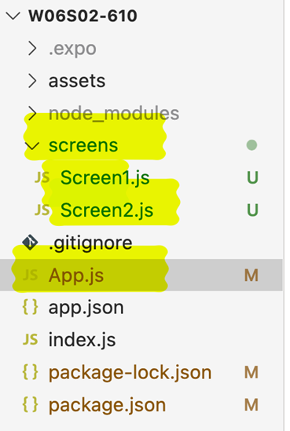
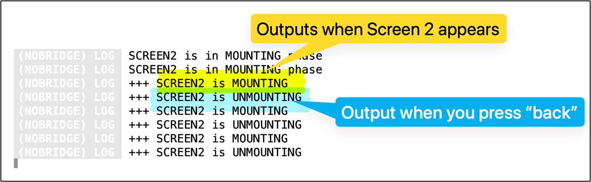
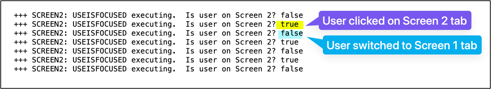
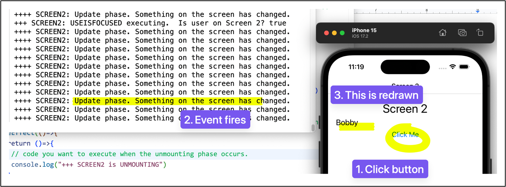

# BTP610; Week 6, Session 2
## Life Cycle Functions
________________________________________

### Dependencies
```sh
npm install @react-navigation/native
npx expo install react-native-screens react-native-safe-area-context
npm install @react-navigation/stack
npx expo install react-native-gesture-handler
npm install @react-navigation/bottom-tabs
```

They introduce new components that are specifically used for handling navigation


### 2 Screens Example

```js
// screens/Screen1.js
import { StyleSheet, Text, View, Button } from 'react-native';
const Screen1 = ({navigation}) => {
  
   const buttonPressed = () => {
       navigation.navigate("Screen 2")
   }
   return(
       <View>
           <Text>This is screen 1</Text>
           <Button title="Go to next" onPress={buttonPressed}/>
       </View>
   )
}

const styles = StyleSheet.create({
   container: {
     flex: 1,
     backgroundColor: '#fff',
     alignItems: 'center',
     justifyContent: 'center',
   },
});

export default 
```
---

```js   
// screens/Screen2.js
	import { StyleSheet, Text, View } from 'react-native';
const Screen1 = () => {
  
   return(
       <View>
           <Text>This is screen 2</Text>
       </View>
   )
}

const styles = StyleSheet.create({
   container: {
     flex: 1,
     backgroundColor: '#fff',
     alignItems: 'center',
     justifyContent: 'center',
   },
});

export default Screen1
```
---

```js
//  App.js

import { StyleSheet, Text, View } from "react-native";

import "react-native-gesture-handler";

import { NavigationContainer } from "@react-navigation/native";
import { createStackNavigator } from "@react-navigation/stack";

import Screen1 from "./screens/Screen1";
import Screen2 from "./screens/Screen2";


const Stack = createStackNavigator();

export default function App() {
 return (
   <NavigationContainer>
     <Stack.Navigator initialRouteName="Screen 1">
       <Stack.Screen name="Screen 1" component={Screen1} />
       <Stack.Screen name="Screen 2" component={Screen2} />
     </Stack.Navigator>
   </NavigationContainer>
 );
}

const styles = StyleSheet.create({
 container: {
   flex: 1,
   backgroundColor: "#fff",
   alignItems: "center",
   justifyContent: "center",
 },
});
```
---

## React component lifecycle

### **Diagram of the lifecycle**
https://camo.githubusercontent.com/4784a81d4ad6a73f82a836724237c172d3418d0ef63bdc792c82ef91b69f2293/68747470733a2f2f70726f6a656374732e776f6a74656b6d616a2e706c2f72656163742d6c6966656379636c652d6d6574686f64732d6469616772616d2f6f67696d6167652e706e67

- The React component lifecycle refers to the sequence of events that happen from the moment a component is created (mounted) to the moment it is no longer needed (unmounted).

- There are 3 main lifecycle function (functions provided by the SDK that enable you to hook into (look) at the life cycle of a component):

    - MOUNTING:   This event fires when the component (screen) is first loaded
        - When the screen loads, connect to a database and pull some data

```js
useEffect(()=>{}, [])
```

    - UPDATING:  This event fires when the component UI updates. When the screen user interface needs to update itself, then the event will fire

```js
useEffect(()=>{})
```

    - UNMOUNTING:   This event fires when the component is no longer needed.  React Native will delete that screen from memory.

```js
useEffect(()=>{
   return ()=>{}
 },[])
```


#### `screens/Screen2.js`


```js
//screens/Screen2.js
import { View, Text, StyleSheet, Button } from "react-native";
import { useEffect, useState } from "react"

export default Screen2 = () => {

 // state variable
 const [nameToDisplay, setNameToDisplay] = useState("")
 // life cycle functions on screen #2

 // 1. MOUNTING:
 useEffect(()=>{}, [])

 // 2. UPDATE
 useEffect(()=>{})

 // 3. UNMOUNT:
 useEffect(()=>{
   return ()=>{}
 },[])

 const btnPressed = () => {
   const friends = ["Abby", "Bobby", "Carlos", "Diego", "Emily", "Francis"]
   const randomPosition = Math.floor(Math.random() * (friends.length) + 0)
   setNameToDisplay(friends[randomPosition])   
 }

 return (
   <View style={styles.container}>
     <Text style={styles.headingText}>Screen 2</Text>
     <Text style={styles.text}>{nameToDisplay}</Text>  
     <Button onPress={btnPressed} title="Click Me"/>
   </View>    
   
 );
};

const styles = StyleSheet.create({
 container: {
   flex: 1,
   backgroundColor: "#fff",
   padding:20,
 },
 headingText: {
   fontSize: 30,
   textAlign: "center",
   paddingBottom: 5,
 },
 text: {
   fontSize: 20,
 },   
});


```
---

Update code to executes a console.log() when the screen appears or disappears:


```js
import { View, Text, StyleSheet, Button } from "react-native";
import { useEffect, useState } from "react"

export default Screen2 = () => {

// state variable
const [nameToDisplay, setNameToDisplay] = useState("")
// life cycle functions on screen #2

// 1. MOUNTING: This lifecycle function executes when app requests this screen to appear on the device
useEffect(()=>{
   // code you want to execute when the mounting phase occurs
   console.log("+++ SCREEN2 is MOUNTING")
}, [])

// 2. UPDATE
useEffect(()=>{})

// 3. UNMOUNT: This function executes when the screen is no longer needed (when the screen disappears)
useEffect(()=>{
  return ()=>{
   // code you want to execute when the unmounting phase occurs.
   console.log("+++ SCREEN2 is UNMOUNTING")
  }
},[])


const btnPressed = () => {
   // When button pressed, pick a random friend from the array and display it on the screen
  const friends = ["Abby", "Bobby", "Carlos", "Diego", "Emily", "Francis"]
  const randomPosition = Math.floor(Math.random() * (friends.length) + 0)
  setNameToDisplay(friends[randomPosition])  
}


return (
  <View style={styles.container}>
    <Text style={styles.headingText}>Screen 2</Text>
    <Text style={styles.text}>{nameToDisplay}</Text> 
    <Button onPress={btnPressed} title="Click Me"/>
  </View>   
 
);
};


const styles = StyleSheet.create({
container: {
  flex: 1,
  backgroundColor: "#fff",
  padding:20,
},
headingText: {
  fontSize: 30,
  textAlign: "center",
  paddingBottom: 5,
},
text: {
  fontSize: 20,
},  
});

```
---
### Mounting and unmounting in a Tab Navigator

Observe that when your screens are connected in a Tab Navigator, you get different behaviour:


If the unmount never occurs, then that means the screen is never removed from memory


Installed the tab navigtaion library: `npm install @react-navigation/bottom-tabs`

```js
App.js

import { StyleSheet, Text, View } from "react-native";

import "react-native-gesture-handler";

import { NavigationContainer } from "@react-navigation/native";
import { createStackNavigator } from "@react-navigation/stack";
import { createBottomTabNavigator } from '@react-navigation/bottom-tabs';

import Screen1 from "./screens/Screen1";
import Screen2 from "./screens/Screen2";


const Stack = createStackNavigator();
const Tab = createBottomTabNavigator();

export default function App() {
 return (
   <NavigationContainer>
     <Tab.Navigator initialRouteName="Screen 1">
       <Tab.Screen name="Screen 1" component={Screen1} />
       <Tab.Screen name="Screen 2" component={Screen2} />
     </Tab.Navigator>
   </NavigationContainer>
 );
}

const styles = StyleSheet.create({
 container: {
   flex: 1,
   backgroundColor: "#fff",
   alignItems: "center",
   justifyContent: "center",
 },
});
```
--- 

### How do you know which tab you are on?

The react native navigation library provides access to a custom hook function that programmatically determines if you are on the current screen.
```js
import { useIsFocused } from "@react-navigation/native";
```


The `useIsFocused` function will detect when the user is on Screen 2 (and when they are not)



## Code

```js
import { View, Text, StyleSheet, Button } from "react-native";
import { useEffect, useState } from "react"

import { useIsFocused } from "@react-navigation/native";

export default Screen2 = () => {

// state variable
const [nameToDisplay, setNameToDisplay] = useState("")
// life cycle functions on screen #2

// 1. MOUNTING: This lifecycle function executes when app requests this screen to appear on the device
useEffect(()=>{
   // code you want to execute when the mounting phase occurs
   console.log("+++ SCREEN2 is MOUNTING")
}, [])

// 2. UPDATE
useEffect(()=>{})

// 3. UNMOUNT: This function executes when the screen is no longer needed (when the screen disappears)
useEffect(()=>{
  return ()=>{
   // code you want to execute when the unmounting phase occurs.
   console.log("+++ SCREEN2 is UNMOUNTING")
  }
},[])


// 4. UseIsFocused
const screenIsActive = useIsFocused()

useEffect(()=>{
   console.log(`+++ SCREEN2: USEISFOCUSED executing.  Is user on Screen 2? ${screenIsActive}`)
},[screenIsActive])


const btnPressed = () => {
   // When button pressed, pick a random friend from the array and display it on the screen
  const friends = ["Abby", "Bobby", "Carlos", "Diego", "Emily", "Francis"]
  const randomPosition = Math.floor(Math.random() * (friends.length) + 0)
  setNameToDisplay(friends[randomPosition])  
}


return (
  <View style={styles.container}>
    <Text style={styles.headingText}>Screen 2</Text>
    <Text style={styles.text}>{nameToDisplay}</Text> 
    <Button onPress={btnPressed} title="Click Me"/>
  </View>   
 
);
};


const styles = StyleSheet.create({
container: {
  flex: 1,
  backgroundColor: "#fff",
  padding:20,
},
headingText: {
  fontSize: 30,
  textAlign: "center",
  paddingBottom: 5,
},
text: {
  fontSize: 20,
},  
});
```
---


#### Update Function



```js
// 2. UPDATE
useEffect(()=>{
   console.log("++++ SCREEN2: Update phase. Something on the screen has changed.")
})
```

Example: 

```js
import { View, Text, StyleSheet, Button } from "react-native";
import { useEffect, useState } from "react"

import { useIsFocused } from "@react-navigation/native";

export default Screen2 = () => {

// state variable
const [nameToDisplay, setNameToDisplay] = useState("")
// life cycle functions on screen #2

// 1. MOUNTING: This lifecycle function executes when app requests this screen to appear on the device
useEffect(()=>{
   // code you want to execute when the mounting phase occurs
   console.log("+++ SCREEN2 is MOUNTING")
}, [])

// 2. UPDATE
useEffect(()=>{
   console.log("++++ SCREEN2: Update phase. Something on the screen has changed.")
})

// 3. UNMOUNT: This function executes when the screen is no longer needed (when the screen disappears)
useEffect(()=>{
  return ()=>{
   // code you want to execute when the unmounting phase occurs.
   console.log("+++ SCREEN2 is UNMOUNTING")
  }
},[])


// 4. UseIsFocused
const screenIsActive = useIsFocused()

useEffect(()=>{
   console.log(`+++ SCREEN2: USEISFOCUSED executing.  Is user on Screen 2? ${screenIsActive}`)
},[screenIsActive])


const btnPressed = () => {
   // When button pressed, pick a random friend from the array and display it on the screen
  const friends = ["Abby", "Bobby", "Carlos", "Diego", "Emily", "Francis"]
  const randomPosition = Math.floor(Math.random() * (friends.length) + 0)
  setNameToDisplay(friends[randomPosition])  
}

const [luckyNumber, setLuckyNumber] = useState(1)

const btnPressed2 = () => {
   const num = Math.floor(Math.random() * (10 - 1 + 1) + 1);
   setLuckyNumber(num)
}

return (
  <View style={styles.container}>
    <Text style={styles.headingText}>Screen 2</Text>
    <Text style={styles.text}>{nameToDisplay}</Text> 
    <Button onPress={btnPressed} title="Click Me"/>
    <Button onPress={btnPressed2} title="Get Lucky Number"/>
    {
       (luckyNumber > 5)
       ? <Text style={styles.text}>You win! {luckyNumber}</Text>
       : <Text style={styles.text}>You Lose! {luckyNumber}</Text>
    }
  </View>   
 
);
};


const styles = StyleSheet.create({
container: {
  flex: 1,
  backgroundColor: "#fff",
  padding:20,
},
headingText: {
  fontSize: 30,
  textAlign: "center",
  paddingBottom: 5,
},
text: {
  fontSize: 20,
},  
});


```
---

### Code example with lucky number

```js
import { View, Text, StyleSheet, Button } from "react-native";
import { useEffect, useState } from "react"

import { useIsFocused } from "@react-navigation/native";

export default Screen2 = () => {

// state variable
const [nameToDisplay, setNameToDisplay] = useState("")
// life cycle functions on screen #2

// 1. MOUNTING: This lifecycle function executes when app requests this screen to appear on the device
useEffect(()=>{
   // code you want to execute when the mounting phase occurs
   console.log("+++ SCREEN2 is MOUNTING")
}, [])


// 3. UNMOUNT: This function executes when the screen is no longer needed (when the screen disappears)
useEffect(()=>{
  return ()=>{
   // code you want to execute when the unmounting phase occurs.
   console.log("+++ SCREEN2 is UNMOUNTING")
  }
},[])


// 4. UseIsFocused
const screenIsActive = useIsFocused()

useEffect(()=>{
   console.log(`+++ SCREEN2: USEISFOCUSED executing.  Is user on Screen 2? ${screenIsActive}`)
},[screenIsActive])


const btnPressed = () => {
   // When button pressed, pick a random friend from the array and display it on the screen
  const friends = ["Abby", "Bobby", "Carlos", "Diego", "Emily", "Francis"]
  const randomPosition = Math.floor(Math.random() * (friends.length) + 0)
  setNameToDisplay(friends[randomPosition])  
}

const [luckyNumber, setLuckyNumber] = useState(1)

const btnPressed2 = () => {
   const num = Math.floor(Math.random() * (10 - 1 + 1) + 1);
   setLuckyNumber(num)
}


// 2. UPDATE: This executes when ANY state variable changes
useEffect(()=>{
   console.log("++++ SCREEN2: Update phase. Something on the screen has changed.")
})
// Will execute every time luckyNumber state variable updates
useEffect(()=>{
   console.log("++++ SCREEN2: Update phase. Lucky number state variable changed.")
},[luckyNumber])

return (
  <View style={styles.container}>
    <Text style={styles.headingText}>Screen 2</Text>
    <Text style={styles.text}>{nameToDisplay}</Text> 
    <Button onPress={btnPressed} title="Click Me"/>
    <Button onPress={btnPressed2} title="Get Lucky Number"/>
    {
       (luckyNumber > 5)
       ? <Text style={styles.text}>You win! {luckyNumber}</Text>
       : <Text style={styles.text}>You Lose! {luckyNumber}</Text>
    }
  </View>   
 
);
};


const styles = StyleSheet.create({
container: {
  flex: 1,
  backgroundColor: "#fff",
  padding:20,
},
headingText: {
  fontSize: 30,
  textAlign: "center",
  paddingBottom: 5,
},
text: {
  fontSize: 20,
},  
});
```
---


