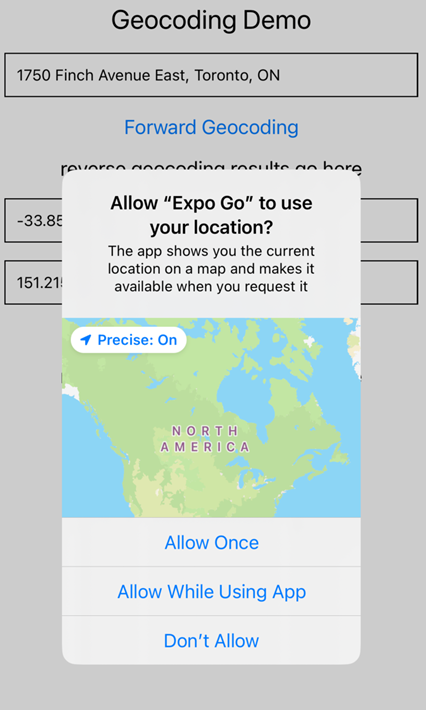
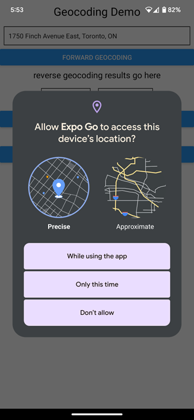

# BTP 610;Week 8 - APIs

## Topics

1.	Review: What is an API
2.	Review: How to fetch data from an API in a normal web application
3.	How to fetch data from an API in a React Native app and display in a list (week 9 session 01)

## What is a Web API?

- Web APIS are websites that contain a repository of data. For example:

    - Sport scores: https://api-sports.io/
    - Weather data: https://openweathermap.org/api
    - Currency exchange values: https://www.xe.com/xecurrencydata/
    - Schedule of TTC bus arrivals: https://open.toronto.ca/dataset/ttc-real-time-next-vehicle-arrival-nvas/
    - Products in a store: https://fakestoreapi.com/

- The API provides an interface that you can use to access the repository of data programmatically.

- Typically, the interface consists of a server endpoint or server url

- When you access the endpoint/url, the website will return the corresponding data to you in a machine-readable format.
	
    - A machine-readable format is a technique for structuring data to make it easy for software to read and manipulate the data programmatically.
    - Popular structured data formats include: JSON and XML

- Most modern APIs will respond with JSON data.

## Why do you need an API?

- API data is used to enrich your application

- The advantage of using an API is that you do not have to manually collect, update, and maintain the data yourself. 

- Offloading data collection to 3rd parties is advantageous even for large companies like Google and Microsoft.

- In the below examples, notice that both Microsoft and Google can display weather data
- The weather data comes from Weather.com (not self-collected by Microsoft or Google engineers).  
- In other words, Microsoft and Google are consuming data
- Consuming data enables a developer to focus on the presentation of the data, rather than the collection of data.  In the below screenshots, observe:
    - The difference in user interface
    - The difference in displayed weather data (Microsoft shows sunrise, sunset and historical weather data. Google does not.)


Image: Weather search results in Google


Weather search results in Microsoft Bing:


## How to use an API in a regular web application?

In Javascript, we use the built-in fetch and json functions to retrieve data from an api and convert the data to a JSON data structure.

- fetch(url)  → Connects to the specified url and returns a promise containing a Response object.  
- The Response object is a built-in data structure that represents the response to a web request
- Documentation:  https://developer.mozilla.org/en-US/docs/Web/API/Response

- .json() → converts a Response object to a Javascript data structure (array of javascript objects, or a single javascript object)

## Code Example:  Retrieving data from an API

In this example, we review how ot use the fetch() and json() functions to retrieve data from an API

- Sample API containing fake employee information: https://jsonplaceholder.typicode.com/users



- Code for retrieving and outputting data from the API:
    - Try this out by copying and pasting the code here:  https://playcode.io/javascript

```javascript
// 1. create a function that get the API data
// we need async() because our function code uses an await somehwere
// the rule of using await is that the function must use an async
const getData = async () => {
 // a. Connect to the api endpoint and get the response
 // You must have the fetch() execute as a background task
 // In JS: await forces the operation to execute in the background
 const response = await fetch('https://jsonplaceholder.typicode.com/users');
 console.log(response);

 // b. Convert the response into a Javascript data structure
 // - array of javascript objects (https://jsonplaceholder.typicode.com/users)
 // - single javascript object.   (https://api.sunrisesunset.io/json?lat=38.907192&lng=-77.036873)
 const data = await response.json();
 console.log(data);
 // .json() has automatically converted the api to an array of js objects


 // c. do something with the (display it in your app)
 // - web app, then show it in the console.error
 // -react native, then show it in a FlatList in your ui
 console.log(`How many items are in the array? ${data.length}`)
 console.log(data[0].name)
 console.log(data[0].email)
 console.log(data[0].address.city)
 console.log(data[0].address.geo.lat)
 console.log(data[0].address.geo.lng)

 for (let i = 0; i < data.length; i++) {
   console.log(data[i].name)
 }


};

// 2. use the function in your program
console.log('API DEMO');
getData();
```


### Code Breakdown

1.	The fetch() and json() functions are marked with await because both functions return a Promise and thus must be executed as a background task

```javascript
const response = await fetch(url);
const data = await response.json();
```


2.	Because there are await statements in the code, the function must be marked with the async keyword.  Recall that async and await always go together!

```javascript
const getData = async () => {
    // code goes here
}
```


3.	If successful, the response.json() function will return the data as either:

- a.	A Javascript object literal
- b.	An array of data

```javascript
const data = await response.json();
console.log(data);
```

In this case, the API data contains an array of values.  


Thus, the response.json() function returns an array of javascript object literals


## Example: Code example of an api that converts to a single json object

```javascript
// 1. create a function that get the API data
// we need async() because our function code uses an await somehwhere
// the rule of using await is that the function must use an async
const getData = async () => {
 // a. Connect to the api endpoint and get the response
 // You must have the fetch() execute as a background task
 // In JS: await forces the operation to execute in the background
 const response = await fetch('https://api.sunrisesunset.io/json?lat=38.907192&lng=-77.036873');
 console.log(response);

 // b. Convert the response into a Javascript data structure
 // - array of javascript objects (https://jsonplaceholder.typicode.com/users)
 // - single javascript object.   (https://api.sunrisesunset.io/json?lat=38.907192&lng=-77.036873)
 const data = await response.json();
 console.log(data);
 // .json() has automatically converted the api to an JS object


 // c. do something with the (display it in your app)
 // - web app, then show it in the console.error
 // -react native, then show it in a FlatList in your ui
 console.log(data.status)
 console.log(data.results.golden_hour)
 console.log(data.results.date)
 console.log(data.results.sunrise)
};

// 2. use the function in your program
console.log('API DEMO');
getData();
```

## Example: Object destructuring syntax:

You can use object destructuring syntax to simplify your code syntax when using properties in a Javascript object.

In the code below, observe how to use object destructring to retrieve the properties of the student.

```javascript
const student = {
 name:"Peter",
 age:51,
 email:"peter@gmail.com",
 favCourse: {
   code:"BTI425",
   coursename:"Web Programming #3",
   prof: {fullname:"David", contact:"david@seneca.ca"}
 }
}

// extract the properties of the student
console.log(student.name)
console.log(student.age)
console.log(student.email)

// object destructing syntax
// create individual variables that contain the properties
const {name, age, email, favCourse} = student
console.log(name)
console.log(age)
console.log(email)

const {code, coursename, prof} = favCourse
console.log(code)
console.log(coursename)

const {fullname, contact} = prof
console.log(fullname)
console.log(contact)
```
---

In React Native, object destructring is used in a variety of places:

- Props on a custom component

### Using dot syntax to get the props	
```javascript
<Song name="APT" artist="Rose f Bruno Mars"/>

export function Song(props) {

   return(
       <View>
           <Text>{props.name} by {props.artist}</Text>
       </View>
   )
}
```
    

### Using object destructing 
```javascript
<Song name="APT" artist="Rose f Bruno Mars"/>

export function Song({name, artist}) {

   return(
       <View>
           <Text>{name} by {artist}</Text>
       </View>
   )
}

```
---

- Navigation object on a screen

```javascript
const HomeScreen = ({navigation}) => {

  useEffect(()=>{
     navigation.setOptions({        
        headerRight: () => (
           <View style={styles.row}>
              <Pressable onPress={addPressed}>
                 <Entypo name="add-to-list" size={24} color="black" />
              </Pressable>              
           </View>
         ),
     })   
  }, [navigation])


  const addPressed = () => {
     // navigate to next screen
     navigation.navigate("Add a Task")
  }

  return()

}
```

- Rendering the row for the FlatList

```javascript
<FlatList
           data={tasks}
           keyExtractor={(item)=>{ return item.id }}
           ItemSeparatorComponent={
              ()=>{
                return(
                  <View style={styles.divider}></View>
              )
             }
           }
           renderItem={
           ({item})=>{
                 return(
                    <View style={styles.rowContainer}>
                       <Text>{item.name}</Text>
                       {
                          (item.isHighPriority === true) &&
                          <FontAwesome name="exclamation-circle" size={24} color="black" />
                       }                    
                    </View>
                 )
              }
           }
     />
```
---


## Fetching API Data in a React Native App

Most applications will retrieve API data when the screen loads.

To implement this behaviour:

1. Add a hook function for the mounting phase (this is the lifecycle function that executes when the screen loads)

```javascript
useEffect(()=>{},[])
```

2. Inside the mounting phase, retrieve the data from the API

```javascript
useEffect(()=>{
	const response = fetch(...)
          const data  = response.json()
},[])
```

3. Save the data (array) to a state variable

```javascript
const [listitems, setListItems] = useState([])

useEffect(()=>{
	const response = fetch(...)
          const data  = response.json()
	setListItems([...data])
},[])
```

4. Attach the state variable to a FlatLIst

```javascript
<FlatList data ={listitems} key={} renderItem={}/>
```

5. Done
 
## Build a screen that displays a list of users 

The users are retrieved from the RandomUserAPI

https://randomuser.me/api/?results=5

1. Create a RN project
2. Detect when the screen loads:

```javascript
import { StyleSheet, Text, View, FlatList  } from 'react-native';
import {useEffect} from "react"

export default function App() {

 useEffect(()=>{
   console.log("DEBUG: Screen is loading..")
 },[])


 return (
   <View style={styles.container}>
     <Text style={styles.header}>Demo of API</Text>


     {/* <FlatList
         style={styles.list}
         data={}
         keyExtractor={(item)=>{ return item.id }}
         ItemSeparatorComponent={
           ()=>{
             return(
               <View style={styles.divider}></View>
           )
           }
         }
         renderItem={
         ({item})=>{
               return(
                 <View style={styles.rowContainer}>
                     <Text>{item.name}</Text>
                     {
                       (item.isHighPriority === true) &&
                       <FontAwesome name="exclamation-circle" size={24} color="black" />
                     }                   
                 </View>
               )
           }
         }
    /> */}
   </View>
 );
}

const styles = StyleSheet.create({
 container: {
   flex: 1,
   backgroundColor: '#fff',
   alignItems: 'center',
   justifyContent: 'center',
 },
 list: {
   borderWidth:3,
   borderColor:"magenta"
 },
 header: {
   fontSize:30
 }
});
```
___

3. Retrieve the API data

- Theoreitcal answer

```javascript
useEffect(async ()=>{
   console.log("DEBUG: Screen is loading..")
   const response = await fetch('https://api.sunrisesunset.io/json?lat=38.907192&lng=-77.036873');
   const data = await response.json()
   console.log(data)
 },[])
```


To fix this:


```javascript
import { StyleSheet, Text, View, FlatList  } from 'react-native';
import {useEffect} from "react"

export default function App() {

 useEffect(()=>{
   console.log("DEBUG: Screen is loading..")
   getAPIData()
 },[])

 // helper function
 const getAPIData = async () => {
   const response = await fetch('https://api.sunrisesunset.io/json?lat=38.907192&lng=-77.036873');
   const data = await response.json()
   console.log(data)
 }


 return (
   <View style={styles.container}>
     <Text style={styles.header}>Demo of API</Text>


     {/* <FlatList
         style={styles.list}
         data={}
         keyExtractor={(item)=>{ return item.id }}
         ItemSeparatorComponent={
           ()=>{
             return(
               <View style={styles.divider}></View>
           )
           }
         }
         renderItem={
         ({item})=>{
               return(
                 <View style={styles.rowContainer}>
                     <Text>{item.name}</Text>
                     {
                       (item.isHighPriority === true) &&
                       <FontAwesome name="exclamation-circle" size={24} color="black" />
                     }                   
                 </View>
               )
           }
         }
    /> */}
   </View>
 );
}

const styles = StyleSheet.create({
 container: {
   flex: 1,
   backgroundColor: '#fff',
   alignItems: 'center',
   justifyContent: 'center',
 },
 list: {
   borderWidth:3,
   borderColor:"magenta"
 },
 header: {
   fontSize:30
 }
});
```
---


- Save the data to a state variable

```javascript
import { StyleSheet, Text, View, FlatList  } from 'react-native';
import {useEffect, useState} from "react"


export default function App() {

 // state varialble to store the items that you want to show in the list
 const [listData, setListData] = useState([])


 useEffect(()=>{
   console.log("DEBUG: Screen is loading..")
   getAPIData()
 },[])

 // helper function
 const getAPIData = async () => {
   const URL =  "https://randomuser.me/api/?results=5"
   const response = await fetch(URL);
   const data = await response.json()
   console.log(data)

   // data = {results:[{...}], info:{}}
   // extract the array from the api data
   const {results} = data
   // const results = data.results
   console.log(`How many users are there? ${results.length}`)
   // save it to the state variable
   setListData([...results])
 }


 return (
   <View style={styles.container}>
     <Text style={styles.header}>Demo of API</Text>


     {/* <FlatList
         style={styles.list}
         data={}
         keyExtractor={(item)=>{ return item.id }}
         ItemSeparatorComponent={
           ()=>{
             return(
               <View style={styles.divider}></View>
           )
           }
         }
         renderItem={
         ({item})=>{
               return(
                 <View style={styles.rowContainer}>
                     <Text>{item.name}</Text>
                     {
                       (item.isHighPriority === true) &&
                       <FontAwesome name="exclamation-circle" size={24} color="black" />
                     }                   
                 </View>
               )
           }
         }
    /> */}
   </View>
 );
}

const styles = StyleSheet.create({
 container: {
   flex: 1,
   backgroundColor: '#fff',
   alignItems: 'center',
   justifyContent: 'center',
 },
 list: {
   borderWidth:3,
   borderColor:"magenta"
 },
 header: {
   fontSize:30
 }
});
```

 
- Display it in the list - 10:45

```javascript
import { StyleSheet, Text, View, FlatList  } from 'react-native';
import {useEffect, useState} from "react"

export default function App() {

 // state variable to store the items that you want to show in the list
 const [listData, setListData] = useState([])


 useEffect(()=>{
   console.log("DEBUG: Screen is loading..")
   getAPIData()
 },[])

 // helper function
 const getAPIData = async () => {
   const URL =  "https://randomuser.me/api/?results=5"
   const response = await fetch(URL);
   const data = await response.json()
   console.log(data)

   // data = {results:[{...}], info:{}}
   // extract the array from the api data
   const {results} = data
   // const results = data.results
   console.log(`How many users are there? ${results.length}`)
   // save it to the state variable
   setListData([...results])
 }


 return (
   <View style={styles.container}>
     <Text style={styles.header}>Demo of API</Text>

     {/* You choose which property in the API object that you want to use as an id */}
     <FlatList
         style={styles.list}
         data={listData}
         keyExtractor={(item)=>{ return item.login.uuid }}
         ItemSeparatorComponent={
           ()=>{
             return(
               <View style={styles.divider}></View>
           )
           }
         }
         renderItem={
         ({item})=>{
               return(
                 <View style={styles.rowContainer}>
                     <Text style={styles.text}>{item.name.first} {item.name.last}</Text>                                       
                 </View>
               )
           }
         }
    />
   </View>
 );
}

const styles = StyleSheet.create({
 container: {
   flex: 1,
   backgroundColor: '#fff',
   paddingTop:100,
   paddingHorizontal:10
 },
 list: {
   borderWidth:3,
   borderColor:"magenta"
 },
 header: {
   fontSize:30
 },
 text:{
   fontSize:24,
 }
});
```
---

## Example: Show a “loading” screen while the api loads

```javascript
import { StyleSheet, Text, View, FlatList  } from 'react-native';
import {useEffect, useState} from "react"


export default function App() {

 // state varialble to store the items that you want to show in the list
 const [listData, setListData] = useState([])

 const [doneLoading, setDoneLoading] = useState(false)

 useEffect(()=>{
   console.log("DEBUG: Screen is loading..")
   getAPIData()
 },[])

 // helper function
 const getAPIData = async () => {
   const URL =  "https://randomuser.me/api/?results=5"
   const response = await fetch(URL);
   const data = await response.json()
   console.log(data)

   // data = {results:[{...}], info:{}}
   // extract the array from the api data
   const {results} = data
   // const results = data.results
   console.log(`How many users are there? ${results.length}`)
   // save it to the state variable
   setListData([...results])

   // after all data is loaded, then set the doneLoading to true
   setDoneLoading(true)
 }

 return (
   <View style={styles.container}>
     <Text style={styles.header}>Demo of API</Text>

     {
       (doneLoading === false)
         ?
         <Text style={styles.header}>Screen is loading...</Text>
         :
         <FlatList
         style={styles.list}
         data={listData}
         keyExtractor={(item)=>{ return item.login.uuid }}
         ItemSeparatorComponent={
           ()=>{
             return(
               <View style={styles.divider}></View>
           )
           }
         }
         renderItem={
         ({item})=>{
               return(
                 <View style={styles.rowContainer}>
                     <Text style={styles.text}>{item.name.first} {item.name.last}</Text>                                       
                 </View>
               )
           }
         }
    />
     }


     {/* You choose which property in the API object that you want to use as an id */}
    
   </View>
 );
}

const styles = StyleSheet.create({
 container: {
   flex: 1,
   backgroundColor: '#fff',
   paddingTop:100,
   paddingHorizontal:10
 },
 list: {
   borderWidth:3,
   borderColor:"magenta"
 },
 header: {
   fontSize:30
 },
 text:{
   fontSize:24,
 }
});
```
---

## Exercise:  Update the row:

- Show the picture
- Show the Name
- Show the city/location

```javascript
import { StyleSheet, Text, View, FlatList, Image  } from 'react-native';
import {useEffect, useState} from "react"


export default function App() {

 // state varialble to store the items that you want to show in the list
 const [listData, setListData] = useState([])

 // const [doneLoading, setDoneLoading] = useState(false)

 useEffect(()=>{
   console.log("DEBUG: Screen is loading..")
   getAPIData()
 },[])

 // helper function
 const getAPIData = async () => {
   const URL =  "https://randomuser.me/api/?results=12"
   const response = await fetch(URL);
   const data = await response.json()
   console.log(data)

   // data = {results:[{...}], info:{}}
   // extract the array from the api data
   const {results} = data
   // const results = data.results
   console.log(`How many users are there? ${results.length}`)
   // save it to the state variable
   setListData([...results])

   // // after all data is loaded, then set the doneLoading to true
   // setDoneLoading(true)
 }

 return (
   <View style={styles.container}>
     <Text style={styles.header}>Demo of API</Text>

     {
       (listData.length === 0)
         ?
         <Text style={styles.header}>Screen is loading...</Text>
         :
         <FlatList
         style={styles.list}
         data={listData}
         keyExtractor={(item)=>{ return item.login.uuid }}
         ItemSeparatorComponent={
           ()=>{
             return(
               <View style={styles.divider}></View>
           )
           }
         }
         renderItem={
         ({item})=>{
               return(
                 <View style={styles.rowContainer}>

                     <Image source={{uri: item.picture.large}} style={styles.profilePic}/>
                     <View>
                       <Text style={styles.text}>{item.name.first} {item.name.last}</Text>
                    
                       <Text style={styles.text}>
                         {item.location.city}, {item.location.country}</Text>
                      
                       <Text style={styles.text}>
                       Age: {item.dob.age}
                       </Text>        
                     </View>
                 </View>
               )
           }
         }
    />
     }


     {/* You choose which property in the API object that you want to use as an id */}
    
   </View>
 );
}

const styles = StyleSheet.create({
 container: {
   flex: 1,
   backgroundColor: '#fff',
   paddingTop:100,
   paddingHorizontal:10
 },
 list: {
   borderWidth:3,
   borderColor:"magenta"
 },
 header: {
   fontSize:30
 },
 text:{
   fontSize:24,
 },
 divider: {
   borderWidth:1,
   borderColor:"#ccc",
   marginVertical:12
 },
 profilePic: {
   width:125,
   height:125,       
   borderRadius:"50%",
   borderColor:"#555",
   borderWidth:1,
  
 },
 rowContainer: {
   flexDirection:"row",
   alignItems:"center",
   gap:10
 }
});
```

---


●	Hardware: Location, Maps, Camera
●	Database: Cloud (firebase)
●	Posting the project for this course
 
### Experiment #2 - check if the array is empty
