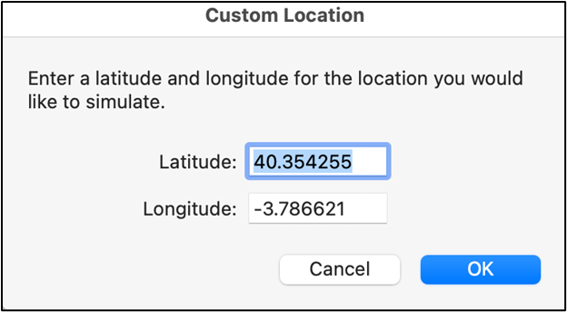
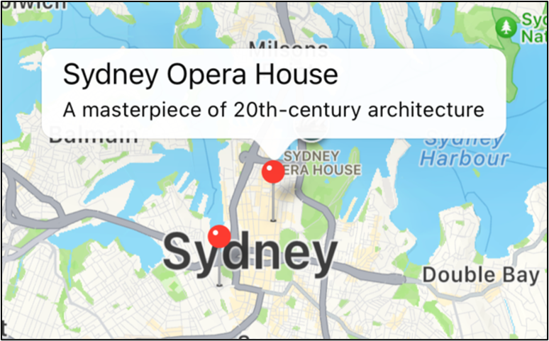
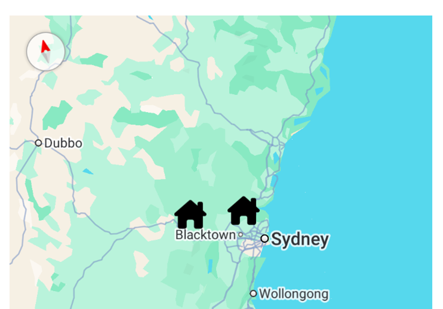

# BTP610 - Week 9 - Geocoding


## Install Starter Code

`btp610\apps\w08-geocoding-starter`

NOTES:

RECORDING: Managing a List of Markers (10 min)
Shows how to work with a list of markers. Code reference is on page 31 of code along doc
https://senecapolytechnic.zoom.us/rec/share/RN0VfO2kUQaCgoy6HlaF45xHz44u1pkoMWrLeibcZZVI7ogYlvUKD36Yz1RG3Tc.622Ct24qeP9MXxNr?startTime=1743042571000


RECORDING: Programatically moving a map (10 min)
Shows how to programatically move the map to a location. Code reference is on page 32 of the code along document
https://senecapolytechnic.zoom.us/rec/share/RN0VfO2kUQaCgoy6HlaF45xHz44u1pkoMWrLeibcZZVI7ogYlvUKD36Yz1RG3Tc.622Ct24qeP9MXxNr?startTime=1743043799000


map-demo-02.zip
Example from video of working wth a list of map markers and programatically moving the displayed m


## Learning Outcomes:

- What are location services?
- Forward geocoding
- Reverse geocoding
- Getting device location
- Displaying a map


## What are location services?


Location services typically refers to these operations:
- Forward geocoding: converting addresses to coordinates	(latitiude, longitude)
- Reverse geocoding: converting coordinates to addresses
- Retrieving the device’s current location

To perform location services, we need to use a 3rd party library called “expo-location”


## How to implement location services?

Use the Expo-Location library:


Documentation:
https://docs.expo.dev/versions/latest/sdk/location/


Installation instructions:

- Install the location library:

```bash
npm install expo-location
```

- Import the library on the screen that requires geolocation services

```javascript
import * as Location from "expo-location"
```

- **This gives you access to a object called Location**
- **Location has functions that enable you to perform location service (geocoding, current locations)**

## Using the Expo Location functions:

1.	If needed, ask for permissions to use a location service function (geocoding, getting current location)

```javascript
Location.requestForegroudPermissionsAsync()		
```

→ convert an address to coordinate


2.	Call the appropriate library function
```js
Location.geocodeAsync()		
```
→ convert an address to coordinate

```js
Location.reverseGeocodeAsync() 
```
→ coordinate to address

```js
Location.getCurrentPositionAsync()  
```
→ getting the device location


3.	Manage the results of the function call

 
## Permissions

On Android devices, you must request permissions before accessing location services

If you do NOT ask for permissions, you will see an error message:
```bash
 LOG  [Error: Call to function 'ExpoLocation.geocodeAsync' has been rejected.
→ Caused by: Not authorized to use location services]
```


To ask for permissions use the function: `Location.requestForegroundPermissionsAsync()`


Your app should ask for permissions AT THE TIME the app needs location information.

Typically, this occurs when the screen loads:

```js
useEffect(()=>{
      // when the screen loads, ask for permissions      
},[])
```


### Code Example:  Asking for Permissions

#### IOS:


#### Android
The UI for asking for permission varies depending on the Android operating system version:


```js
const requestPermissions = async () => {
   try {           
      const permissionsObject =  
          await Location.requestForegroundPermissionsAsync()
      if (permissionsObject.status  === "granted") {
          alert("Permission granted!")               
      } else {
          alert("Permission denied or not provided")               
      }
   } catch (err) {
      console.log(err)
   }
}
```

This function will:
1.	Check if the user has previously granted location permission
2.	If yes, then do not ask again
3.	If no, ask for permission
    
    a.	If user grants permission, notify the operating system that permissions were granted 
    
    b.	If user denies permission, notify operating system that permissions were denied

An app’s location permission status can be found in your device’s Settings menu:


### Code:

```js
// ask for permissions when the app loads
   useEffect(()=>{
       requestPermissions()
   },[])

   // helper function to request permissions
   // - Show the permission popup and then check what hte user selected (Allow, Allow while in use, deny)
   const requestPermissions = async () => {
     try {          
        const permissionsObject = 
            await Location.requestForegroundPermissionsAsync()
        if (permissionsObject.status  === "granted") {
            alert("Permission granted!")              
        } else {
            alert("Permission denied or not provided")              
        }
     } catch (err) {
        console.log(err)
     }
  }

 ```

### How does the Permission Object work?

The `Location.requestForegroundPermissionsAsync()` function returns a PermissionResponse object literal (click for documentation)

```js
const permissionsObject = {
   canAskAgain: boolean,
   expires: PermissionExpiration object
   granted: boolean
   status: PermissionStatus object
}
```

The status property contains detailed information about the current permission status (click for documentation)

Here are the possible values for the status property:


## Forward Geocoding

```js
Location.geocodeAsync(address)
```

- The function attempts to convert the specified human readable address to coordinates
- For example, “255 Main Street, Toronto” would convert to (43.687310,-79.300650)

The function returns an array of matching locations.
- An address can correspond to more than one coordinate
- Therefore, `Location.geocodeAsync(..) returns its results as an array
- Typically, there is only 1 item in the array
- But there may be situations when there is more than one

When retrieving the coordinate, use the first item in the array.


### Sample code:

```js
try {
           const geocodedLocation = await Location.geocodeAsync(addressFromUI)
           console.log(geocodedLocation) // array of possible locations
          
           const result = geocodedLocation[0]
           if (result === undefined) {
               alert("No coordinates found")
               return
           }
          
           console.log(result)
           console.log(`Latitude: ${result.latitude}`)
           console.log(`Longitude: ${result.longitude}`)
          
          
           const outputString = `${addressFromUI} is located at ${result.latitude}, ${result.longitude}`
           setFwdGecodeResultsLabel(outputString)


       } catch (err) {
           console.log(err)
       }
```


### Sample output:


###  Code Along From Class:

```js
import * as Location from "expo-location"

import { StyleSheet, Text, View, TextInput, Button, SafeAreaView, Platform, StatusBar } from "react-native";
import { useState } from "react"


export default function App()  {

   const [addressFromUI, setAddressFromUI] = useState("1750 Finch Avenue East, Toronto, ON")
 
   // Starbucks Vancouver: 2505 Granville St, Vancouver, BC V6H 3G7
   const [latFromUI, setLatFromUI] = useState("-49.2470185")
   const [lngFromUI, setLngFromUI] = useState("-123.1692495")

   const [fwdGecodeResultsLabel, setFwdGecodeResultsLabel] = useState("reverse geocoding results go here")
   const [reverseGecodeResultsLabel, setReverseGecodeResultsLabel] = useState("reverse geocoding results go here")
   const [currLocationLabel, setCurrLocationLabel] = useState("curr location results here")

   const doFwdGeocode = async () => {
       console.log("+++ DEBUG: Foward Geocoding")

       // 1. attempt: convert the address to a coordinate
       const geocodedLocation = await Location.geocodeAsync(addressFromUI)

       // 2. get the results
       const results = geocodedLocation[0]
       // --- 2a. results = undefined       
       if (results === undefined) {
           // could not find a matching coordinate
           // addressFromUI = "BLAH BLAH BLAH XHSYD 2343423"
           console.log("ERROR: cannot find coordinate")
           setFwdGecodeResultsLabel("ERROR: Could not find coordinate.")
           // stop and do not proceed with any other logic
           return
       }
       // --- 2b. results contains something
       console.log("Results found:")
       console.log(results)
       // {"accuracy": 100, "altitude": 0, "latitude": 43.7957894, "longitude": -79.3489909}

       // 3. extract the latitude and longitude and show it in the UI
       const output = `Lat: ${results.latitude}, Lng: ${results.longitude}`
       setFwdGecodeResultsLabel(output)
   }
  
   const doReverseGeocode = () => {
      
   }

   const getCurrLocation = () => {

   }

   return (
       <SafeAreaView styles={styles.container}>
           <Text style={styles.headingText}>Geocoding Demo</Text>
        
           <TextInput
               style={styles.input}
               onChangeText={setAddressFromUI}
               placeholder="Enter address (example: 123 Main Street)"
               value={addressFromUI}
           />
           <Button title="Forward Geocoding" onPress={doFwdGeocode}/>
           <Text style={styles.text}>{fwdGecodeResultsLabel}</Text>

           <View style={{flexDirection:"row", justifyContent:"center"}}>
               <TextInput
                   style={styles.input}
                   onChangeText={setLatFromUI}
                   placeholder="Enter latitude"
                   value={latFromUI}
               />
               <TextInput
                   style={styles.input}
                   onChangeText={setLngFromUI}
                   placeholder="Enter longitude"
                   value={lngFromUI}
               />
           </View>

           <Button title="Reverse Geocoding" onPress={doReverseGeocode}/>
           <Text style={styles.text}>{reverseGecodeResultsLabel}</Text>

           <Button title="Get Current Location" onPress={getCurrLocation}/>
           <Text style={styles.text}>{currLocationLabel}</Text>

       </SafeAreaView>
   );
}

const styles = StyleSheet.create({
   container: {
     flex: 1,
     backgroundColor: "#fff",
     alignItems: "center",
     justifyContent: "center",
     paddingTop: (Platform.OS === "android") ? StatusBar.currentHeight : 0,     
   },
   text: {
       fontSize:18,
       marginVertical:8,
       textAlign:"center"
   },
   headingText: {
       fontSize:24,
       marginVertical: 8,
       textAlign:"center",
   },     
   input: {
       height: 40,
       margin: 8,
       borderWidth: 1,
       padding: 10,
   },   
   map : {
     borderWidth:1,
     borderColor:"black",     
     height:300,
   }
});
```


## Reverse Geocoding

```js
Location.reverseGeocodeAsync(coordinates, {})
```

- The function attempts to convert the specified coordinate into a  human readable address
- For example, (43.687310,-79.300650) will convert to “255 Main Street, Toronto, ON, Canada”

The function will return an array of objects containing the corresponding address.  

Each object in the array will look like this:

```json
{
    "city": "Toronto",
    "country": "Canada",
    "district": "Don Valley Village",
    "isoCountryCode": "CA",
    "name": "Seneca Polytechnic - Newnham Campus",
    "postalCode": "M2J 2X5",
    "region": "ON",
    "street": "Finch Ave E",
    "streetNumber": "1750",
    "subregion": "Toronto",
    "timezone": "America/Toronto"
}
 ```

If the address does not have information for a particular object property, then the property’s value will be set to null.

For example, ("-33.8568", "151.2153") produces this result:

```json
{
    "city": "Sydney",
    "country": "Australia",
    "district": "Sydney Opera House and Botanical Garden",
    "isoCountryCode": "AU",
    "name": "Sydney Opera House",
    "postalCode": "2000",
    "region": "NSW",
    "street": null,
    "streetNumber": null,
    "subregion": "Sydney",
    "timezone": "Australia/Sydney"}
```

 
### Sample code:

```js
try {
    // create the coordinates object
    // properties here: https://docs.expo.dev/versions/latest/sdk/location/#locationgeocodedlocation
    const coords = {
         latitude: parseFloat(latFromUI),
         longitude: parseFloat(lngFromUI)
    }
    // returns an array of LocationGeocodedAddress objects
    // properties of this object are here: https://docs.expo.dev/versions/latest/sdk/location/#locationgeocodedaddress
     const postalAddresses 
         = await Location.reverseGeocodeAsync(coords, {})
     const result = postalAddresses[0]
          
     if (result === undefined) {
        alert("No results found.")
        return
     }

     console.log(`Street: ${result.street}`)
     console.log(`City: ${result.city}`)
     console.log(`Province/State: ${result.region}`)
     console.log(`Country: ${result.country}`)

     const outputString = `Street: ${result.street}\nCity: ${result.city}\nProvince/State: ${result.region}\nCountry: ${result.country}`
     setReverseGecodeResultsLabel(outputString)
} catch(err) {
     console.log(err)
}
```
### Code Example From Class

```js
import * as Location from "expo-location"

import { StyleSheet, Text, View, TextInput, Button, SafeAreaView, Platform, StatusBar } from "react-native";
import { useState } from "react"


export default function App()  {

   const [addressFromUI, setAddressFromUI] = useState("1750 Finch Avenue East, Toronto, ON")
 
   // Starbucks Vancouver: 2505 Granville St, Vancouver, BC V6H 3G7
   const [latFromUI, setLatFromUI] = useState("43.7778779")
   const [lngFromUI, setLngFromUI] = useState("-79.3495249")

   const [fwdGecodeResultsLabel, setFwdGecodeResultsLabel] = useState("reverse geocoding results go here")
   const [reverseGecodeResultsLabel, setReverseGecodeResultsLabel] = useState("reverse geocoding results go here")
   const [currLocationLabel, setCurrLocationLabel] = useState("curr location results here")

   const doFwdGeocode = async () => {
       console.log("+++ DEBUG: Foward Geocoding")

       // 1. attempt: convert the address to a coordinate
       const geocodedLocation = await Location.geocodeAsync(addressFromUI)

       // 2. get the results
       const results = geocodedLocation[0]
       // --- 2a. results = undefined       
       if (results === undefined) {
           // could not find a matching coordinate
           // addressFromUI = "BLAH BLAH BLAH XHSYD 2343423"
           console.log("ERROR: cannot find coordinate")
           setFwdGecodeResultsLabel("ERROR: Could not find coordinate.")
           // stop and do not proceed with any other logic
           return
       }
       // --- 2b. results contains something
       console.log("Results found:")
       console.log(results)
       // {"accuracy": 100, "altitude": 0, "latitude": 43.7957894, "longitude": -79.3489909}

       // 3. extract the latitude and longitude and show it in the UI
       const output = `Lat: ${results.latitude}, Lng: ${results.longitude}`
       setFwdGecodeResultsLabel(output)
   }
  
   const doReverseGeocode = async () => {
       // 1. get the coordinates from the ui
       // build a  object with it
       // Use these property names with these spellings
       // (This is a requirement of the Location.geocode function)

       // Data in a textbox is ALWAYS represented as astring
       // But the location.geocode function needs numbers
       // So you must convert to a number before you can use
       //  it with the Location function
       const coords = {
           latitude:   parseFloat(latFromUI),
           longitude:  parseFloat(lngFromUI)}

       console.log("DEBUG: What is coords?")
       console.log(coords)
       // use the function
       // parameter #2 is always a empty object {}
       const abc = await Location.reverseGeocodeAsync(coords, {})
       const results = abc[0]
       // handle the results
       if (results === undefined) {
           // could not find a matching address
           console.log("ERROR: cannot find coordinate")
           setReverseGecodeResultsLabel("ERROR: Could not find coordinate.")
       }
       // can find address
       console.log("DEBUG: Reverse Geocoding")
       console.log(results)

       // {"city": "Toronto", "country": "Canada", "district": "Don Valley Village", "isoCountryCode": "CA", "name": "34 Leith Hill Rd", "postalCode": "M2J 1Z4", "region": "ON", "street": "Leith Hill Rd", "streetNumber": "34", "subregion": "Toronto", "timezone": "America/Toronto"}

       const output = `
           Address: ${results.name}\n
           City: ${results.city}, ${results.region}\n
           Postal Code: ${results.postalCode}
       `
       setReverseGecodeResultsLabel(output)
   }

   const getCurrLocation = () => {

   }

   return (
       <SafeAreaView styles={styles.container}>
           <Text style={styles.headingText}>Geocoding Demo</Text>
        
           <TextInput
               style={styles.input}
               onChangeText={setAddressFromUI}
               placeholder="Enter address (example: 123 Main Street)"
               value={addressFromUI}
           />
           <Button title="Forward Geocoding" onPress={doFwdGeocode}/>
           <Text style={styles.text}>{fwdGecodeResultsLabel}</Text>

           <View style={{flexDirection:"row", justifyContent:"center"}}>
               <TextInput
                   style={styles.input}
                   onChangeText={setLatFromUI}
                   placeholder="Enter latitude"
                   value={latFromUI}
               />
               <TextInput
                   style={styles.input}
                   onChangeText={setLngFromUI}
                   placeholder="Enter longitude"
                   value={lngFromUI}
               />
           </View>

           <Button title="Reverse Geocoding" onPress={doReverseGeocode}/>
           <Text style={styles.text}>{reverseGecodeResultsLabel}</Text>

           <Button title="Get Current Location" onPress={getCurrLocation}/>
           <Text style={styles.text}>{currLocationLabel}</Text>

       </SafeAreaView>
   );
}

const styles = StyleSheet.create({
   container: {
     flex: 1,
     backgroundColor: "#fff",
     alignItems: "center",
     justifyContent: "center",
     paddingTop: (Platform.OS === "android") ? StatusBar.currentHeight : 0,     
   },
   text: {
       fontSize:18,
       marginVertical:8,
       textAlign:"center"
   },
   headingText: {
       fontSize:24,
       marginVertical: 8,
       textAlign:"center",
   },     
   input: {
       height: 40,
       margin: 8,
       borderWidth: 1,
       padding: 10,
   },   
   map : {
     borderWidth:1,
     borderColor:"black",     
     height:300,
   }
});
```


####   Get the user’s (device) current location

```js
Location.getCurrentPositionAsync({accuracy})
```

- Attempts to retrieve the current location of the device
- The function accepts an accuracy parameter. This parameter specifies how precise the location finding is. 
- Location is normally retrieved using either the device’s GPS or Wifi.  GPS is more precise than Wifi, but GPS consumes more battery power than Wifi.
- By default, the accuracy is set to  Location.Accuracy.Balanced


##### Code sample:

```js
try {           
   const location = await Location.getCurrentPositionAsync({accuracy:Location.Accuracy.Balanced});           

   console.log(`The current location is:`)
   console.log(location)

   setCurrLocationLabel(`Current location: ${JSON.stringify(location)}`)
   // alert(JSON.stringify(location))
} catch (err) {
   console.log(err)
}

```


#### Get Current Location returns

```json
{
    "coords": {"accuracy": 5, "altitude": 0, "altitudeAccuracy": -1, "heading": -1, "latitude": 40.354255, "longitude": -3.786621, "speed": -1}, 
    "timestamp": 1711031513428.132
}
``` 

On IOS, you can set the location using the emulator setting Feature > Location > Custom Location



### Full Code From Class:

1. Ask for permissions
2. Get the current location of the device

```js
import * as Location from "expo-location"

import { StyleSheet, Text, View, TextInput, Button, SafeAreaView, Platform, StatusBar } from "react-native";
import { useState, useEffect } from "react"


export default function App()  {

   const [addressFromUI, setAddressFromUI] = useState("1750 Finch Avenue East, Toronto, ON")
 
   // Starbucks Vancouver: 2505 Granville St, Vancouver, BC V6H 3G7
   const [latFromUI, setLatFromUI] = useState("43.7778779")
   const [lngFromUI, setLngFromUI] = useState("-79.3495249")

   const [fwdGecodeResultsLabel, setFwdGecodeResultsLabel] = useState("reverse geocoding results go here")
   const [reverseGecodeResultsLabel, setReverseGecodeResultsLabel] = useState("reverse geocoding results go here")
   const [currLocationLabel, setCurrLocationLabel] = useState("curr location results here")


   // use this funciton when the app loads
   useEffect(()=>{
       requestPermissions()
   },[])


   // dd a function to ask for permissions
   const requestPermissions = async () => {
       try {          
          const permissionsObject = 
              await Location.requestForegroundPermissionsAsync()
          if (permissionsObject.status  === "granted") {
              alert("Permission granted!")              
          } else {
              alert("Permission denied or not provided")              
          }
       } catch (err) {
          console.log(err)
       }
    }
   


   const doFwdGeocode = async () => {
       console.log("+++ DEBUG: Foward Geocoding")

       // 1. attempt: convert the address to a coordinate
       const geocodedLocation = await Location.geocodeAsync(addressFromUI)

       // 2. get the results
       const results = geocodedLocation[0]
       // --- 2a. results = undefined       
       if (results === undefined) {
           // could not find a matching coordinate
           // addressFromUI = "BLAH BLAH BLAH XHSYD 2343423"
           console.log("ERROR: cannot find coordinate")
           setFwdGecodeResultsLabel("ERROR: Could not find coordinate.")
           // stop and do not proceed with any other logic
           return
       }
       // --- 2b. results contains something
       console.log("Results found:")
       console.log(results)
       // {"accuracy": 100, "altitude": 0, "latitude": 43.7957894, "longitude": -79.3489909}

       // 3. extract the latitude and longitude and show it in the UI
       const output = `Lat: ${results.latitude}, Lng: ${results.longitude}`
       setFwdGecodeResultsLabel(output)
   }
  
   const doReverseGeocode = async () => {
       // 1. get the coordinates from the ui
       // build a  object with it
       // Use these property names with these spellings
       // (This is a requirement of the Location.geocode function)

       // Data in a textbox is ALWAYS represented as astring
       // But the location.geocode function needs numbers
       // So you must convert to a number before you can use
       //  it with the Location function
       const coords = {
           latitude:   parseFloat(latFromUI),
           longitude:  parseFloat(lngFromUI)}

       console.log("DEBUG: What is coords?")
       console.log(coords)
       // use the function
       // parameter #2 is always a empty object {}
       const abc = await Location.reverseGeocodeAsync(coords, {})
       const results = abc[0]
       // handle the results
       if (results === undefined) {
           // could not find a matching address
           console.log("ERROR: cannot find coordinate")
           setReverseGecodeResultsLabel("ERROR: Could not find coordinate.")
       }
       // can find address
       console.log("DEBUG: Reverse Geocoding")
       console.log(results)

       // {"city": "Toronto", "country": "Canada", "district": "Don Valley Village", "isoCountryCode": "CA", "name": "34 Leith Hill Rd", "postalCode": "M2J 1Z4", "region": "ON", "street": "Leith Hill Rd", "streetNumber": "34", "subregion": "Toronto", "timezone": "America/Toronto"}

       const output = `
           Address: ${results.name}\n
           City: ${results.city}, ${results.region}\n
           Postal Code: ${results.postalCode}
       `
       setReverseGecodeResultsLabel(output)
   }

   const getCurrLocation = async () => {
       const location = await Location.getCurrentPositionAsync({accuracy:Location.Accuracy.Balanced})

       console.log("DEBUG: Get current location")
       console.log(location)

       // output to the user interface
       // TODO:{"coords": {"accuracy": 5, "altitude": 0, "altitudeAccuracy": -1, "heading": -1, "latitude": 40.354255, "longitude": -3.786621, "speed": -1},
       // "timestamp": 1711031513428.132}

       // setCurrLocationLabel(`Lat: ${location.coords.latitude}, Lng: ${location.coords.longitude}`)
   }

   return (
       <SafeAreaView styles={styles.container}>
           <Text style={styles.headingText}>Geocoding Demo</Text>
        
           <TextInput
               style={styles.input}
               onChangeText={setAddressFromUI}
               placeholder="Enter address (example: 123 Main Street)"
               value={addressFromUI}
           />
           <Button title="Forward Geocoding" onPress={doFwdGeocode}/>
           <Text style={styles.text}>{fwdGecodeResultsLabel}</Text>

           <View style={{flexDirection:"row", justifyContent:"center"}}>
               <TextInput
                   style={styles.input}
                   onChangeText={setLatFromUI}
                   placeholder="Enter latitude"
                   value={latFromUI}
               />
               <TextInput
                   style={styles.input}
                   onChangeText={setLngFromUI}
                   placeholder="Enter longitude"
                   value={lngFromUI}
               />
           </View>

           <Button title="Reverse Geocoding" onPress={doReverseGeocode}/>
           <Text style={styles.text}>{reverseGecodeResultsLabel}</Text>

           <Button title="Get Current Location" onPress={getCurrLocation}/>
           <Text style={styles.text}>{currLocationLabel}</Text>

       </SafeAreaView>
   );
}

const styles = StyleSheet.create({
   container: {
     flex: 1,
     backgroundColor: "#fff",
     alignItems: "center",
     justifyContent: "center",
     paddingTop: (Platform.OS === "android") ? StatusBar.currentHeight : 0,     
   },
   text: {
       fontSize:18,
       marginVertical:8,
       textAlign:"center"
   },
   headingText: {
       fontSize:24,
       marginVertical: 8,
       textAlign:"center",
   },     
   input: {
       height: 40,
       margin: 8,
       borderWidth: 1,
       padding: 10,
   },   
   map : {
     borderWidth:1,
     borderColor:"black",     
     height:300,
   }
});
```

## Working with a Map

Use the React Native Maps library: https://github.com/react-native-maps/react-native-maps

```bash
npx expo install react-native-maps
```

Import the MapView component. This component displays a map

```js
import MapView from "react-native-maps"
```

Create a state variable that stores the visible area of the map

```js
const [visibleMapRegion, setVisibleMapRegion] = useState(
     {
       latitude: 43.7949433,
       longitude: -79.3529767,
       latitudeDelta: 1,
       longitudeDelta:1
     }
   )
```


Attach this state variable to the MapView component

```js
<MapView initialRegion={visibleMapRegion} style={styles.map}></MapView>
```

Note: Styles.map is:

```js
map : {
     borderWidth:1,
     borderColor:"black",     
     height:300,
   }
```

### Code From Class to show a map

```js
import * as Location from "expo-location"
import MapView from "react-native-maps"

import { StyleSheet, Text, View, TextInput, Button, SafeAreaView, Platform, StatusBar } from "react-native";
import { useState, useEffect } from "react"


export default function App()  {

   const [addressFromUI, setAddressFromUI] = useState("1750 Finch Avenue East, Toronto, ON")
 
   // Starbucks Vancouver: 2505 Granville St, Vancouver, BC V6H 3G7
   const [latFromUI, setLatFromUI] = useState("43.7778779")
   const [lngFromUI, setLngFromUI] = useState("-79.3495249")

   const [fwdGecodeResultsLabel, setFwdGecodeResultsLabel] = useState("reverse geocoding results go here")
   const [reverseGecodeResultsLabel, setReverseGecodeResultsLabel] = useState("reverse geocoding results go here")
   const [currLocationLabel, setCurrLocationLabel] = useState("curr location results here")


   // state variable to control the visible area of the map
   // the coordinates will dictate the starting position of the map
   const [visibleMapRegion, setVisibleMapRegion] = useState(
       {
         latitude: 43.7949433,
         longitude: -79.3529767,
         latitudeDelta: 1,
         longitudeDelta:1
       }
   )

   // use this funciton when the app loads
   useEffect(()=>{
       requestPermissions()
   },[])

   // dd a function to ask for permissions
   const requestPermissions = async () => {
       try {          
          const permissionsObject = 
              await Location.requestForegroundPermissionsAsync()
          if (permissionsObject.status  === "granted") {
              alert("Permission granted!")              
          } else {
              alert("Permission denied or not provided")              
          }
       } catch (err) {
          console.log(err)
       }
    }

   const doFwdGeocode = async () => {
       console.log("+++ DEBUG: Foward Geocoding")

       // 1. attempt: convert the address to a coordinate
       const geocodedLocation = await Location.geocodeAsync(addressFromUI)

       // 2. get the results
       const results = geocodedLocation[0]
       // --- 2a. results = undefined       
       if (results === undefined) {
           // could not find a matching coordinate
           // addressFromUI = "BLAH BLAH BLAH XHSYD 2343423"
           console.log("ERROR: cannot find coordinate")
           setFwdGecodeResultsLabel("ERROR: Could not find coordinate.")
           // stop and do not proceed with any other logic
           return
       }
       // --- 2b. results contains something
       console.log("Results found:")
       console.log(results)
       // {"accuracy": 100, "altitude": 0, "latitude": 43.7957894, "longitude": -79.3489909}

       // 3. extract the latitude and longitude and show it in the UI
       const output = `Lat: ${results.latitude}, Lng: ${results.longitude}`
       setFwdGecodeResultsLabel(output)
   }
  
   const doReverseGeocode = async () => {
       // 1. get the coordinates from the ui
       // build a  object with it
       // Use these property names with these spellings
       // (This is a requirement of the Location.geocode function)

       // Data in a textbox is ALWAYS represented as astring
       // But the location.geocode function needs numbers
       // So you must convert to a number before you can use
       //  it with the Location function
       const coords = {
           latitude:   parseFloat(latFromUI),
           longitude:  parseFloat(lngFromUI)}

       console.log("DEBUG: What is coords?")
       console.log(coords)
       // use the function
       // parameter #2 is always a empty object {}
       const abc = await Location.reverseGeocodeAsync(coords, {})
       const results = abc[0]
       // handle the results
       if (results === undefined) {
           // could not find a matching address
           console.log("ERROR: cannot find coordinate")
           setReverseGecodeResultsLabel("ERROR: Could not find coordinate.")
       }
       // can find address
       console.log("DEBUG: Reverse Geocoding")
       console.log(results)

       // {"city": "Toronto", "country": "Canada", "district": "Don Valley Village", "isoCountryCode": "CA", "name": "34 Leith Hill Rd", "postalCode": "M2J 1Z4", "region": "ON", "street": "Leith Hill Rd", "streetNumber": "34", "subregion": "Toronto", "timezone": "America/Toronto"}

       const output = `
           Address: ${results.name}\n
           City: ${results.city}, ${results.region}\n
           Postal Code: ${results.postalCode}
       `
       setReverseGecodeResultsLabel(output)
   }

   const getCurrLocation = async () => {
       const location = await Location.getCurrentPositionAsync({accuracy:Location.Accuracy.Balanced})

       console.log("DEBUG: Get current location")
       console.log(location)

       // ouptut to the user interface
       // TODO:{"coords": {"accuracy": 5, "altitude": 0, "altitudeAccuracy": -1, "heading": -1, "latitude": 40.354255, "longitude": -3.786621, "speed": -1},
       // "timestamp": 1711031513428.132}

       setCurrLocationLabel(`Lat: ${location.coords.latitude}, Lng: ${location.coords.longitude}`)
   }

   return (
       <SafeAreaView styles={styles.container}>
           <Text style={styles.headingText}>Geocoding Demo</Text>
        
           <TextInput
               style={styles.input}
               onChangeText={setAddressFromUI}
               placeholder="Enter address (example: 123 Main Street)"
               value={addressFromUI}
           />
           <Button title="Forward Geocoding" onPress={doFwdGeocode}/>
           <Text style={styles.text}>{fwdGecodeResultsLabel}</Text>

           <View style={{flexDirection:"row", justifyContent:"center"}}>
               <TextInput
                   style={styles.input}
                   onChangeText={setLatFromUI}
                   placeholder="Enter latitude"
                   value={latFromUI}
               />
               <TextInput
                   style={styles.input}
                   onChangeText={setLngFromUI}
                   placeholder="Enter longitude"
                   value={lngFromUI}
               />
           </View>

           <Button title="Reverse Geocoding" onPress={doReverseGeocode}/>
           <Text style={styles.text}>{reverseGecodeResultsLabel}</Text>

           <Button title="Get Current Location" onPress={getCurrLocation}/>
           <Text style={styles.text}>{currLocationLabel}</Text>

           <MapView initialRegion={visibleMapRegion} style={styles.map}></MapView>
          
       </SafeAreaView>
   );
}

const styles = StyleSheet.create({
   container: {
     flex: 1,
     backgroundColor: "#fff",
     alignItems: "center",
     justifyContent: "center",
     paddingTop: (Platform.OS === "android") ? StatusBar.currentHeight : 0,     
   },
   text: {
       fontSize:18,
       marginVertical:8,
       textAlign:"center"
   },
   headingText: {
       fontSize:24,
       marginVertical: 8,
       textAlign:"center",
   },     
   input: {
       height: 40,
       margin: 8,
       borderWidth: 1,
       padding: 10,
   },   
   map : {
     borderWidth:1,
     borderColor:"black",     
     height:300,
   }
});
```


### Add a Marker to the Map

```js
import MapView, {Marker} from "react-native-maps"

<Marker
     coordinate={{latitude:43.6826927, longitude:-79.6904297}}
onPress={()=>{ alert("You clicked on the airport!")}}
/>
```
#### Code:

```js
<MapView initialRegion={visibleMapRegion} style={styles.map}>
               <Marker
                coordinate={{latitude:43.6826927, longitude:-79.6904297}}
               onPress={()=>{ alert("You clicked on the airport!")}}
               />
 </MapView>
```
### Add another marker

```js
<MapView initialRegion={visibleMapRegion} style={styles.map}>
               <Marker
                coordinate={{latitude:43.6826927, longitude:-79.6904297}}
               onPress={()=>{ alert("You clicked on the airport!")}}
               />
               <Marker
                   coordinate={{latitude:43.7778779, longitude:-79.3495249}}
                   onPress={()=>{ alert("You clicked on college!")}}
               />
           </MapView>
```
### Marker with a popup

If you add a title and description property to a <Marker>, then clicking on the marker will automatically show a “details” popup window.  


```js
<Marker 	coordinate={{latitude:-33.8688, longitude:151.2093}}                   
title="Sydney Opera House"
description="A masterpiece of 20th-century architecture">
</Marker>
``` 

### Creating Custom Marker

The visual appearance of a marker can be customized. 


<Marker coordinate={{latitude:43.948238, longitude:-79.0435025}}>
   <View style={{backgroundColor:"yellow", borderWidth:1, borderColor:"black"}}>
      <Text>ABCD</Text>
      <Text>DEFGH</Text>
      <MaterialCommunityIcons name="heart-plus" size={24} color="black" />
   </View>
</Marker>  
```

###    Code Along:  Markers, Custom Marker

```js
import * as Location from "expo-location"
import MapView, {Marker} from "react-native-maps"

import { StyleSheet, Text, View, TextInput, Button, SafeAreaView, Platform, StatusBar } from "react-native";
import { useState, useEffect } from "react"


export default function App()  {

   const [addressFromUI, setAddressFromUI] = useState("1750 Finch Avenue East, Toronto, ON")
 
   // Starbucks Vancouver: 2505 Granville St, Vancouver, BC V6H 3G7
   const [latFromUI, setLatFromUI] = useState("43.7778779")
   const [lngFromUI, setLngFromUI] = useState("-79.3495249")

   const [fwdGecodeResultsLabel, setFwdGecodeResultsLabel] = useState("reverse geocoding results go here")
   const [reverseGecodeResultsLabel, setReverseGecodeResultsLabel] = useState("reverse geocoding results go here")
   const [currLocationLabel, setCurrLocationLabel] = useState("curr location results here")


   // state variable to control the visible area of the map
   // the coordinates will dictate the starting position of the map
   const [visibleMapRegion, setVisibleMapRegion] = useState(
       {
         latitude: 43.7949433,
         longitude: -79.3529767,
         latitudeDelta: 1,
         longitudeDelta:1
       }
   )

   // use this funciton when the app loads
   useEffect(()=>{
       requestPermissions()
   },[])


   // dd a function to ask for permissions
   const requestPermissions = async () => {
       try {          
          const permissionsObject = 
              await Location.requestForegroundPermissionsAsync()
          if (permissionsObject.status  === "granted") {
              alert("Permission granted!")              
          } else {
              alert("Permission denied or not provided")              
          }
       } catch (err) {
          console.log(err)
       }
    }
   


   const doFwdGeocode = async () => {
       console.log("+++ DEBUG: Foward Geocoding")

       // 1. attempt: convert the address to a coordinate
       const geocodedLocation = await Location.geocodeAsync(addressFromUI)

       // 2. get the results
       const results = geocodedLocation[0]
       // --- 2a. results = undefined       
       if (results === undefined) {
           // could not find a matching coordinate
           // addressFromUI = "BLAH BLAH BLAH XHSYD 2343423"
           console.log("ERROR: cannot find coordinate")
           setFwdGecodeResultsLabel("ERROR: Could not find coordinate.")
           // stop and do not proceed with any other logic
           return
       }
       // --- 2b. results contains something
       console.log("Results found:")
       console.log(results)
       // {"accuracy": 100, "altitude": 0, "latitude": 43.7957894, "longitude": -79.3489909}

       // 3. extract the latitude and longitude and show it in the UI
       const output = `Lat: ${results.latitude}, Lng: ${results.longitude}`
       setFwdGecodeResultsLabel(output)
   }
  
   const doReverseGeocode = async () => {
       // 1. get the coordinates from the ui
       // build a  object with it
       // Use these property names with these spellings
       // (This is a requirement of the Location.geocode function)

       // Data in a textbox is ALWAYS represented as astring
       // But the location.geocode function needs numbers
       // So you must convert to a number before you can use
       //  it with the Location function
       const coords = {
           latitude:   parseFloat(latFromUI),
           longitude:  parseFloat(lngFromUI)}

       console.log("DEBUG: What is coords?")
       console.log(coords)
       // use the function
       // parameter #2 is always a empty object {}
       const abc = await Location.reverseGeocodeAsync(coords, {})
       const results = abc[0]
       // handle the results
       if (results === undefined) {
           // could not find a matching address
           console.log("ERROR: cannot find coordinate")
           setReverseGecodeResultsLabel("ERROR: Could not find coordinate.")
       }
       // can find address
       console.log("DEBUG: Reverse Geocoding")
       console.log(results)

       // {"city": "Toronto", "country": "Canada", "district": "Don Valley Village", "isoCountryCode": "CA", "name": "34 Leith Hill Rd", "postalCode": "M2J 1Z4", "region": "ON", "street": "Leith Hill Rd", "streetNumber": "34", "subregion": "Toronto", "timezone": "America/Toronto"}

       const output = `
           Address: ${results.name}\n
           City: ${results.city}, ${results.region}\n
           Postal Code: ${results.postalCode}
       `
       setReverseGecodeResultsLabel(output)
   }

   const getCurrLocation = async () => {
       const location = await Location.getCurrentPositionAsync({accuracy:Location.Accuracy.Balanced})

       console.log("DEBUG: Get current location")
       console.log(location)

       // ouptut to the user interface
       // TODO:{"coords": {"accuracy": 5, "altitude": 0, "altitudeAccuracy": -1, "heading": -1, "latitude": 40.354255, "longitude": -3.786621, "speed": -1},
       // "timestamp": 1711031513428.132}

       setCurrLocationLabel(`Lat: ${location.coords.latitude}, Lng: ${location.coords.longitude}`)


       // 1. create a state variable that stores a marker position
       // 2. when you ge the current location, you update the state variable with the lat/lng
       // 3. Attach the state variable to the <Makrer> element
       // 4. When the state variable updates, the Marker will update

   }

   return (
       <SafeAreaView styles={styles.container}>
           <Text style={styles.headingText}>Geocoding Demo</Text>
        
           <TextInput
               style={styles.input}
               onChangeText={setAddressFromUI}
               placeholder="Enter address (example: 123 Main Street)"
               value={addressFromUI}
           />
           <Button title="Forward Geocoding" onPress={doFwdGeocode}/>
           <Text style={styles.text}>{fwdGecodeResultsLabel}</Text>

           <View style={{flexDirection:"row", justifyContent:"center"}}>
               <TextInput
                   style={styles.input}
                   onChangeText={setLatFromUI}
                   placeholder="Enter latitude"
                   value={latFromUI}
               />
               <TextInput
                   style={styles.input}
                   onChangeText={setLngFromUI}
                   placeholder="Enter longitude"
                   value={lngFromUI}
               />
           </View>

           <Button title="Reverse Geocoding" onPress={doReverseGeocode}/>
           <Text style={styles.text}>{reverseGecodeResultsLabel}</Text>

           <Button title="Get Current Location" onPress={getCurrLocation}/>
           <Text style={styles.text}>{currLocationLabel}</Text>

           <MapView initialRegion={visibleMapRegion} style={styles.map}>
               <Marker
                   coordinate={{latitude:43.6826927, longitude:-79.6904297}}
                   title="Toronto Pearson Airport"
                   description="The busiest airport in canada"
             
               />
               {/* <Marker
                   coordinate={{latitude:43.7778779, longitude:-79.3495249}}
                   onPress={()=>{ alert("You clicked on college!")}}
               /> */}

               <Marker
                   coordinate={{latitude:43.7778779, longitude:-79.3495249}}
                   onPress={()=>{ alert("You clicked on college!")}}
               >
                   <View style={{backgroundColor:"yellow", borderWidth:1, borderColor:"black"}}>
                   <Text>ABCD</Text>
                   <Text>DEFGH</Text>                  
                   </View>
               </Marker> 

           </MapView>

       </SafeAreaView>
   );
}

const styles = StyleSheet.create({
   container: {
     flex: 1,
     backgroundColor: "#fff",
     alignItems: "center",
     justifyContent: "center",
     paddingTop: (Platform.OS === "android") ? StatusBar.currentHeight : 0,     
   },
   text: {
       fontSize:18,
       marginVertical:8,
       textAlign:"center"
   },
   headingText: {
       fontSize:24,
       marginVertical: 8,
       textAlign:"center",
   },     
   input: {
       height: 40,
       margin: 8,
       borderWidth: 1,
       padding: 10,
   },   
   map : {
     borderWidth:1,
     borderColor:"black",     
     height:300,
   }
});


 
Managing a List of Markers

1. Create a state variable that tracks the markers

const [markerList, setMarkersList] = useState([
   { name: "Sydney Opera House", lat: -33.856159, lng: 151.215256 },
   { name: "Great Barrier Reef", lat: -18.156290, lng: 147.485962 }
])

2. Use the .map() function to generate 1 marker per item in the list

<MapView style={{flex:1, margin:20}} initialRegion={displayedRegion}>
         {
           markerList.map((location, index)=>{             
             return (
               <Marker key={index}
                       coordinate={{latitude:location.lat, longitude:location.lng}}
                       title={location.name}/>                   
             )
           })
         }
</MapView>
```


#### Result:


3. Any changes to the array will automatically redraw the map

```js
// Adding a marker to the map
markerList.push({name: "Uluru-Kata Tjuta National Park", lat: -25.344490, lng: 131.035431}
setMarkersList([...markerList])

// Removing all markers from the map
setMarkersList([])
```

### Programmatically updating the visible map area:

1. Create a “ref” variable. This is a variable that stores a pointer to the MapView component (and remembers the pointer even between screen refreshes)

```js
// Import the useRef() function from react library
import { useState, useEffect, useRef } from "react"

// Create a “ref” variable that will store a pointer to the MapView
const mapRef = useRef(null)


// Attach the ref variable to the <MapView> element

<MapView initialRegion={visibleMapRegion} style={styles.map} ref={mapRef}>
```


2. When a button is pressed, use this to update the visible map region:

```js
mapRef.current.animateToRegion(
     {
       latitude: 43.7949433,
       longitude: -79.3529767,
       latitudeDelta: 1,
       longitudeDelta:1
     }
)


```

#### Example code:

```js
import { StyleSheet, Text, View, TextInput, Button, SafeAreaView, Platform, StatusBar } from "react-native";
import { useState, useEffect, useRef } from "react"

import MapView, {Marker} from "react-native-maps"

import MaterialCommunityIcons from '@expo/vector-icons/MaterialCommunityIcons';


export default function App()  {

   // state variable that stores the current visible area of the map
   const [visibleMapRegion, setVisibleMapRegion] = useState(
     {
       latitude: 43.7949433,
       longitude: -79.3529767,
       latitudeDelta: 1,    // large numbers will zoom out, small numbers zoom in
       longitudeDelta:1     // large numbers will zoom out, small numbers zoom in 
     }
   )

 // pointer to the map
 const mapRef = useRef(null)


 const moveMapSomewhere = () => {
   console.log("moving map")

   mapRef.current.animateToRegion(
     {
       latitude: 49.257706,
       longitude: -123.2064761,
       latitudeDelta: 1,
       longitudeDelta:1
     }
   )

   // This does not work, it is just here for your reference to show
   // that it doesn't work

   // setVisibleMapRegion({
   //   latitude: 49.257706,
   //   longitude: -123.2064761,
   //   latitudeDelta: 1,
   //   longitudeDelta:1
   // } )
 }

   return (
       <SafeAreaView styles={styles.container}>
           <Text style={styles.headingText}>Map Demo</Text>

           <MapView initialRegion={visibleMapRegion} style={styles.map} ref={mapRef}>
               <Marker
                 coordinate={{latitude:43.6826927, longitude:-79.6904297}}
                 onPress={()=>{
                   alert("You clicked on airports")
                 }}
               />
               <Marker
                 coordinate={{latitude:43.8461025, longitude:-79.6475165}}                
                 title="Bolton, Ontario"
                 description="Somewhere in Bolton"
               />
               <Marker coordinate={{latitude:43.948238, longitude:-79.0435025}}>
                 <View style={{backgroundColor:"yellow", borderWidth:1, borderColor:"black"}}>
                   <Text>ABCD</Text>
                   <Text>DEFGH</Text>
                   <MaterialCommunityIcons name="heart-plus" size={24} color="black" />
                 </View>
               </Marker>                                
              
              
           </MapView>

           <Button title="Move Map Somewhere!" onPress = {moveMapSomewhere}/>

       </SafeAreaView>
   );

}

const styles = StyleSheet.create({
   container: {
     flex: 1,
     backgroundColor: "#fff",
     alignItems: "center",
     justifyContent: "center",
     paddingTop: (Platform.OS === "android") ? StatusBar.currentHeight : 0,     
   },
   text: {
       fontSize:18,
       marginVertical:8,
       textAlign:"center"
   },
   headingText: {
       fontSize:24,
       marginVertical: 8,
       textAlign:"center",
   },      
   map : {
     borderWidth:1,
     borderColor:"black",     
     height:300,
   }
});

```
