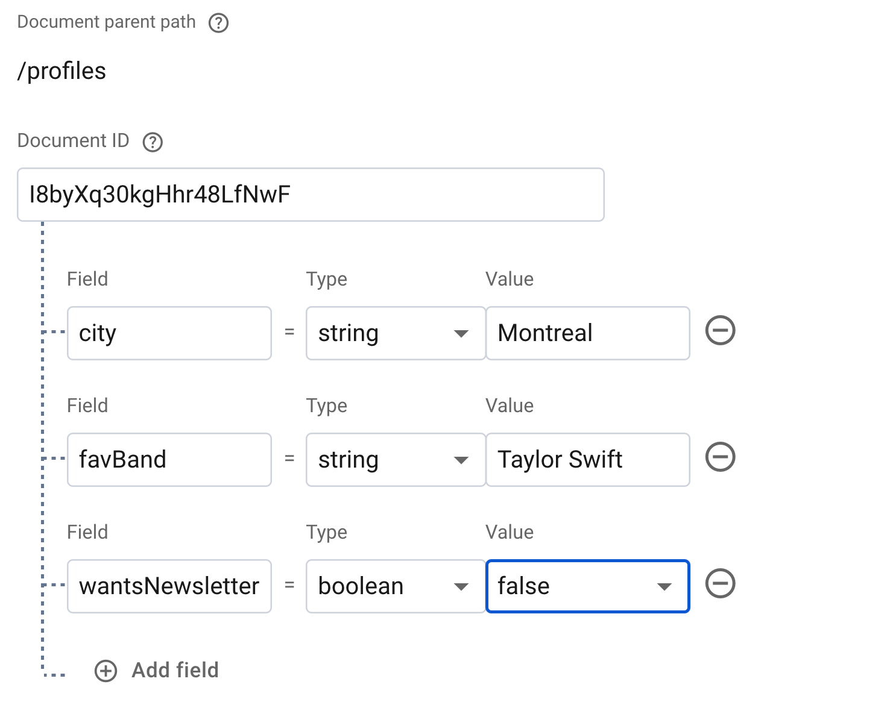
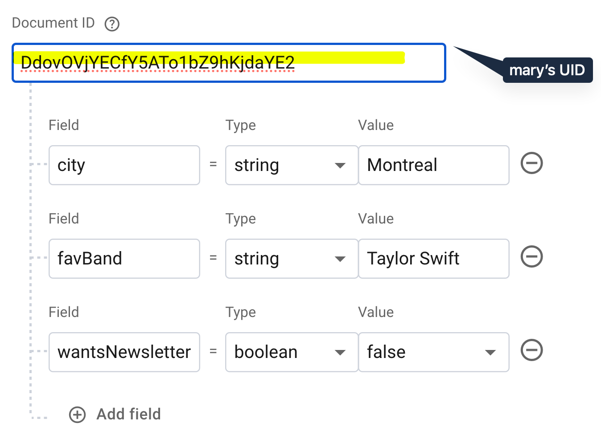
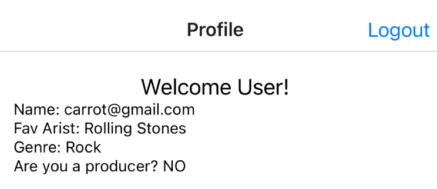
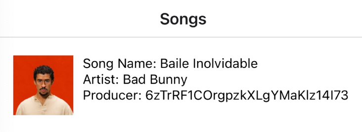
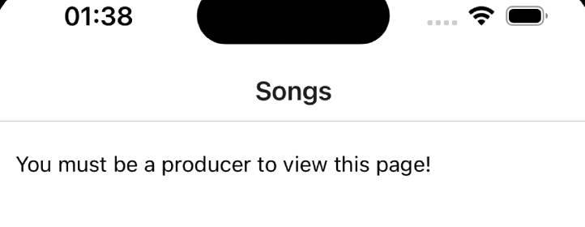
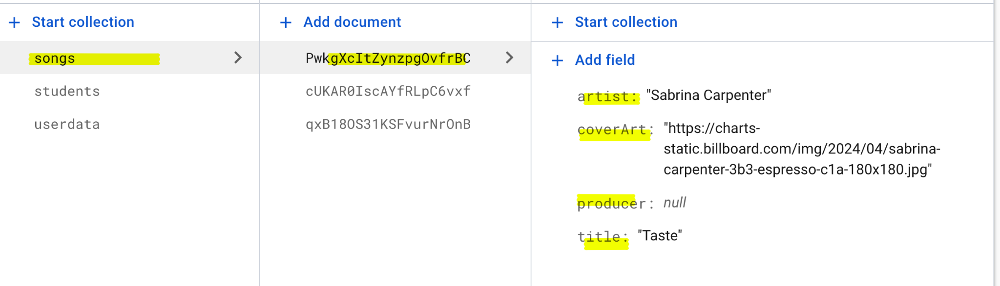
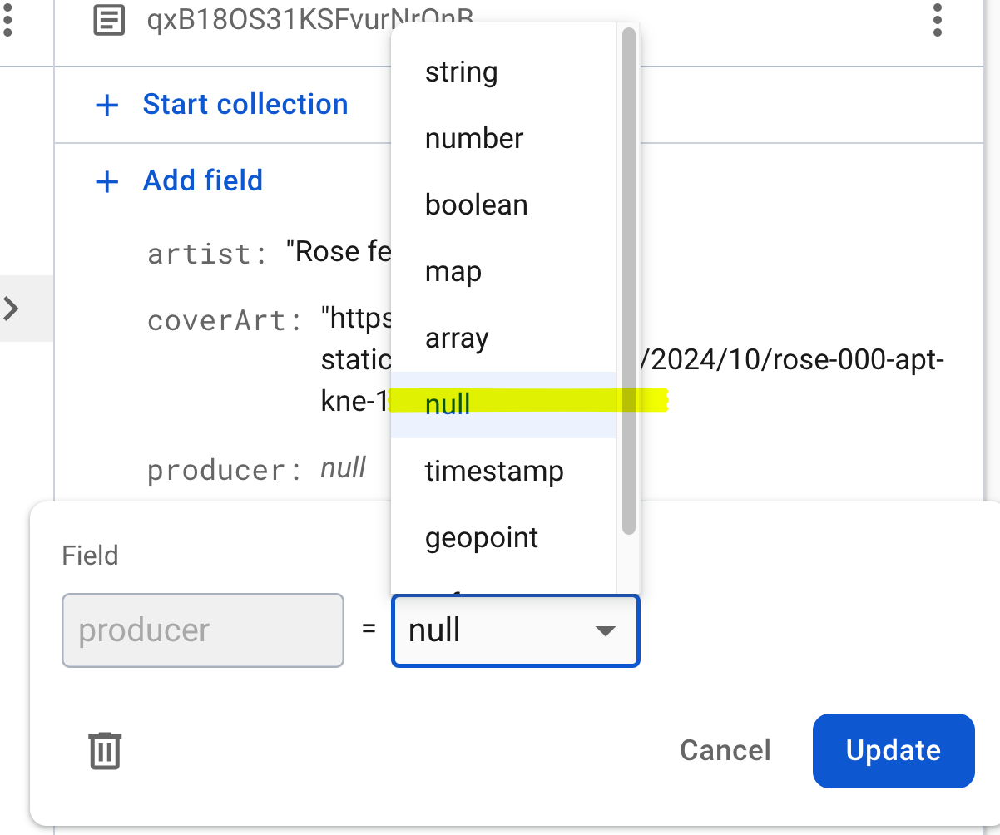
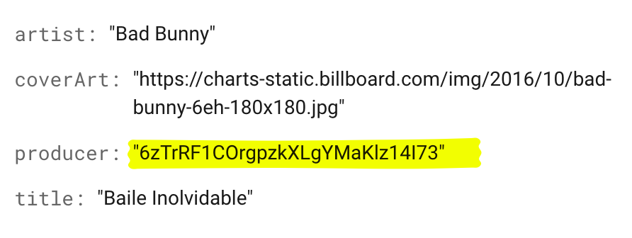

# Attaching a User Profile to a Firebase Account

Information about the currently logged in user can be obtained from the
auth.currentUser variable.

However, there may be situations when you want to *save* additional data
that is associated with a user. To do this, we need to create a *user
profile* for each user.

**<u>How do we create user profiles?</u>**

1\. On the signup page, add form fields to capture the additional
details about the user.

> If building a music-related app, you can capture:

- City (so you can show them tours from their favorite arits which is
  will be coming to their city soon)

- Favorite band/musician?

- Do you want to signup for the newsletter

2\. After creating an account in Firebase, create a corresponding user
profile in a database.

> We represent user profiles as a document in a database collection.

- Create a collection called “profiles”

- Add a document that contains the profile information

- Set the document id to match the person’s Firebase Auth UID

#  

# How to create a User Profile

Typically, we represent a *user profile* as a **document** in a
**Firestore collection**.

We associate the ***document*** with a specific user using the **uid**
generated by **Firebase Auth**.

For example:

# Firestore: The setDoc() function

Use the Firestore setDoc function to create a document with a specific
document id.

Example:

- This code adds a document with id “LA151” into a collection called
  “students”

<table>
<colgroup>
<col style="width: 100%" />
</colgroup>
<thead>
<tr>
<th>
// Add a new document in collection "cities" with a document id
of "LA151"

import { doc, setDoc } from "firebase/firestore";

// Add a new document in collection "cities" with a document id of
"LA151"

await setDoc(doc(db, "cities", "LA151"), {

name: "Los Angeles",

state: "CA",

country: "USA"

});
</th>
</tr>
</thead>
<tbody>
</tbody>
</table>

Documentation:
[<u>https://firebase.google.com/docs/firestore/manage-data/add-data#set_a_document</u>](https://firebase.google.com/docs/firestore/manage-data/add-data#set_a_document)

# Using the setDoc() function to create a profile for the user:

Code: LoginScreen.js

- Ensure you have the correct imports

**import** {db, auth} **from**
"../firebaseConfig"

**import** {collection, setDoc} **from**
"firebase/firestore"

**import** {createUserWithEmailAndPassword, signInWithEmailAndPassword }
**from** "firebase/auth";

- In the create account button handler:

**const** createAccountPressed = **async** () **=\>** {

console.log("Creating account...")

**try** {

**const** userCredential

= **await** createUserWithEmailAndPassword(auth, emailFromUI,
passwordFromUI)

// DEBUG: create a corresponding user profile

console.log(userCredential)

console.log(userCredential.user.uid)

alert("user created!")

// create a corresponding user profile

// insert a new document into the userdata collection

**const** documentToInsert = {

isProducer: isProducerInUI,

genre:genreFromUI,

favArtist:artistFromUI

}

**await** setDoc(doc(db, "userdata", userCredential.user.uid),
documentToInsert)

alert("user profile created!")

} **catch** (err) {

console.log("Error when creating user")

console.log(\`Error code: \${err.code}\`)

console.log(\`Error message: \${err.message}\`)

}

}

**Showing the User Profile Information on another Page**

After the account is created, navigate the user to the Profile Screen.  
The ProfileScreens should retrieve and display the currently logged in
user’s profile information:

**How to do it:**

1/ Import Firestore functions that we need imports

*ProfileScreen.js*

<table>
<colgroup>
<col style="width: 100%" />
</colgroup>
<thead>
<tr>
<th>
<strong>import</strong> {auth, <mark>db</mark>}
<strong>from</strong> "../firebaseConfig"

<mark><strong>import</strong> {getDoc, doc} <strong>from</strong>
"firebase/firestore"</mark>
</th>
</tr>
</thead>
<tbody>
</tbody>
</table>

2/ Get the corresponding user profile for the logged in user

*ProfileScreen.js*

<table>
<colgroup>
<col style="width: 100%" />
</colgroup>
<thead>
<tr>
<th>
// Will execute when the screen loads (mounting phase)

useEffect(()=&gt;{

getProfileData()

},[])

// Helper function

<strong>const</strong> getProfileData = <strong>async</strong> ()
<strong>=&gt;</strong> {

// debug

console.log(auth.currentUser)

// 1. retrieve the user profile data from the firestore
collection

<strong>const</strong> docSnap = <strong>await</strong>
getDoc(doc(db, "userdata", auth.currentUser.uid))

<strong>if</strong> (docSnap.exists()) {

console.log("Document data:", docSnap.data());

} <strong>else</strong> {

// docSnap.data() will be undefined in this case

console.log("No such document!");

}

}
</th>
</tr>
</thead>
<tbody>
</tbody>
</table>

3/ After retrieving the data, display the value in the user interface
using a state variable:

- Create a state variable to store the profile data

**const** \[profile, setProfile\] = useState(**null**)

- In the helper function, update the state variable with the profile
  from the database

**const** getProfileData = **async** () **=\>** {

// debug

console.log(auth.currentUser)

// 1. retrieve the user profile data from the firestore collection

**const** docSnap = **await** getDoc(doc(db, "userdata",
auth.currentUser.uid))

**if** (docSnap.exists()) {

console.log("Document data:", docSnap.data());

} **else** {

// docSnap.data() will be undefined in this case

console.log("No such document!");

}

setProfile(docSnap.data())

}

- Display the profile data in the user interface:

**return**(

\<View style={styles.container}\>

\<Text style={styles.heading}\>Welcome User!\</Text\>

\<Text\>Name:
{auth.currentUser.email}\</Text\>

{

(profile !== **null**) &&

\<View\>

\<Text\>Fav Arist:
{profile.favArtist}\</Text\>

\<Text\>Genre: {profile.genre}\</Text\>

\<Text\>Are you a producer? {(profile.isProducer ===
**true**) ? "YES" : "NO"} \</Text\>

\</View\>

}

\</View\>

)

Full code:

**import** { StyleSheet, Text, View, Button, TextInput, TextView,
Switch, Pressable} **from** 'react-native';

**import** {useState, useEffect} **from** "react"

**import** {auth, db} **from** "../firebaseConfig"

**import** {getDoc, doc} **from** "firebase/firestore"

**const** ProfileScreen = ({navigation}) **=\>** {

**const** \[profile, setProfile\] = useState(**null**)

// Will execute when the screen loads (mounting phase)

useEffect(()**=\>**{

getProfileData()

},\[\])

**const** getProfileData = **async** () **=\>** {

// debug

console.log(auth.currentUser)

// 1. retrieve the user profile data from the firestore collection

**const** docSnap = **await** getDoc(doc(db, "userdata",
auth.currentUser.uid))

**if** (docSnap.exists()) {

console.log("Document data:", docSnap.data());

} **else** {

// docSnap.data() will be undefined in this case

console.log("No such document!");

}

setProfile(docSnap.data())

}

// {"favArtist": "Michael Jackson1", "genre": "Pop2", "isProducer":
true}

useEffect(()**=\>**{

navigation.setOptions({

headerRight: () **=\>** (

\<Button onPress={logoutUser} title="Logout"/\>

),

})

}, \[navigation\])

**const** logoutUser = () **=\>** {

auth.signOut()

// go back to previous screen

navigation.goBack()

}

**return**(

\<View style={styles.container}\>

\<Text style={styles.heading}\>Welcome User!\</Text\>

\<Text\>Name: {auth.currentUser.email}\</Text\>

{

(profile !== **null**) &&

\<View\>

\<Text\>Fav Arist: {profile.favArtist}\</Text\>

\<Text\>Genre: {profile.genre}\</Text\>

\<Text\>Are you a producer? {(profile.isProducer === **true**) ? "YES" :
"NO"} \</Text\>

\</View\>

}

\</View\>

)

}

**export** **default** ProfileScreen

**const** styles = StyleSheet.create({

container: {

flex: 1,

backgroundColor: '#fff',

padding:20,

},

tb: {

width:"100%",

borderRadius:5,

backgroundColor:"#efefef",

color:"#333",

fontWeight:"bold",

paddingHorizontal:10,

paddingVertical:15,

marginVertical:10,

},

btn: {

borderWidth:1,

borderColor:"#141D21",

borderRadius:8,

paddingVertical:8,

marginVertical:8

},

darkBtn: {

borderWidth:1,

backgroundColor:"#000",

borderRadius:8,

paddingVertical:16,

marginVertical:8

},

btnLabel: {

fontSize:16,

textAlign:"center"

},

error: {

fontSize:16,

textAlign:"center",

color:"blue"

},

heading : {

fontSize:20,

textAlign:"center",

},

text : {

fontSize:18,

marginVertical:8,

}

});

**Homework: A producer can work on a song**

Write the code for the Songs page.

- If the logged in user is a producer, show the songs they produced

- If they are not a producer, show an error message:

**Solution**

1/ Create a songs collection and populate with some data

- Each song has fields for a song artist, song title, coverart and a
  producer

- Set the producer to null (by default: the producer does not exist)

- Set some songs to have a producer of null

- Set other songs to have a producer set to an existing user uid:

2/ **Retrieve the list of songs**

**import** { StyleSheet, Text, View, FlatList, Image} **from**
'react-native';

**import** {useState, useEffect} **from** "react"

**import** {db, auth} **from**
"../firebaseConfig"

**import** { doc, getDoc, getDocs, collection, query,
where } **from** "firebase/firestore"

**const** SongsScreen = () **=\>** {

**const** \[songList, setSonglist\] = useState(\[

{id:0, name:"song 1", artist:"artist 1",
coverArt:"https://picsum.photos/100", producer:**null**},

{id:1, name:"song 2", artist:"artist 2",
coverArt:"https://picsum.photos/100", producer:**null**},

\])

**const** \[errorMessage, setErrorMessage\] = useState("")

useEffect(()**=\>**{

getSongs()

},\[\])

**const** getSongs = **async** () **=\>** {

**try** {

// 1. get the user profile so we can check if the
user is a producer

**const** docSnap = **await** getDoc(doc(db,
"userdata", auth.currentUser.uid))

**const** profile = docSnap.data()

**if** (profile.isProducer === **false**) {

setErrorMessage("You must be a producer to view this
page!")

**return**

}

// if you reach this point, then the logged in user
is a producer

// find all songs with producer = logged in
user

**const** q = query(collection(db, "songs"),
where("producer", "==", auth.currentUser.uid))

**const** querySnapshot = **await** getDocs(q)

// iterate over the results

**const** temp = \[\]

querySnapshot.forEach((currDoc)**=\>**{

temp.push({...currDoc.data(), id: currDoc.id})

})

console.log(temp)

// update the flatlist

setSonglist(temp)

} **catch**(err) {

console.log(err)

}

}

**return**(

\<View style={styles.container}\>

{

(errorMessage !== "") && \<Text\>{errorMessage}\</Text\>

}

{ (errorMessage === "") &&

\<FlatList

data={songList}

keyExtractor={(item)**=\>**{ **return** item.id }}

renderItem={

({item})**=\>**{

**return**(

\<View style={styles.row}\>

\<Image

style={{width:64, height:64}}

source={{

uri: item.coverArt,

}}

/\>

\<View\>

\<Text\>Song Name: {item.title}\</Text\>

\<Text\>Artist: {item.artist}\</Text\>

{

(item.producer === **null**) ?

\<Text\>Producer: NONE!\</Text\> :

\<Text\>Producer: {item.producer}\</Text\>

}

\</View\>

\</View\>

)

}

}

ItemSeparatorComponent={

()**=\>**{

**return**(

\<View style={{borderWidth:1, borderColor:"#ccc",
marginVertical:4}}\>\</View\>

)

}

}

/\>

}

\</View\>

)

}

**const** styles = StyleSheet.create({

container: {

flex: 1,

backgroundColor: '#fff',

padding:20,

},

row:{

flexDirection:"row",

gap:10,

},

heading : {

fontSize:20,

textAlign:"center",

},

text : {

fontSize:18,

marginVertical:8,

}

});

**export** **default** SongsScreen
