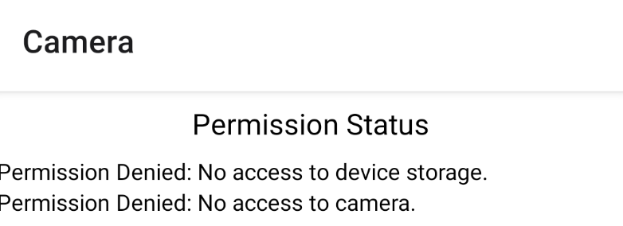
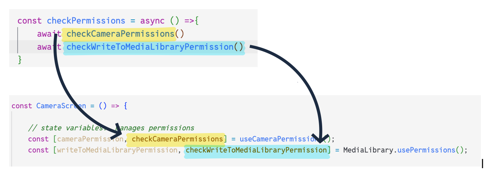
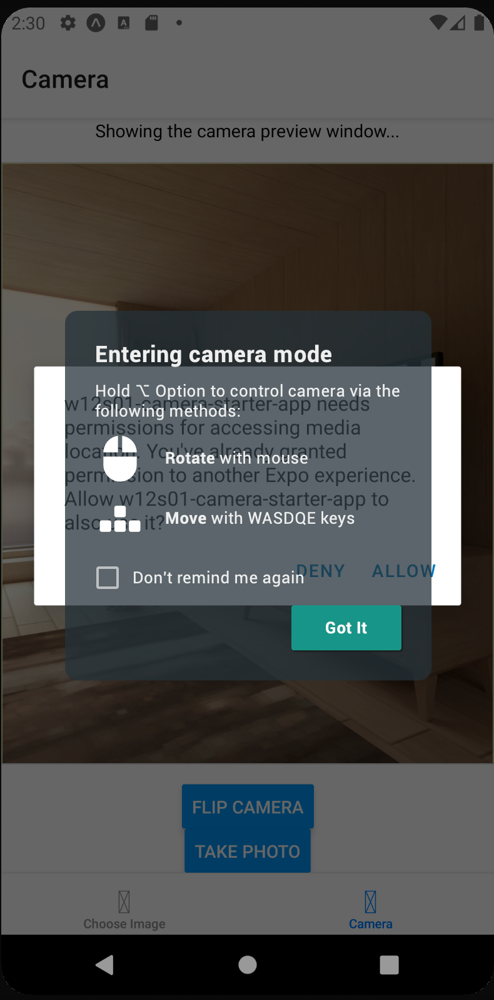
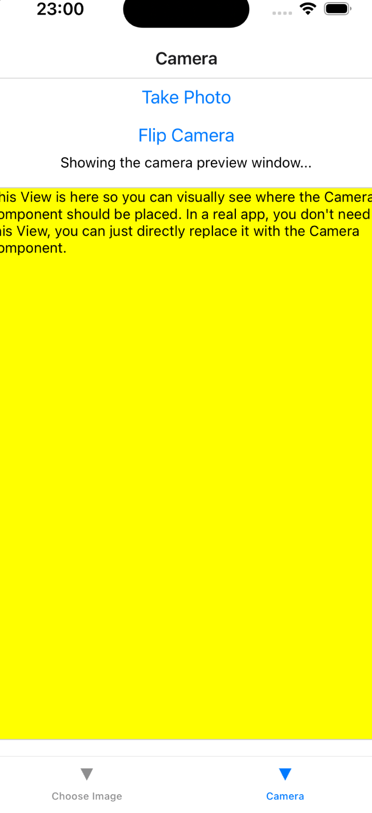
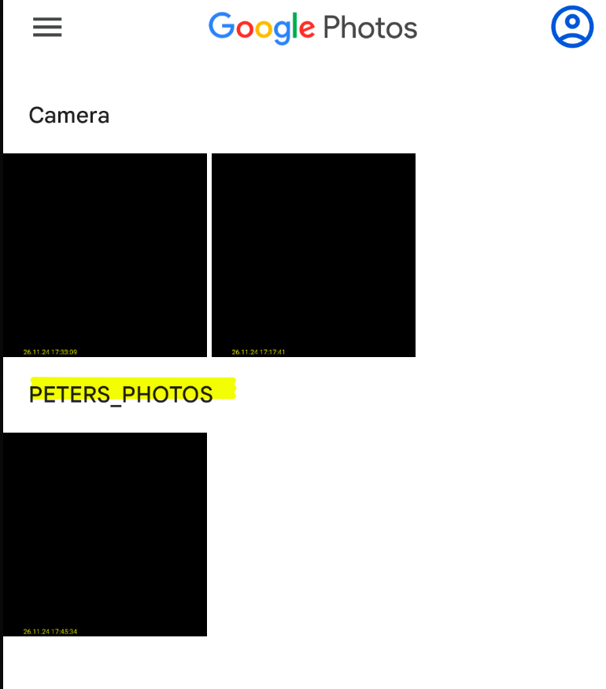

# Taking Photos with the Camera

# How to Take a Photo

Here is the process for taking a photo with the camera

1.  Request permissions to access the camera

2.  Request permissions to save data to the device storage

3.  Open the camera preview window

4.  Take the photo

5.  Save the photo to device storage (or the cloud!)

# 

# 

# Dependencies

Install the Expo Camera and Expo Media Storage libraries:

- Expo Camera

| npm install expo-camera |
|-------------------------|

- Expo Media Storage

| npm install expo-media-library |
|--------------------------------|

- On the screens that require access to the camera and storage, import
  the variables

<table>
<colgroup>
<col style="width: 100%" />
</colgroup>
<thead>
<tr>
<th>
import { Camera, useCameraPermission} from "expo-camera"

import * as MediaLibrary from 'expo-media-library';
</th>
</tr>
</thead>
<tbody>
</tbody>
</table>

# 

#  

# Requesting permissions

The Camera and Media Storage libraries come with hook functions that
enable you to request and manage permissions.

**1. Request permissions to use camera**

- Import

import { CameraView, useCameraPermissions } from 'expo-camera'

- Create a state variable to manage camera permissions

const \[cameraPermission, checkCameraPermissions\] =
useCameraPermissions();

- What is the purpose of these state variables?

  - cameraPermission: Contains a permission object

  - checkCameraPermissions: Function used to check if permissions are
    granted or not. If this is the first time the app runs, display the
    permissions popupbox

**2. Request permissions to save a photo to the device storage**

- Imports

import \* as MediaLibrary from 'expo-media-library'

- Create state variables to manage permissions for accessing media
  storage

const \[writeToMediaLibraryPermission,
checkWriteToMediaLibraryPermission\] = MediaLibrary.usePermissions();

- What is the purpose of these state variables?

  - writeToMediaLibraryPermission: Contains a permission object

  - checkWriteToMediaLibraryPermission: Check if permissions are granted
    or not. If this is the first time the app runs, display the
    permissions popup box

**Code Example:**

*This is the code for a screen that requests camera and media storage
permissions when the screen loads.*

const CameraScreen = () =\> {

const \[cameraPermission, checkCameraPermissions\] =
useCameraPermissions();

const \[writeToMediaLibraryPermission,
checkWriteToMediaLibraryPermission\] = MediaLibrary.usePermissions();

useEffect(()=\>{

console.log("Checking permissions on initial screen load....")

checkPermissions()

},\[\])

const checkPermissions = async () =\>{

try {

await checkCameraPermissions()

await checkWriteToMediaLibraryPermission()

} catch (err) {

console.log("ERROR: When asking for permissions")

console.log(err)

}

}

return(

\<View\>

{

(writeToMediaLibraryPermission !== null &&
writeToMediaLibraryPermission.granted === false) &&

\<Text\>Permission Denied: No access to device storage.\</Text\>

}

{

(cameraPermission !== null && cameraPermission.granted === false) &&

\<Text\>Permission Denied: No access to camera.\</Text\>

}

\</View\>

)

}

Expected output: *When the screen loads, a permissions dialog box is
displayed:*

*Camera permission popup Media storage permission popup*

If permissions denied, then an error message is shown:

**How this code works:**

1.  When the screen loads, request permissions.

> useEffect(()=\>{
>
> console.log("Checking permissions on initial screen load....")
>
> checkPermissions()
>
> },\[\])

2.  checkPermissions() is a helper function that requests camera and
    media storage permissions.

> const checkPermissions = async () =\>{
>
> await checkCameraPermissions()
>
> await checkWriteToMediaLibraryPermission()
>
> }
>
> The checkCameraPermissions() and checkWriteToMediaLibraryPermissions()
> are the *setter* functions for the permission state variables:

3.  If permissions are denied, then show an error message on the screen:

{

(writeToMediaLibraryPermission !== null

> && writeToMediaLibraryPermission.granted === false) &&

\<Text\>Permission Denied: No access to device storage.\</Text\>

}

# 

#  

# Displaying a \<CameraView\>

Here is the code for displaying the camera on the screen:

const CameraScreen = () =\> {

const \[cameraPermission, checkCameraPermissions\] =
useCameraPermissions();

*// ... other code to check permissions*

*// Camera related state and ref variables*

const cameraRef = useRef(null)

const isCameraReady = useRef(false)

const \[type, setType\] = useState("back")

*// helper function that executes when camera is ready*

const checkCameraStatus = () =\> {

isCameraReady.current = true

}

return (

\<View style={styles.container}\>

\<View\>

{*/\* assuming permission granted, then show the Camera\*/*}

{

(cameraPermission !== null && cameraPermission.granted === true) &&

\<CameraView

style={{height:"100%", width:"100%"}}

facing={type}

onCameraReady={checkCameraStatus}

ref={cameraRef}

/\>

}

\</View\>

\</View\>

)

}

export default CameraScreen

Result:

Android: IOS: Camera does not work in the IOS emulator!

**How this code works**

1.  The Expo Camera library provides a custom component called
    \<CameraView\>. This component displays a camera preview (the output
    of the camera) on the screen.

2.  For the \<CameraView\> component to work correctly, we need:

<!-- -->

1.  State variables to remember which camera the user wants to use
    (front vs back camera)

> const \[type, setType\] = useState("back")

2.  Ref variables that contain pointers to the \<CameraView\> component

> const cameraRef = useRef(null)

3.  Ref variables to remember whether React has properly “initialized”
    the camera

> const isCameraReady = useRef(false)

*REVIEW: Ref variables are special variable that React will remember in
between screen refreshes*

4.  A helper function that checks when the app has finished accessing
    and configuring the device’s camera. This function is attached to
    the \<CameraView\> component:

> const checkCameraStatus = () =\> {
>
> *// this function executes when device's camera is ready to go*
>
> console.log("cameraIsReady is firing...")
>
> *// update variable that tracks the camera readiness*
>
> isCameraReady.current = true
>
> }

3.  Assuming all of the above is added to your screen, add a
    \<CameraView\> component:

> \<CameraView
>
> style={{height:"100%", width:"100%"}}
>
> facing={type}
>
> onCameraReady={checkCameraStatus}
>
> ref={cameraRef}
>
> /\>

What does this code do?

- facing: Sets the default camera to the FRONT or BACK camera

- onCameraReady: Callback function that executes when the app is done
  opening the device’s camera and displays the camera output into the
  \<Camera\> component

- ref: Required to keep track of the \<Camera\> component between state
  changes

# Flip the Camera

This function switches between the front and back camera.

const toggleCameraType = () =\> {

setType(

(currCameraType)=\>{

if (currCameraType === "front") {

*// if type == front, change it to back*

return "back"

} else if (currCameraType === "back") {

*// if type == back change it to front*

return "front"

}

}

)

}

The current camera type is stored in a state variable. To flip the
camera, update the state variable to the opposite value. Specifically:

1.  Check the current value of the state variable.

2.  If set to "front", then update it to "back"

3.  If set to "back", then update it to "front"

Observe the syntax for updating the state variable:

setType((currCameraType)=\>{ return ...})

This type of state update is called “updating the state based on a
previous value”.

Read more here:

[<u>https://react.dev/reference/react/useState#updating-state-based-on-the-previous-state</u>](https://react.dev/reference/react/useState#updating-state-based-on-the-previous-state)

# Capturing the Current Camera output

Here’s the code for taking a photo. This code will capture the current
camera output and save it to a file on your device.

const takePhoto = async () =\> {

try {

const photoInfo = await cameraRef.current.takePictureAsync()

console.log("SUCCESS: See below for photo info")

console.log(photoInfo)

} catch (err) {

console.log(err)

}

}

Here’s how it works:

1.  takePictureAsync() will attempt to take a photo. If successful, the
    photo information is returned and saved to the photoInfo variable.

const photoInfo = await cameraRef.current.takePictureAsync()

2.  The data about your photo is represented as a Javascript object
    variable that looks like this:

*Contents of the photoData object:*

| {"height": 1126, "uri": "file:///var/mobile/Containers/Data/Application/BB43F031-F4E4-4610-B5C4-708E597B4962/Library/Caches/ExponentExperienceData/@anonymous/w110s01-d009711e-68e7-4664-81d1-a77f03350008/Camera/00BE4708-1395-432C-869E-C05429A78F11.jpg", "width": 1080} |
|----|

# Properties:

- height, width → size of photo

- uri: → location of where photo is saved in device memory

#  

3.  By default, the photo will be saved to the application’s cache
    directory. This is a special folder on the device that is used for
    temporary storage of data associated with the currently app.

4.  The cache is not a safe place for storage! When the phone is low on
    memory, the device will attempt to free up space by deleting the
    contents of the cache!

#  

# Saving Photo to Device Photo Gallery

To store the photo more *permanently*, you must write the photo data to
the device’s photo gallery.

1\. Create a state variable that controls media permissions

<table>
<colgroup>
<col style="width: 100%" />
</colgroup>
<thead>
<tr>
<th>
// state variables to manage Media permissions

const [writeToMediaLibraryPermission,
<mark>checkWriteToMediaLibraryPermission</mark>] =
MediaLibrary.usePermissions();
</th>
</tr>
</thead>
<tbody>
</tbody>
</table>

2\. Request permissions to access the phone’s storage

<table>
<colgroup>
<col style="width: 100%" />
</colgroup>
<thead>
<tr>
<th>
useEffect(()=&gt;{

console.log("Checking permissions on initial screen load....")

checkPermissions()

},[])

// Helper function to request permissions

onst checkPermissions = async () =&gt;{

// TODO: Check permissions

// 1. Ask for permission to access the camera

// call await on the state setter function

try {

await checkCameraPermissions()

<mark>await checkWriteToMediaLibraryPermission()</mark>

} catch (err) {

console.log("ERROR: When asking for permissions")

console.log(err)

}

}
</th>
</tr>
</thead>
<tbody>
</tbody>
</table>

Result

3\. To save a photo

*Sample*

<table>
<colgroup>
<col style="width: 100%" />
</colgroup>
<thead>
<tr>
<th>
const takePhoto = async () =&gt; {

// TODO: Implement code to take a photo using
camerRef.takePictureAsync()

try {

console.log("Attempting to take a photo")

// 1. Assuming you take the picture, the info about the picture will
be returned to you as an object

const photoInfo = await cameraRef.current.takePictureAsync()

console.log("SUCCESS: See below for photo info")

console.log(photoInfo)

// 2. Save the file to the photo gallery

console.log("Attempting to save to gallery")

<mark>const asset = await
MediaLibrary.createAssetAsync(photoInfo.uri)</mark>

console.log("SUCCESS: Photo saved! here is the info")

console.log(asset)

} catch (err) {

console.log(err)

}

}
</th>
</tr>
</thead>
<tbody>
</tbody>
</table>

Result:

<table>
<colgroup>
<col style="width: 100%" />
</colgroup>
<thead>
<tr>
<th>
{

"albumId": "-2075821635",

"creationTime": 0,

"duration": 0,

"filename": "b0242498-02f4-4567-94d2-2d4f1a4a0692.jpg",

"height": 1311,

"id": "30",

"mediaType": "photo",

"modificationTime": 1732659461000,

"uri":
"file:///storage/emulated/0/DCIM/b0242498-02f4-4567-94d2-2d4f1a4a0692.jpg",

"width": 1074

}
</th>
</tr>
</thead>
<tbody>
</tbody>
</table>

To save the photo to a specific *album* in the gallery:

<table>
<colgroup>
<col style="width: 100%" />
</colgroup>
<thead>
<tr>
<th>
const takePhoto = async () =&gt; {

// TODO: Implement code to take a photo using
camerRef.takePictureAsync()

try {

console.log("Attempting to take a photo")

// 1. Assuming you take the picture, the info about the picture will
be returned to you as an object

const photoInfo = await cameraRef.current.takePictureAsync()

console.log("SUCCESS: See below for photo info")

console.log(photoInfo)

// 2. Save the file to the photo gallery

console.log("Attempting to save to gallery")

const asset = await MediaLibrary.createAssetAsync(photoInfo.uri)

console.log("SUCCESS: Photo saved! here is the info")

console.log(asset)

// 3. Example of creating a photo album and putting the photo in the
album

// a. Specify the album name

// b. Does this album already exist in the gallerY?

console.log("DEBUG: Checking if album PETERS PHOTOS exists")

const existingAlbum = await
MediaLibrary.getAlbumAsync("<mark>PETERS_PHOTOS</mark>")

if (existingAlbum === null) {

// d. If no, then create the album and save the photo in there

console.log("DEBUG: Album does not exist, so creating and
saving")

const createdAlbum = await
MediaLibrary.<mark>createAlbumAsync</mark>("PETERS_PHOTOS", asset,
false)

} else {

// c. If yes, then save the photo in there

console.log("DEBUG: Album exists, so saving now")

const photoAdded = await
MediaLibrary.<mark>addAssetsToAlbumAsync</mark>([asset], existingAlbum,
false)

}

console.log("saving to album complete")

} catch (err) {

console.log(err)

}

}
</th>
</tr>
</thead>
<tbody>
</tbody>
</table>

