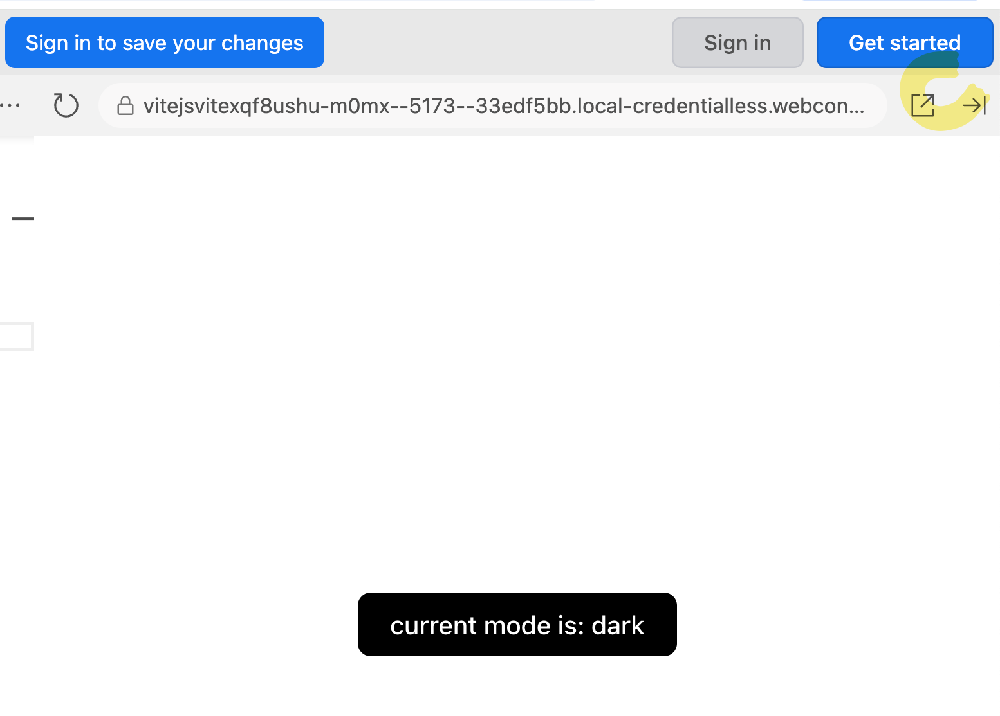

# Link to Stackblitz:

[<u>https://vite.new/react</u>](https://vite.new/react)

# 

# Example of updating a state variable based on a previous value

To update a state variable based on a previous value, use a functional
update:

*// the new wage is the old wage increased by 15%*

setHourlyWage((currWage)=\>{

return currWage \* 1.15

})

This is the equivalent of doing:

currWage = currWage \* 1.15

Examples: *to run these examples use StackBlitz:
[<u>https://vite.new/react</u>](https://vite.new/react)*

import { useState } from 'react';

import reactLogo from './assets/react.svg';

import viteLogo from '/vite.svg';

import './App.css';

function App() {

const \[count, setCount\] = useState(0);

const \[mode, setMode\] = useState('dark');

const \[num, setNum\] = useState(100);

const updateCounter = () =\> {

setCount((currValue) =\> {

return currValue + 1;

});

};

const updateMode = () =\> {

setMode((currValue) =\> {

if (currValue === 'dark') {

return 'light';

} else {

return 'dark';

}

});

};

const flip = () =\> {

setNum((currValue) =\> {

return currValue \* -1;

});

};

return (

\<\>

\

\<button onClick={updateCounter}\>count is {count}\</button\>

\<button onClick={updateMode} className={mode}\>

current setting: {mode}

\</button\>

\<button onClick={flip}\>flip number: {num}\</button\>

\</div\>

\</\>

);

}

export default App;

*App.css*

.dark {

background-color: black;

color: white;

}

.light {

background-color: \#eee;

color: black;

}

Comparison:

<table>
<colgroup>
<col style="width: 50%" />
<col style="width: 50%" />
</colgroup>
<thead>
<tr>
<th>Non functional update</th>
<th>Functional update</th>
</tr>
<tr>
<th>
const updateCounter = () =&gt; {

setCount(count + 1);

};
</th>
<th>
const updateCounter = () =&gt; {

setCount((currValue) =&gt; {

return currValue + 1;

});

};
</th>
</tr>
</thead>
<tbody>
</tbody>
</table>

<table>
<colgroup>
<col style="width: 50%" />
<col style="width: 50%" />
</colgroup>
<thead>
<tr>
<th style="text-align: left;">Non functional update</th>
<th style="text-align: left;"><em>Functional update</em></th>
</tr>
<tr>
<th>
const updateMode = () =&gt; {

let curr = mode;

if (curr === 'dark') {

setMode('light');

} else {

setMode('dark');

}

};
</th>
<th>
const updateMode = () =&gt; {

setMode((currValue) =&gt; {

if (currValue === 'dark') {

return 'light';

} else {

return 'dark';

}

});

};
</th>
</tr>
</thead>
<tbody>
</tbody>
</table>

Why should you use functional updates?

- State variables are updated asynchronously (as a background task.

- Therefore, you have *no guarantee* that when you access the state
  variable, you have its most up to date value.

<!-- -->

- In a functional update, React promises that you have the most updated
  value in the variable

Example of when you don’t always have the latest value;

import { useState } from 'react';

import reactLogo from './assets/react.svg';

import viteLogo from '/vite.svg';

import './App.css';

function App() {

const \[count, setCount\] = useState(0);

const \[mode, setMode\] = useState('dark');

const \[num, setNum\] = useState(100);

const updateCounter = () =\> {

setCount((currValue) =\> {

return currValue + 1;

});

};

const test = () =\> {

setCount(count + 1); *// count = 1 *

setCount(count + 1); *// count = 2 *

setCount(count + 1); *// count = 3*

};

return (

\<\>

\

\<button onClick={test}\>count is {count}\</button\>

\</div\>

\</\>

);

}

export default App;

# The useRef variable

Used to remember the value of a variable in between state updates.

(updates a state variable without triggering a UI refresh.

Click here to see console

Example of state that triggers a ui change:

import { useState, useEffect, useRef } from 'react';

import './App.css';

function App() {

const \[mode, setMode\] = useState('dark');

useEffect(() =\> {

console.log('mode change, refreshing UI');

}, \[mode\]);

const changeMode = () =\> {

setMode((curr) =\> {

if (curr === 'dark') {

return 'light';

} else {

return 'dark';

}

});

console.log('What is count? ' + count);

};

const \[count, setCount\] = useState(0);

useEffect(() =\> {

console.log('count changed, refreshing UI');

}, \[count\]);

const updateCount = () =\> {

setCount(count + 1);

};

return (

\<\>

\

\<button onClick={updateCount}\>Count is: {count}\</button\>

\<button onClick={changeMode} className={mode}\>

current mode is: {mode}

\</button\>

\</div\>

\</\>

);

}

export default App;

State variable does update and triggers a refresh

**Example of using a ref variable to count**

import { useState, useEffect, useRef } from 'react';

import './App.css';

function App() {

const \[mode, setMode\] = useState('dark');

useEffect(() =\> {

console.log('mode change, refreshing UI');

}, \[mode\]);

const changeMode = () =\> {

setMode((curr) =\> {

if (curr === 'dark') {

return 'light';

} else {

return 'dark';

}

});

console.log('What is count? ' + count.current);

};

*// const \[count, setCount\] = useState(0);*

const count = useRef(0);

useEffect(() =\> {

console.log('count changed, refreshing UI');

}, \[count\]);

const updateCount = () =\> {

*// setCount(count + 1);*

count.current = count.current + 5;

console.log(\`new value of count: \${count.current}\`);

};

return (

\<\>

\

\<button onClick={updateCount}\>Count is: {count.current}\</button\>

\<button onClick={changeMode} className={mode}\>

current mode is: {mode}

\</button\>

\</div\>

\</\>

);

}

export default App;

Variable updated but does not produce a sate update.
