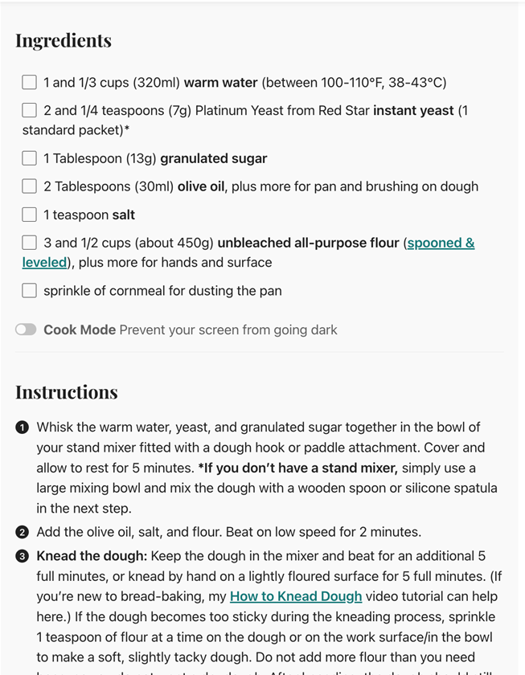
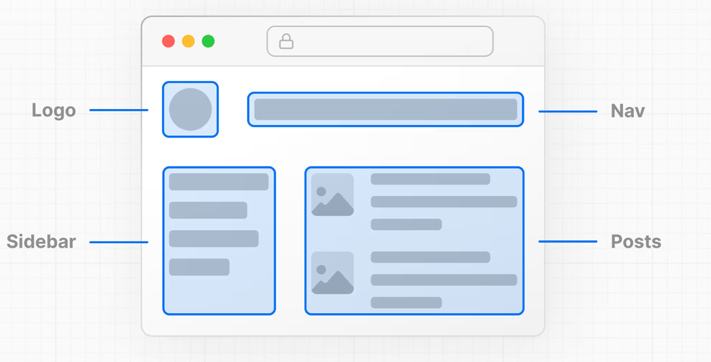
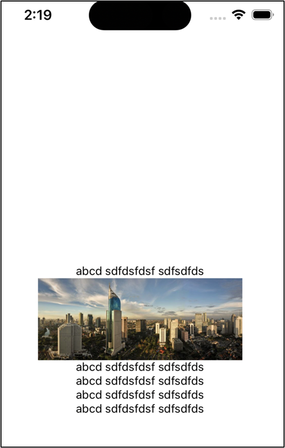
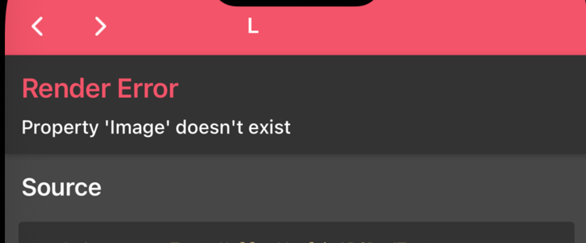

**Week 1 Session 02**

## Learning Outcomes:

●     What is React

●     What is React Native

●     What is declarative programming

●     What are components?

●     What are reusable components?

●     Create a React Native project?

●     Purpose of an App.js file

●     React Native components:  Text, image


## Review: React Intro / Principles of React


React is a modern web framework used to create the user interfaces of websites.

React is based on two principles:

1.    **Declaratively** specifying what the user interface looks like, and what it should do

2.    User interfaces are composed of **reusable components**

What are the programming approaches you can use to create a software program?

●     Imperative programming

●     Declarative programming

●     Object oriented programming

●     Event driven programming

### Concept 1:  Declarative Programming vs Imperative Programming


Software programs can be written **imperatively** or **declaratively**

**1.**    **Imperative programming:**

●     You provide step-by-step instructions for how to accomplish a task

**2.**    **Declarative programming**

●     You tell the software what to do, and the software does it

●     You do not always know exactly _how_ it is doing it

●     But you trust that it will do it

#### Imperative



#### Declarative


### Concept 2a: Reusable components

A component is a user interface element that contains all the UI + logic to make that element work properly.

Components are reusable. After the component is defined, it can be used in many places in throughout the user interface.

Example: 
 
https://www.datocms-assets.com/48294/1664023742-component-library-vs-ds-/image/image-4-component-libraries-contain-ui-elements-freepik.webp?auto=format


 
### Concept 3b: Component Based Design



### React Native - Building a User Interface

- React Native provides a library of commonly used user interface elements that can be used to build the UI of your screens

####  List of Components

- `<Text>`:  Displays a label (text) on the screen
- `<TextInput>`:  Displays a textbox
- `<View>`: Used as a container element to store other elements
- `<Button>`:  Displays a native button
- `<Pressable>`:  Creates a container that can be “clicked” 
- `<Image>`:  Displays an image
    - If you are displaying an image from a url (internet), you must specify a height and width 
    - If you display an image from a file, height and width are not required.
- `<Switch>`: Displays a toggle
- `<SafeAreaView>`: Specific to IOS devices.  Putting code within a `<SafeAreaView>` will automatically display the user interface below the IOS camera notch

Documentation: https://reactnative.dev/docs/0.72/components-and-apis#basic-components
 

### Structure of a React Native Screen


- The App.js file is the initial screen displayed by the mobile application.


- The App.js file must specify a Javascript  function that returns the user interface elements that should be displayed on the screen.

 
### Introduction to React Native Components
- React Native provides a library of commonly used user interface elements that can be used to build the UI of your screens

Documentation: https://reactnative.dev/docs/0.72/components-and-apis#basic-components

#### Example: Showing a network image

1. Display this image:

https://cdn.britannica.com/88/132688-050-E9739DD9/Skyline-Jakarta-Indonesia.jpg


2.  Write the code

- Import the image at the top of your file

```js
import { StyleSheet, Text, View, Image } from 'react-native';
```

- Provide a height and width to the image:
```js
<Image source={{uri:"https://cdn.britannica.com/88/132688-050-E9739DD9/Skyline-Jakarta-Indonesia.jpg"}}
width={250}
height={100}
/>
```
3. Result


  

#### Why do I need to import?

In web, you get all the html by default:  
`<h1>`, `<p>`, `<input/>`, ``

In React Native, you must import the tag before you can use it.

Otherwise, you get an error:

 

## Troubleshooting Expo Install
### Installing a different version of Node

If you get “node unsupported” warnings or errors, try downgrading your node to node 18:

https://nodejs.org/en/download

 


